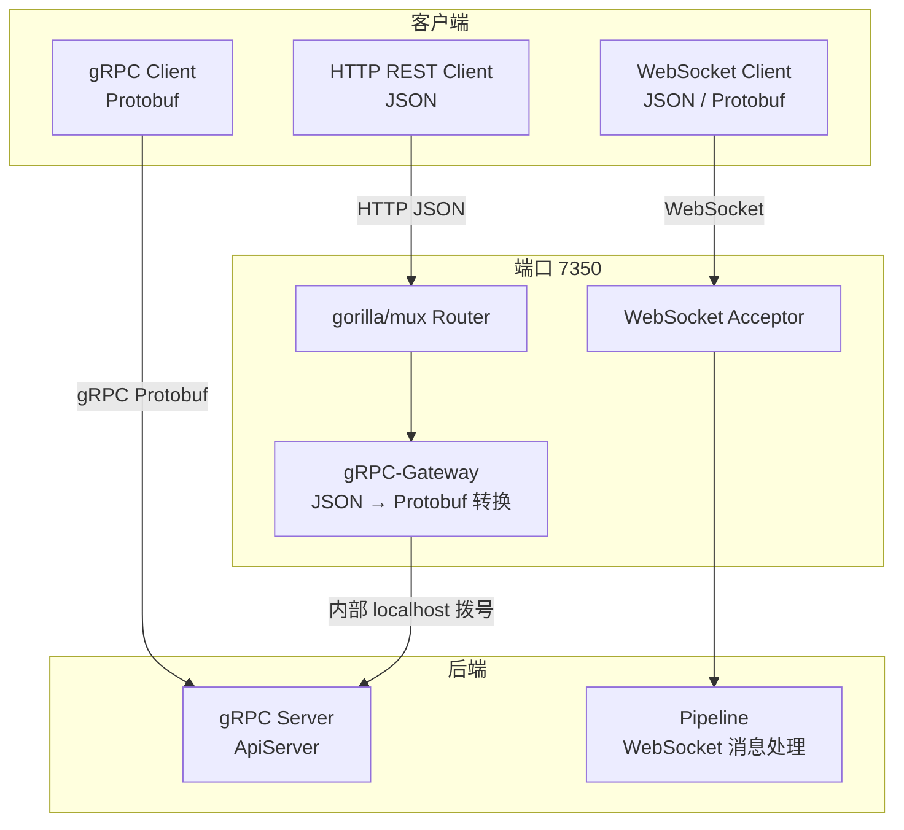
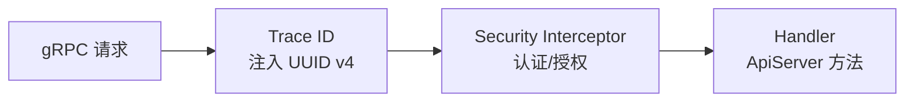
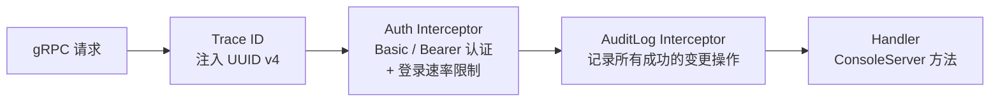
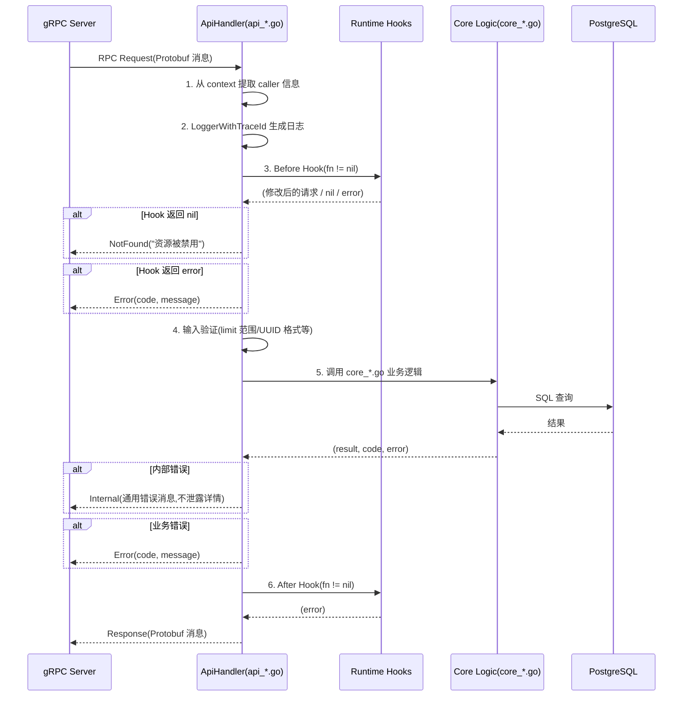
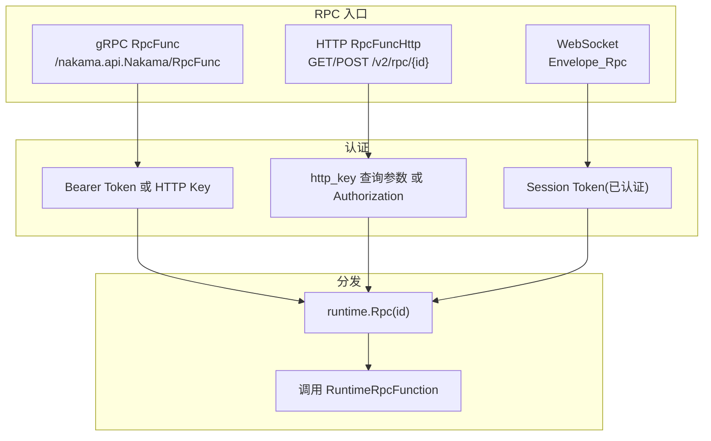
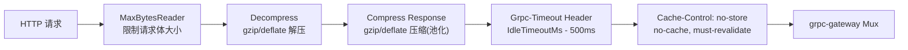

# Nakama API 设计文档

## 1. 概述

Nakama 通过端口 7350 同时提供 HTTP REST 和 gRPC 两种 API 协议,通过 gRPC-Gateway 实现协议转换。所有 API 共享同一套 Protobuf 服务定义,支持 JSON 和 Protobuf 二进制两种序列化格式。WebSocket 实时 API 使用独立的 `rtapi.Envelope` 消息协议。

### 1.1 协议架构



### 1.2 双服务器架构

Nakama 在每个端口采用**独立 gRPC 服务器 + HTTP 网关**的双层架构:

| 组件 | gRPC 端口 | HTTP 端口 | 用途 |
|------|-----------|----------|------|
| API Server | 7349(内部) | 7350(客户端) | 客户端业务 API |
| Console Server | 7348(内部) | 7351(管理) | 管理后台 API |

---

## 2. Protobuf 服务定义

### 2.1 主 API 服务

**Proto 文件:** `apigrpc/apigrpc.proto`
**Package:** `nakama.api`
**服务名:** `Nakama`

主 API 服务包含 **65 个 RPC 方法**,按功能域组织:

```mermaid
graph TB
    subgraph NakamaService["Nakama gRPC Service"]
        direction TB
        
        Auth["认证 (10)<br/>Authenticate* + SessionRefresh"]
        Account["账户 (3)<br/>Get/Update/Delete"]
        Session["会话 (1)<br/>SessionLogout"]
        Friends["好友 (7)<br/>Add/Block/Delete/Import/List*"]
        Groups["群组 (13)<br/>Create/Update/Delete/Join/Leave/<br/>Add/Ban/Kick/Promote/Demote/List*"]
        Leaderboard["排行榜 (5)<br/>Write/Delete/List/AroundOwner"]
        Tournament["锦标赛 (7)<br/>Write/Delete/List/Join/AroundOwner"]
        Storage["存储 (4)<br/>Read/Write/Delete/List"]
        LinkUnlink["关联 (18)<br/>Link*/Unlink* × 9"]
        IAP["内购 (7)<br/>Validate* + List/GetSubscription"]
        Other["其他 (7)<br/>Event/GetUsers/ListMatches<br/>ListNotifications/DeleteNotifications<br/>ListChannelMessages/ListParties<br/>GetMatchmakerStats/Healthcheck"]
    end

    subgraph SpecialEntry["特殊入口"]
        RPC["RpcFunc<br/>自定义 RPC 端点"]
    end
```



### 2.2 HTTP 路由映射

Protobuf 使用 `google.api.http` 注解定义 HTTP 路由。路由模式:

| 模式 | 示例 | HTTP 方法 |
|------|------|----------|
| 认证 | `/v2/account/authenticate/{provider}` | POST |
| 账户 | `/v2/account` | GET/PUT/DELETE |
| 好友 | `/v2/friend` | GET/POST/DELETE |
| 群组 | `/v2/group/{group_id}` | GET/POST/PUT/DELETE |
| 排行榜 | `/v2/leaderboard/{leaderboard_id}` | GET/POST/DELETE |
| 锦标赛 | `/v2/tournament/{tournament_id}` | GET/POST/PUT/DELETE |
| 存储 | `/v2/storage` | GET/POST/PUT |
| 关联 | `/v2/account/link/{provider}` | POST |
| RPC | `/v2/rpc/{id}` | GET/POST |
| 健康检查 | `/healthcheck` | GET |

### 2.3 Console API 服务

**Proto 文件:** `console/console.proto`
**Package:** `nakama.console`
**服务名:** `Console`

包含约 **75 个 RPC 方法**,覆盖: 认证(4)、管理员 CRUD(8)、ACL 模板(4)、玩家账户(14+9 解绑)、账户备注(3)、钱包(2)、群组(8)、存储(8)、排行榜(5)、比赛(2)、通知(4)、IAP(4)、频道消息(2)、API Explorer(3)、审计日志(2)、设置(3)、系统(5)、Satori(2)。

---

## 3. gRPC Interceptor 链

### 3.1 API Server Interceptor



**Security Interceptor 三层认证逻辑:**

```go
switch {
case info.FullMethod == "/nakama.api.Nakama/Healthcheck":
    // 无认证 — 跳过
    
case isSessionRefresh || isAuthenticateXxx:
    // Basic Auth — 验证 ServerKey
    parseBasicAuth(authorization) == config.ServerKey
    
case info.FullMethod == "/nakama.api.Nakama/RpcFunc":
    // 混合认证 — Bearer Token 或 HTTP Key
    parseBearerAuth(token) → 验证 JWT
    或
    request.http_key == config.HTTPKey
    
default:
    // Bearer Auth — 验证 Session Token
    parseBearerAuth(token) → 验证 JWT
    → sessionCache.IsValidSession()
}
```

### 3.2 Console Server Interceptor



---

## 4. 上下文信息传递

认证后的信息通过 `context.Context` 传递给业务逻辑:

| 上下文键 | 类型 | 说明 |
|---------|------|------|
| `ctxUserIDKey` | uuid.UUID | 调用者用户 ID |
| `ctxUsernameKey` | string | 调用者用户名 |
| `ctxVarsKey` | map[string]string | 会话变量 |
| `ctxExpiryKey` | int64 | 会话过期时间戳 |
| `ctxTokenIDKey` | string | Token ID(用于黑名单) |
| `ctxTokenIssuedAtKey` | int64 | Token 签发时间 |
| `ctxTraceId` | string | 请求追踪 ID(UUID v4) |
| `ctxFullMethodKey` | string | 完整 gRPC 方法名 |

Console 专用:

| 键 | 类型 | 说明 |
|----|------|------|
| `ctxConsoleUserIdKey` | uuid.UUID | 管理员 ID |
| `ctxConsoleUsernameKey` | string | 管理员用户名 |
| `ctxConsoleEmailKey` | string | 管理员邮箱 |
| `ctxConsoleUserAclKey` | acl.Permission | 管理员 ACL 位图 |

---

## 5. 请求/响应模式

### 5.1 API Handler 标准流程



### 5.2 输入验证规则

| 参数 | 验证规则 |
|------|---------|
| limit | 1 ~ 100(好友: 1 ~ 1000) |
| UUID | 必须为有效 UUID 格式 |
| username | 禁止控制字符 |
| email | `^.+@.+\..+$` |
| collection/key | 1 ~ 128 字符 |
| RPC payload | 字符串(通常为 JSON) |

---

## 6. 游标分页

### 6.1 游标编码格式

```
gob.Encode(cursorStruct) → base64.URLEncoding
```

所有列表操作使用基于游标的分页,无偏移量分页。

### 6.2 各类游标结构

**存储游标:**
```go
type storageCursor struct {
    Key    string
    UserID uuid.UUID
    Read   int32
}
// SQL: AND (collection, read, key, user_id) > ($1, $2, $3, $4)
```

**排行榜记录游标:**
```go
type leaderboardRecordListCursor struct {
    IsNext        bool
    LeaderboardId string
    ExpiryTime    int64
    Score         int64
    Subscore      int64
    OwnerId       string
    Rank          int64
}
// 双向分页(next/prev cursor)
// 验证 LeaderboardId + ExpiryTime 防止游标失效
```

**购买/订阅游标:**
```go
type purchasesListCursor struct {
    TransactionId string
    PurchaseTime  *timestamppb.Timestamp
    UserId        string
    IsNext        bool
    After, Before time.Time  // 验证参数未变
}
// 双向分页,支持 After/Before 时间过滤
```

### 6.3 分页模式

```
正向翻页: WHERE composite_key > cursor  ORDER BY key ASC
反向翻页: WHERE composite_key < cursor  ORDER BY key DESC → 反转结果
```

- 无更多数据时游标为空字符串
- 排行榜和购买列表同时返回 `next_cursor` 和 `prev_cursor`

---

## 7. 错误处理

### 7.1 gRPC 状态码映射

| 场景 | gRPC 状态码 | HTTP 状态码 |
|------|------------|------------|
| 无效输入(错误的 UUID/范围) | `InvalidArgument` (3) | 400 |
| 认证失败(token 无效) | `Unauthenticated` (16) | 401 |
| 权限不足 | `PermissionDenied` (7) | 403 |
| 资源不存在 | `NotFound` (5) | 404 |
| RPC 函数未注册 | `NotFound` (5) | 404 |
| 内部数据库错误 | `Internal` (13) | 500 |
| 未识别的消息类型(WS) | `Unimplemented` (12) | 501 |

### 7.2 HTTP 错误响应格式

```json
{
    "error": "Auth token invalid",
    "message": "Auth token invalid",
    "code": 16
}
```

- `code`: gRPC 状态码整数
- `error`: 简短错误标识
- `message`: 错误描述

### 7.3 内部错误保护

内部错误(DB 错误等)返回通用消息,不泄露数据库细节:
```go
return nil, status.Error(codes.Internal, "Error listing storage objects.")
```

### 7.4 WebSocket 错误码

WebSocket Pipeline 使用 `rtapi.Error` 消息:

| 错误码 | 说明 |
|--------|------|
| `UNRECOGNIZED_PAYLOAD` (1) | 未知消息类型 |
| `MISSING_PAYLOAD` (2) | 消息体为空 |
| `BAD_INPUT` (3) | 输入无效 |
| `MATCH_NOT_FOUND` (4) | 比赛不存在 |
| `MATCH_JOIN_REJECTED` (5) | 加入比赛被拒绝 |
| `RUNTIME_FUNCTION_NOT_FOUND` (6) | RPC 函数不存在 |
| `RUNTIME_FUNCTION_EXCEPTION` (7) | RPC 执行异常 |

---

## 8. RPC 自定义调用

### 8.1 三入口架构



### 8.2 HTTP RPC 特殊功能

- **`?unwrap` 参数:** 绕过 JSON 包裹,直接发送/接收原始数据
- **GET 请求:** 查询参数通过 `q_` 前缀传递给 Runtime
- **POST 请求:** body 自动解析为 JSON 字符串(模拟 gRPC-Gateway 行为)

### 8.3 RPC 函数签名

```go
type RuntimeRpcFunction func(
    ctx         context.Context,
    headers     map[string][]string,
    queryParams map[string][]string,
    traceID     string,
    userID      string,
    username    string,
    vars        map[string]string,
    expiry      int64,
    sessionID   string,
    clientIP    string,
    clientPort  string,
    lang        string,
    payload     string,
) (string, error, codes.Code)
```

---

## 9. WebSocket Envelope 协议

### 9.1 消息格式

```protobuf
message Envelope {
    string cid = 1;  // 请求-响应关联 ID
    oneof message {
        Channel channel = 2;
        ChannelJoin channel_join = 3;
        // ... 共 50+ oneof 变体
        PartyUpdate party_update = 51;
    }
}
```

- **`cid`**(Correlation ID): 客户端发起请求时设置,服务端响应时回传,用于请求-响应匹配。
- **序列化:** 通过 `?format=json`(默认)或 `?format=protobuf` 选择格式。

### 9.2 消息方向约定

- **Client→Server:** `ChannelJoin`, `MatchCreate`, `MatchmakerAdd`, `PartyCreate`, `StatusFollow`, `Rpc`, `Ping` 等
- **Server→Client:** `Channel`, `Match`, `MatchmakerMatched`, `Party`, `Status`, `Notifications`, `Pong`, `Error` 等

---

## 10. gRPC-Gateway 配置

### 10.1 JSON 序列化选项

```go
JSONPb{
    MarshalOptions: protojson.MarshalOptions{
        UseProtoNames:   true,   // 使用 proto 字段名(非 JSON 名)
        UseEnumNumbers:  true,   // 枚举输出为数字(非字符串)
        EmitUnpopulated: false,  // API 网关不输出空字段
    },
    UnmarshalOptions: protojson.UnmarshalOptions{
        DiscardUnknown: true,    // 忽略未知字段
    },
}
```

### 10.2 HTTP 中间件链



### 10.3 CORS 配置

```go
AllowedHeaders: ["Authorization", "Content-Type", "User-Agent"]
AllowedOrigins: ["*"]
AllowedMethods:  ["GET", "HEAD", "POST", "PUT", "DELETE"]
```

Console 额外允许 PATCH 方法。

---

## 11. 数据序列化约定

| 场景 | 格式 | 说明 |
|------|------|------|
| HTTP REST API | JSON (protojson) | 使用 proto 字段名,枚举为数字 |
| gRPC API | Protobuf 二进制 | 标准 protobuf |
| WebSocket | JSON 或 Protobuf | 通过 `?format=` 选择 |
| 游标 | base64(gob(结构体)) | 二进制 gob 后 base64 编码 |
| JWT Token | HS256 签名 | `header.payload.signature` |
| ACL 位图(DB) | JSON | `{"admin":true}` 或 `{"acl":{...}}` |
| ACL 位图(JWT) | base64(RawURL) | 原始字节编码 |

---

## 12. Console API 特殊路由

Console HTTP 网关除标准 gRPC-Gateway 路由外,还包含:

| 路径 | 说明 |
|------|------|
| `POST /v2/console/storage/import` | 文件上传导入(非 gRPC,直接 HTTP) |
| `POST /v2/console/apple/...` | Apple IAP 通知回调 |
| `POST /v2/console/google/...` | Google IAP 通知回调 |
| `/debug/pprof/...` | Go pprof 性能分析(Basic Auth 保护) |
| `/v2/console/hiro/...` | Hiro 运行时自定义处理器(认证+审计) |
| `/` | 嵌入式 Vue SPA 首页 |
| `/static/*` | SPA 静态资源(1年缓存) |

---

## 13. 相关示例

以案例为主线端到端了解 API 使用,请阅读 [功能案例详解](case-studies.md)。

`examples/` 目录包含 API 使用示例,帮助理解本文档中的概念:

| 示例 | 涉及的 API 概念 |
|------|---------------|
| [leaderboard](../examples/leaderboard/) | 设备认证、Bearer Token、排行榜写入/查询、int64 字符串序列化 |
| [tournament](../examples/tournament/) | RPC 双重编码/解码、锦标赛 join/写入、游标分页查询 |

详见 [examples.md](examples.md)。
