# Nakama 架构设计文档

## 1. 系统总览

Nakama 是一个开源、分布式的实时游戏服务器,使用 Go 语言编写,后端数据库支持 **CockroachDB** 或 **PostgreSQL**(wire-compatible)。

### 1.1 部署架构

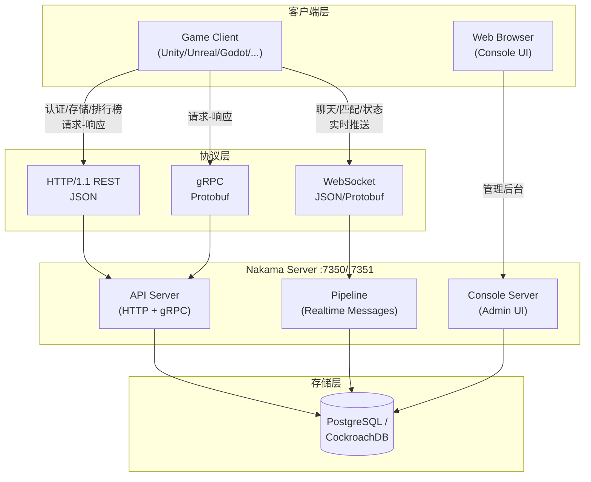

### 1.2 协议端口

| 端口 | 协议 | 用途 |
|------|------|------|
| 7350 | HTTP/1.1, gRPC, WebSocket | 面向客户端的业务 API |
| 7351 | HTTP/1.1 | 嵌入式 Console 管理后台 (Vue SPA) |

---

## 2. 核心组件架构

```mermaid
graph TB
    subgraph EntryPoint["入口 main.go"]
        Main["main()<br/>组件装配 + 生命周期"]
    end

    subgraph CoreComponents["核心组件"]
        direction TB
        SessionReg["SessionRegistry<br/>会话注册表"]
        SessionCache["SessionCache<br/>令牌缓存"]
        StatusReg["StatusRegistry<br/>状态注册表"]
        Tracker["Tracker<br/>在线状态跟踪"]
        MsgRouter["MessageRouter<br/>消息路由"]
        MatchReg["MatchRegistry<br/>比赛注册表"]
        Matchmaker["Matchmaker<br/>匹配器"]
        PartyReg["PartyRegistry<br/>组队注册表"]
        StreamMgr["StreamManager<br/>流管理"]
        LBCache["LeaderboardCache<br/>排行榜缓存"]
        LBRankCache["LeaderboardRankCache<br/>排行榜排名缓存"]
        LBScheduler["LeaderboardScheduler<br/>排行榜定时重置"]
        StorageIdx["StorageIndex<br/>存储索引(Bluge)"]
        Metrics["Metrics<br/>指标(Prometheus)"]
        LoginAttemptCache["LoginAttemptCache<br/>登录尝试缓存"]
        FmCallback["FmCallbackHandler<br/>Fleet Manager 回调"]
    end

    subgraph RuntimeLayer["Runtime 运行时"]
        Runtime["Runtime<br/>钩子调度器"]
        LuaRT["Lua Runtime<br/>(gopher-lua fork)"]
        JsRT["JavaScript Runtime<br/>(goja)"]
        GoRT["Go Runtime<br/>(plugin)"]
    end

    subgraph APILayer["API 层"]
        ApiServer["ApiServer<br/>gRPC + gRPC-Gateway"]
        Pipeline["Pipeline<br/>WebSocket 消息处理"]
    end

    subgraph ConsoleLayer["Console 层"]
        ConsoleServer["ConsoleServer<br/>管理后台 API"]
    end

    Main --> SessionReg
    Main --> SessionCache
    Main --> StatusReg
    Main --> Tracker
    Main --> MsgRouter
    Main --> MatchReg
    Main --> Matchmaker
    Main --> PartyReg
    Main --> StreamMgr
    Main --> LBCache
    Main --> LBRankCache
    Main --> LBScheduler
    Main --> StorageIdx
    Main --> Metrics
    Main --> LoginAttemptCache
    Main --> FmCallback
    Main --> Runtime
    Main --> ApiServer
    Main --> Pipeline
    Main --> ConsoleServer

    Runtime --> LuaRT
    Runtime --> JsRT
    Runtime --> GoRT

    ApiServer --> SessionReg
    ApiServer --> Tracker
    ApiServer --> MsgRouter
    ApiServer --> MatchReg
    ApiServer --> LBCache
    ApiServer --> LBRankCache
    ApiServer --> Runtime
    ApiServer --> Metrics

    Pipeline --> SessionReg
    Pipeline --> Tracker
    Pipeline --> MsgRouter
    Pipeline --> MatchReg
    Pipeline --> Matchmaker
    Pipeline --> PartyReg
    Pipeline --> Runtime
    Pipeline --> Metrics

    ConsoleServer --> Tracker
    ConsoleServer --> MsgRouter
    ConsoleServer --> MatchReg
    ConsoleServer --> Runtime
    ConsoleServer --> Metrics
```

---

## 3. 请求处理流程

### 3.1 HTTP/gRPC API 请求生命周期

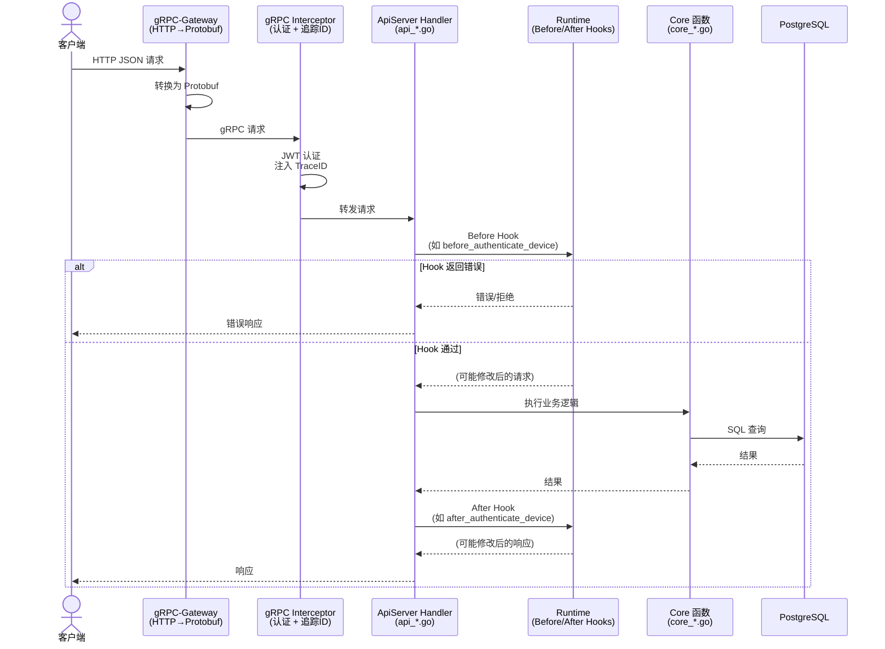

### 3.2 WebSocket 实时消息流程

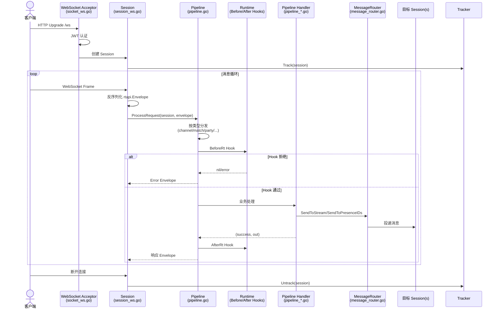

---

## 4. Pipeline 消息分发

Pipeline 是 WebSocket 实时消息的核心路由器,根据 `rtapi.Envelope` 的消息类型分发到对应的处理函数:

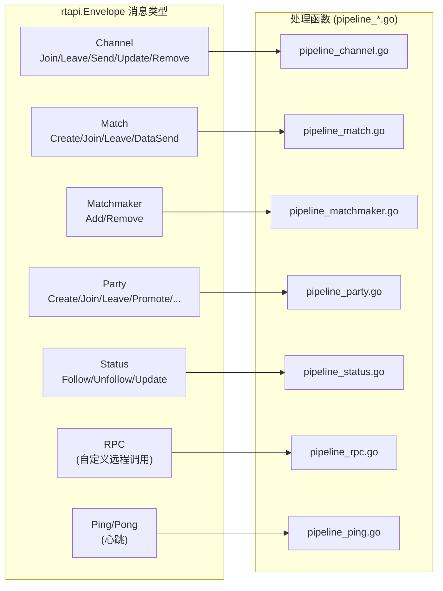

---

## 5. Runtime 运行时系统

### 5.1 三语言运行时架构

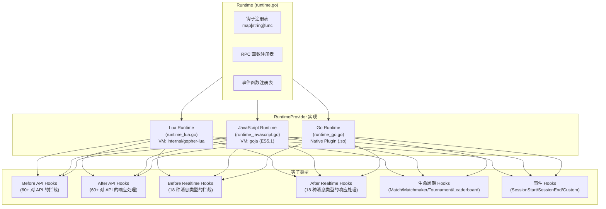

### 5.2 Hook 命名约定

Hook 函数按命名约定自动注册:

| 模式 | 示例 | 说明 |
|------|------|------|
| `before_<method>` | `before_authenticate_device` | API 方法前置拦截 |
| `after_<method>` | `after_write_leaderboard_record` | API 方法后置处理 |
| `before_rt_<type>` | `before_rt_channel_join` | 实时消息前置拦截 |
| `after_rt_<type>` | `after_rt_match_create` | 实时消息后置处理 |
| `rpc_<name>` | `rpc_calculate_damage` | 自定义 RPC 函数 |
| `match_<name>` | `match_deathmatch` | 自定义权威比赛 |

### 5.3 RuntimeExecutionMode

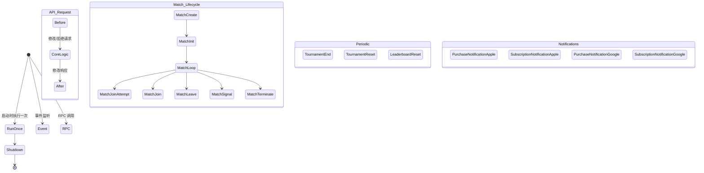

---

## 6. 实时功能核心系统

### 6.1 Presence & Stream 跟踪系统

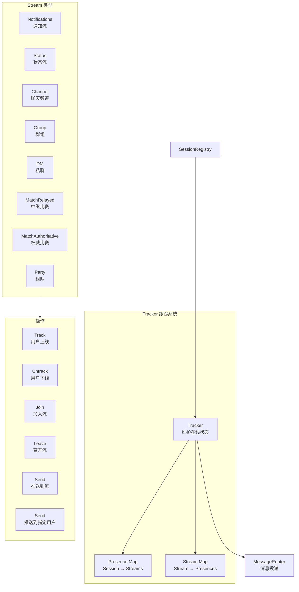

### 6.2 Match 比赛系统

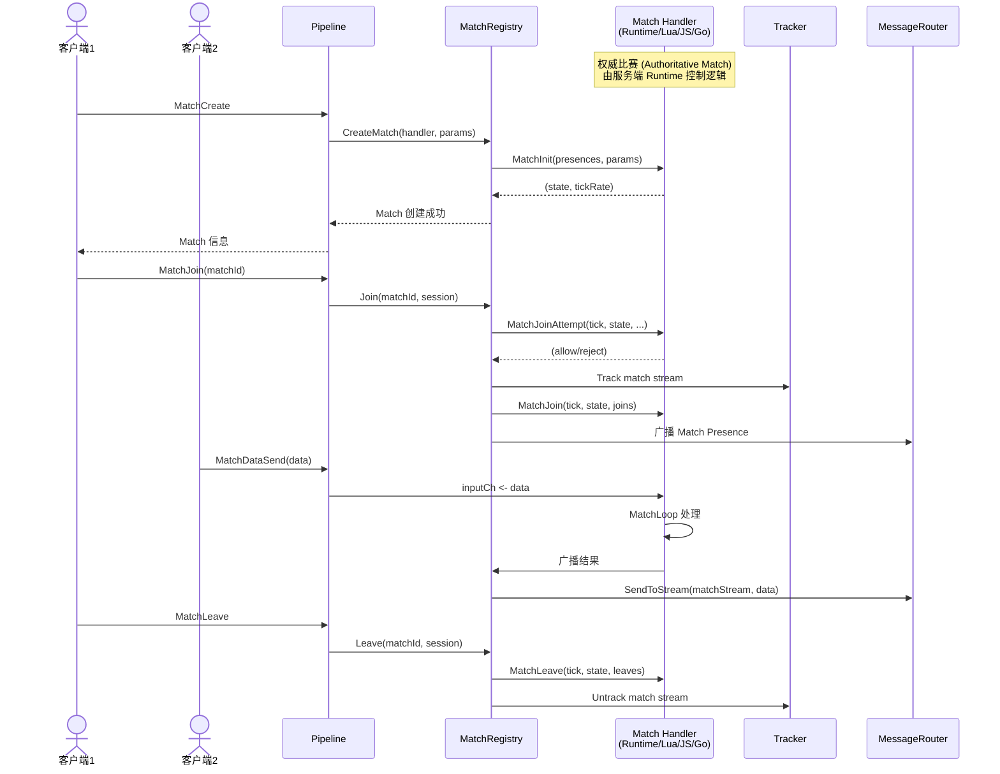

### 6.3 Matchmaker 匹配系统

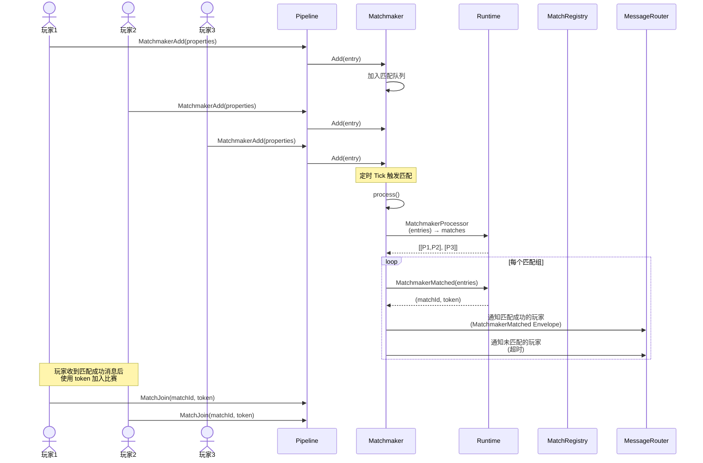

### 6.4 Party 组队系统

```mermaid
stateDiagram-v2
    [*] --> Idle

    Idle --> Leader: PartyCreate(open)
    Leader --> WaitingMembers: 邀请/等待加入

    WaitingMembers --> Full: 成员加入
    WaitingMembers --> Leader: 成员离开

    Full --> Matchmaking: PartyMatchmakerAdd
    Matchmaking --> InMatch: 匹配成功
    InMatch --> Full: 比赛结束

    Leader --> Idle: PartyClose
    Full --> Idle: PartyClose

    note right of Leader: Leader 可以:<br/>- PartyPromote(转让)<br/>- PartyRemove(踢人)<br/>- PartyAccept(审批加入)<br/>- PartyUpdate(更新设置)
```

---

## 7. 数据持久化

### 7.1 数据库迁移

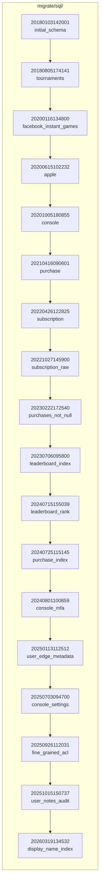

迁移使用 [sql-migrate](https://github.com/heroiclabs/sql-migrate) 库。启动时执行 `migrate up`,运行时会 `migrate check` 验证状态。

### 7.2 核心数据表

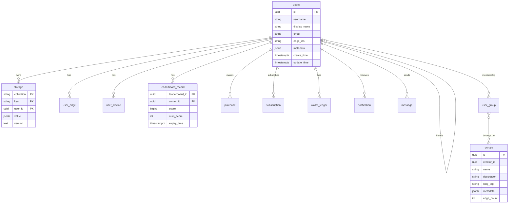

---

## 8. 排行榜系统

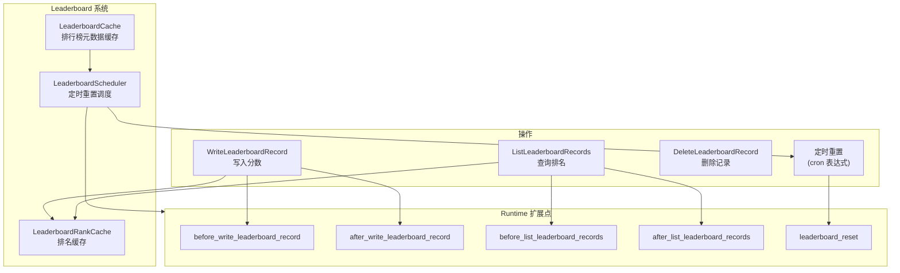

排行榜支持:
- **排序方式**: 升序 / 降序
- **操作符**: Best(取最佳) / Set(设值) / Increment(增量) / Decrement(减量)
- **定时重置**: 基于 Cron 表达式的周期性重置
- **权威模式**: 可配置为权威排行榜,由服务端完全控制

---

## 9. 存储索引

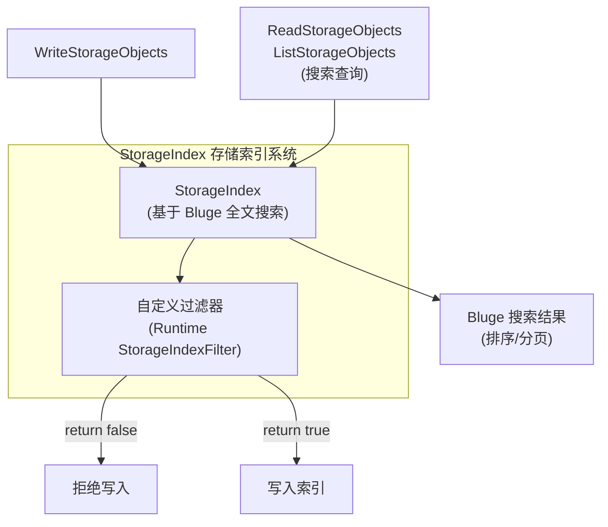

---

## 10. 配置系统

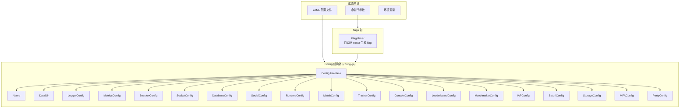

`flags` 包通过反射从 Config 结构体自动生成命令行参数,支持嵌套结构体、切片类型、YAML tag 别名。这是 Uber 开发的配置库的内部 fork。

---

## 11. 指标系统

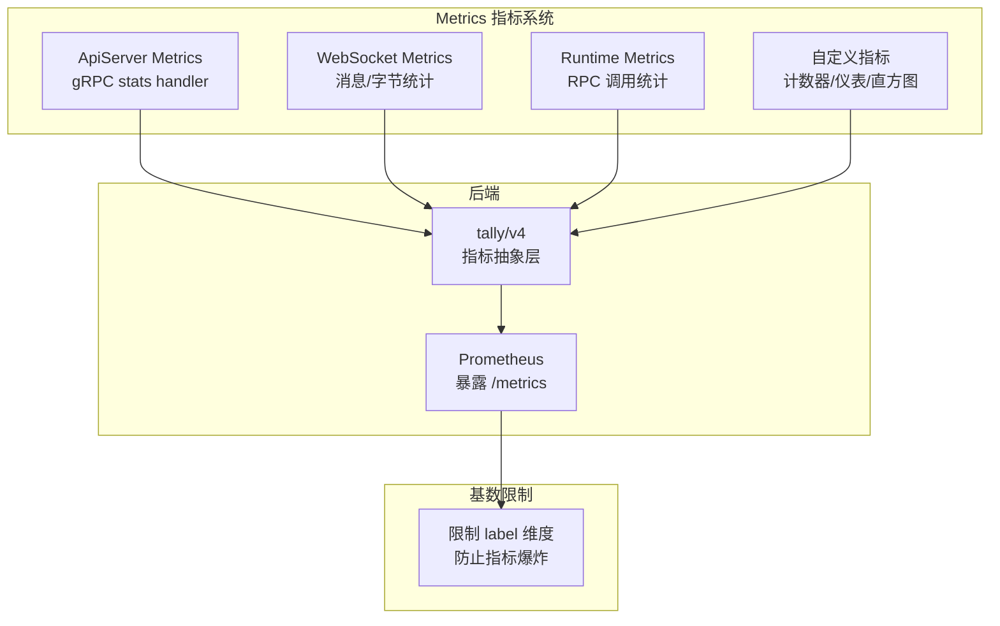

---

## 12. 包依赖关系

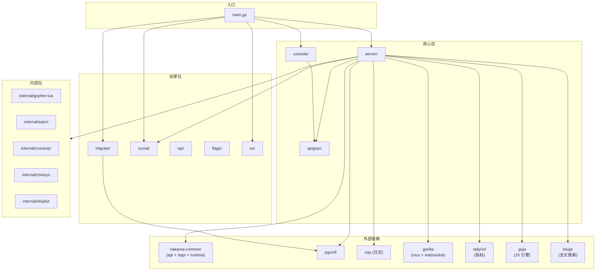

---

## 13. 启动与关闭流程

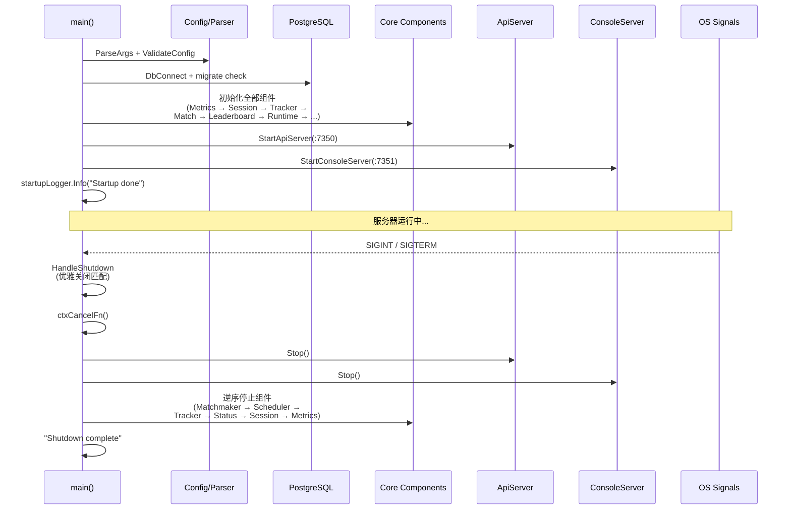

关闭顺序很重要:
1. 先 `HandleShutdown` - 通知所有比赛优雅结束
2. 停止 API 和 Console 接收新请求
3. 停止 Matchmaker
4. 停止 LeaderboardScheduler
5. 停止 Tracker
6. 停止 Session/Status
7. 最后停止 Metrics
