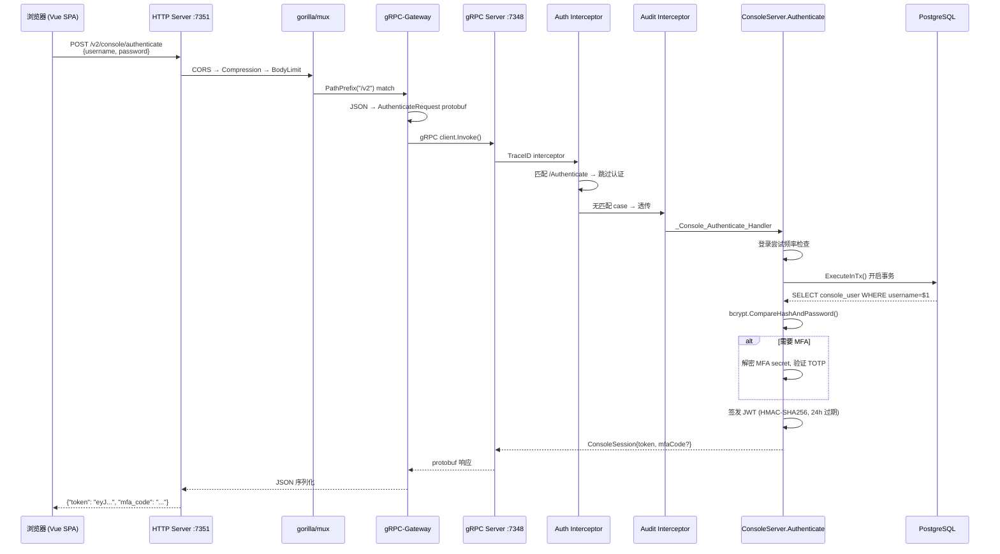
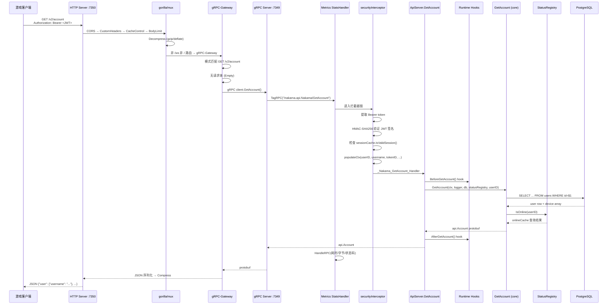
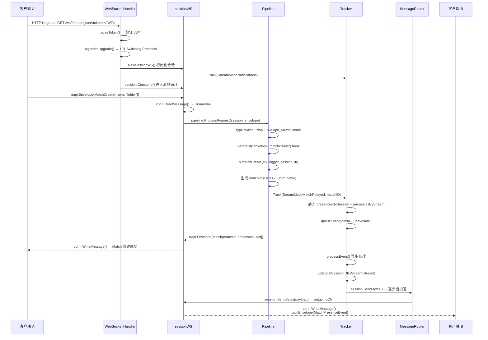

# Nakama 后端调用链详解

> 前端调用链请参见 [call-chains-frontend.md](call-chains-frontend.md) — 包含 Vue SPA 路由导航、组件渲染、API 调用和状态管理。

本文通过三个典型场景的完整调用链,逐层追踪 Nakama 后端的请求处理流程: 从 HTTP 请求进入,经过各层中间件、协议转换、业务逻辑,最终到达数据库并返回响应。

---

## 1. Console 用户登录

> 此场景对应的前端 (Vue SPA) 调用链: [前端: 用户登录](call-chains-frontend.md#1-用户登录-前端视角) — 包含路由守卫、表单提交、token 持久化、MFA 条件渲染等。

**场景**: 管理员在浏览器访问 Console 管理后台,输入用户名密码点击登录。

### 1.1 整体链路



### 1.2 分步骤追踪

#### 阶段一: 路由注册 (服务启动时)

| # | 文件:行号 | 函数 | 说明 |
|---|----------|------|------|
| 1 | `server/console.go:119-130` | `StartConsoleServer` | 创建 gRPC Server,注册三个拦截器: TraceID → `consoleAuthInterceptor` → `consoleAuditLogInterceptor` |
| 2 | `server/console.go:188` | 同上 | `console.RegisterConsoleServer(grpcServer, s)` 绑定所有 Console RPC 实现 |
| 3 | `server/console.go:201-215` | 同上 | 创建 gRPC-Gateway ServeMux,配置 JSON/Protobuf 双向转换 |
| 4 | `server/console.go:228` | 同上 | `RegisterConsoleHandlerFromEndpoint` 拨号内网 gRPC (127.0.0.1:7348),注册 HTTP→gRPC 代理路由 |
| 5 | `console/console.pb.gw.go:6815` | `RegisterConsoleHandlerClient` | 注册路由: `POST /v2/console/authenticate` → 代理到 gRPC |
| 6 | `server/console.go:358-365` | `StartConsoleServer` | gorilla/mux `PathPrefix("/v2")` → 注入 TraceID → 转发到 gRPC-Gateway |
| 7 | `console/console.proto:81-91` | (proto 定义) | `rpc Authenticate` 的 HTTP 注解: `post: "/v2/console/authenticate", body: "*"` |

#### 阶段二: HTTP 请求进入

| # | 文件:行号 | 函数 | 说明 |
|---|----------|------|------|
| 8 | `server/console.go:355` | 内联闭包 | `http.MaxBytesReader` 限制请求体大小 (默认 4MB) |
| 9 | `server/console.go:351` | `handlers.CompressHandler` | 解压 gzip 请求体,压缩响应体 |
| 10 | `server/console.go:358-365` | 内联闭包 | 设置 `Grpc-Timeout` 头,注入 UUID TraceID,转发到 gRPC-Gateway |
| 11 | `console/console.pb.gw.go:8843` | (模式变量) | URL 模式 `POST /v2/console/authenticate` 匹配 |
| 12 | `console/console.pb.gw.go:6815-6826` | 匿名 handler | 选择 JSONPb marshaler,标注 gRPC metadata |
| 13 | `console/console.pb.gw.go:36-47` | `request_Console_Authenticate_0` | JSON body → `AuthenticateRequest{username, password, mfa}` protobuf |
| 14 | `console/console_grpc.pb.go:322-330` | `(*consoleClient).Authenticate` | gRPC 客户端 `Invoke("/nakama.console.Console/Authenticate")` → 内网 TCP |

#### 阶段三: gRPC 服务端处理

| # | 文件:行号 | 函数 | 说明 |
|---|----------|------|------|
| 15 | `server/console.go:123-126` | 内联闭包 (拦截器1) | 生成 UUID v4 TraceID 注入 context |
| 16 | `server/console.go:536-540` | `consoleAuthInterceptor` | 匹配到 `"/nakama.console.Console/Authenticate"` → **跳过认证检查** |
| 17 | `server/console_audit.go:122-128` | `consoleAuditLogInterceptor` | 调用 handler → 检查 switch 无 Authenticate case → 不写入审计日志 |
| 18 | `console/console_grpc.pb.go:1714-1730` | `_Console_Authenticate_Handler` | 反序列化 → `srv.(ConsoleServer).Authenticate(ctx, req)` |

#### 阶段四: 核心认证逻辑

| # | 文件:行号 | 函数 | 说明 |
|---|----------|------|------|
| 19 | `server/console_authenticate.go:93-98` | `(*ConsoleServer).Authenticate` | 入口: 提取客户端 IP,检查登录频率限制 |
| 20 | `server/console_authenticate.go:96` | `loginAttemptCache.Allow` | 检查用户名+IP 是否被锁定 |
| 21 | `server/console_authenticate.go:265` | `ExecuteInTx` | 开启数据库事务 (支持 CockroachDB 自动重试) |
| 22 | `server/db.go:305-348` | `executeInTxPostgres` | 开始事务 → 执行业务逻辑 → 提交; 遇到 40XXX 错误重试最多 5 次 |
| 23 | `server/console_authenticate.go:108-154` | 内联闭包 (admin 分支) | Admin: 明文密码对比 `config.GetConsole().Password` → Upsert `console_user` 表 |
| 24 | `server/console_authenticate.go:427-488` | `lookupConsoleUser` | 普通用户: `SELECT ... FROM console_user WHERE username=$1 OR email=$1` → bcrypt 验证密码 |
| 25 | `server/console_authenticate.go:442-444` | 同上 | **时序攻击防御**: 用户不存在时仍对 dummy 密码执行 bcrypt |
| 26 | `server/console_authenticate.go:169-259` | 内联闭包 (MFA 分支) | 解密 MFA secret (AES-256-GCM) → 验证 TOTP → 处理恢复码 |
| 27 | `server/console_authenticate.go:274-293` | `(*ConsoleServer).Authenticate` | 签发 JWT: `ConsoleTokenClaims{userID, username, email, acl}`, HMAC-SHA256 签名,24h 过期 |
| 28 | `server/console_authenticate.go:274-293` | 同上 | 将 token 存入 `consoleSessionCache` 内存缓存 |

#### 阶段五: 响应返回

| # | 文件:行号 | 函数 | 说明 |
|---|----------|------|------|
| 29 | `console/console_grpc.pb.go:1714-1730` | `_Console_Authenticate_Handler` | protobuf `ConsoleSession` 通过 gRPC 返回 |
| 30 | `console/console.pb.gw.go:6833` | `forward_Console_Authenticate_0` | protobuf → JSON (使用 proto 字段名, 枚举用数字) |
| 31 | `server/console.go:377` | `http.Server` | CORS 头 + gzip 压缩 → 最终 HTTP Response |

---

## 2. 客户端 API 调用 (GetAccount)

> 客户端 SDK 发出此请求。Console 管理后台中的前端调用链参见: [前端: 账户详情导航](call-chains-frontend.md#2-账户列表--详情导航)

**场景**: 游戏客户端通过 HTTP REST 获取自己的账户信息。

### 2.1 整体链路



### 2.2 分步骤追踪

#### 阶段一: 路由与中间件链

请求进入 7350 端口后,按以下顺序经过中间件层:

| 顺序 | 文件:行号 | 中间件 | 说明 |
|------|----------|--------|------|
| 1 | `server/api.go:298` | `handlers.CORS` | 添加 `Access-Control-Allow-Origin: *` 等 CORS 头 |
| 2 | `server/api.go:302-315` | 匿名 handler | 注入配置的自定义响应头 |
| 3 | `server/api.go:282-292` | 匿名 handler | 设置 `Grpc-Timeout` 和 `Cache-Control: no-store, no-cache` |
| 4 | `server/api.go:277-281` | 匿名 handler | `http.MaxBytesReader` 限制请求体 ≤ `MaxRequestSizeBytes` |
| 5 | `server/api.go:647-664` | `decompressHandler` | 若 `Content-Encoding: gzip` 则解压请求体 |
| 6 | `server/api.go:547-608` | `compressHandler` | 若 `Accept-Encoding: gzip/deflate` 则压缩响应体 |

#### 阶段二: 路由分发

| # | 文件:行号 | 函数 | 说明 |
|---|----------|------|------|
| 7 | `server/api.go:260` | `StartApiServer` | gorilla/mux fallback: 所有非 `/` 非 `/ws` 路由 → gRPC-Gateway |
| 8 | `server/api.go:241-244` | 内联中间件 | 注入 UUID v4 TraceID 到 context |
| 9 | `apigrpc/apigrpc.proto:335-336` | (proto 定义) | `rpc GetAccount` HTTP 注解: `get: "/v2/account"` — 无请求体 |
| 10 | `apigrpc/apigrpc.pb.gw.go:4298-4320` | 匿名 handler | 模式匹配 `GET /v2/account`,选择 marshaler,标注 gRPC context |
| 11 | `server/api.go:193-203` | `StartApiServer` | marshaler 配置: `UseProtoNames: true` (snake_case), `UseEnumNumbers: true` |
| 12 | `apigrpc/apigrpc.pb.gw.go:5878-5898` | `RegisterNakamaHandlerFromEndpoint` | 拨号内网 gRPC `127.0.0.1:7349` (端口=HTTP端口-1) |
| 13 | `apigrpc/apigrpc.pb.gw.go:1020-1026` | `request_Nakama_GetAccount_0` | gRPC client.GetAccount() → 内网 TCP |

#### 阶段三: gRPC 认证拦截

| # | 文件:行号 | 函数 | 说明 |
|---|----------|------|------|
| 14 | `server/metrics_grpc_handler.go:43-45` | `TagRPC` | Stats handler 标注 context: `fullMethod = "/nakama.api.Nakama/GetAccount"` |
| 15 | `server/api.go:113-120` | 匿名拦截器 | 注入新 UUID v4 TraceID → 调用 `securityInterceptorFunc` |
| 16 | `server/api.go:455-483` | `securityInterceptorFunc` | `GetAccount` 不在豁免列表 → 进入 Bearer JWT 认证流程 |
| 17 | `server/api.go:518-527` | `parseBearerAuth` | 提取 `Authorization: Bearer <token>` 头 |
| 18 | `server/api.go:529-544` | `parseToken` | HMAC-SHA256 验证 JWT 签名,提取 claims |
| 19 | `server/api.go:479` | `securityInterceptorFunc` | `sessionCache.IsValidSession(userID, exp, tokenId)` 检查会话有效性 |
| 20 | `server/api.go:487-496` | `populateCtx` | 注入 `ctxUserID`, `ctxUsername`, `ctxTokenId`, `ctxVars`, `ctxExpiry`, `ctxIssuedAt` |
| 21 | `apigrpc/apigrpc_grpc.pb.go:2042-2056` | `_Nakama_GetAccount_Handler` | 反序列化 `Empty` → `srv.(NakamaServer).GetAccount(ctx, req)` |

#### 阶段四: 业务处理

| # | 文件:行号 | 函数 | 说明 |
|---|----------|------|------|
| 22 | `server/api_account.go:30-74` | `(*ApiServer).GetAccount` | 从 context 提取 `userID` |
| 23 | `server/logger.go:267-276` | `LoggerWithTraceId` | 将 TraceID 附加到 logger |
| 24 | `server/api_account.go:35-50` | 内联 before-hook | `runtime.BeforeGetAccount()` — 可能被 Lua/Go 脚本修改或拦截 |
| 25 | `server/api.go:784-794` | `traceApiBefore` | 计时 before-hook,记录 Prometheus 指标 |
| 26 | `server/core_account.go:55-143` | `GetAccount` | 核心业务逻辑 — 见下方 SQL 分析 |
| 27 | `server/api_account.go:64-71` | 内联 after-hook | `runtime.AfterGetAccount()` |
| 28 | `server/api.go:796-804` | `traceApiAfter` | 计时 after-hook,记录 Prometheus 指标 |

#### 阶段五: 响应返回

| # | 文件:行号 | 函数 | 说明 |
|---|----------|------|------|
| 29 | `server/metrics_grpc_handler.go:48-65` | `HandleRPC` | 记录 RPC 指标: 耗时、请求/响应字节数、gRPC 状态码 |
| 30 | `apigrpc/apigrpc.pb.gw.go:8056` | `forward_Nakama_GetAccount_0` | `ForwardResponseMessage`: protobuf `api.Account` → JSON |
| 31 | `server/api.go:547-608` | `compressHandler` | 若客户端支持, gzip 压缩 JSON 响应 |
| 32 |  | HTTP Response | 最终 JSON 响应,含 `User`, `Account`, `AccountDevice` 等嵌套结构 |

### 2.3 GetAccount 核心 SQL

`server/core_account.go:81-94` 执行的查询:

```sql
SELECT
    u.username, u.display_name, u.avatar_url, u.lang_tag, u.location,
    u.timezone, u.metadata, u.wallet, u.email,
    u.apple_id, u.facebook_id, u.facebook_instant_game_id, u.google_id,
    u.gamecenter_id, u.steam_id, u.custom_id,
    u.edge_count, u.create_time, u.update_time, u.verify_time, u.disable_time,
    array(SELECT ud.id FROM user_device ud WHERE u.id = ud.user_id)
FROM users u
WHERE u.id = $1
```

查询返回 21 个标量列 + 1 个设备 ID 数组子查询。`QueryRowContext` + `Scan` 后组装为 `api.Account` protobuf,并调用 `statusRegistry.IsOnline(userID)` 检查在线状态。

---

## 3. WebSocket 实时交互 (Match Create)

> 前端 WebSocket 相关交互模式参见: [前端: 组件通信模式](call-chains-frontend.md#4-前端组件通信模式)

**场景**: 游戏客户端通过 WebSocket 创建一场匹配 (relayed match),其他在线玩家收到 Presence 通知。

### 3.1 整体链路



### 3.2 WebSocket 连接建立

| # | 文件:行号 | 函数 | 说明 |
|---|----------|------|------|
| 1 | `server/socket_ws.go:29` | `NewSocketWsAcceptor` | 构造 WebSocket 升级 handler |
| 2 | `server/api.go:233` | `StartApiServer` | gorilla/mux `/ws` 路由注册 |
| 3 | `server/socket_ws.go:44-54` | 内联闭包 | 解析 `?format=json|protobuf` 查询参数 |
| 4 | `server/socket_ws.go:57-78` | 内联闭包 | 提取 Bearer token → `parseToken()` → `sessionCache.IsValidSession()` |
| 5 | `server/socket_ws.go:81-84` | 内联闭包 | 提取 `?lang=en` 查询参数 |
| 6 | `server/socket_ws.go:87` | 内联闭包 | `gorilla/websocket.Upgrade(w, r, nil)` HTTP→WS 协议升级 |
| 7 | `server/socket_ws.go:94-96` | 内联闭包 | 提取客户端 IP + 生成 UUID v1 session ID |
| 8 | `server/session_ws.go:81` | `NewSessionWS` | 创建 sessionWS 结构体,初始化 `context.WithCancel` |
| 9 | `server/session_ws.go:87` | `NewSessionWS` | `populateCtx()` 注入 userID, username, tokenID, vars, expiry |
| 10 | `server/socket_ws.go:105` | 内联闭包 | `sessionRegistry.Add(session)` 注册到会话注册表 |
| 11 | `server/socket_ws.go:108-124` | 内联闭包 | `tracker.Track(StreamModeNotifications)` 注册通知流 Presence |
| 12 | `server/session_ws.go:181` | `(*sessionWS).Consume` | 进入主消息循环 |

### 3.3 消息接收与分发

| # | 文件:行号 | 函数 | 说明 |
|---|----------|------|------|
| 13 | `server/session_ws.go:215` | `Consume` → `IncomingLoop` | `s.conn.ReadMessage()` 阻塞读取 WebSocket 帧 |
| 14 | `server/session_ws.go:229-235` | 同上 | 验证消息类型 (文本=JSON, 二进制=Protobuf) |
| 15 | `server/session_ws.go:247-255` | 同上 | `proto.Unmarshal` 或 `protojsonUnmarshaler.Unmarshal` → `*rtapi.Envelope` |
| 16 | `server/session_ws.go:263-275` | 同上 | `s.pipeline.ProcessRequest(logger, session, envelope)` |
| 17 | `server/pipeline.go:67` | `(*Pipeline).ProcessRequest` | 生成 UUID v4 TraceID,附加到 logger |
| 18 | `server/pipeline.go:84-154` | 同上 | **type switch**: 匹配消息类型到处理函数指针 |
| 19 | `server/pipeline.go:97` | 同上 | `case *rtapi.Envelope_MatchCreate: pipelineFn = p.matchCreate` |
| 20 | `server/pipeline.go:158-187` | 同上 | `Runtime.BeforeRt("envelope_matchcreate")` — 执行 before-hook |
| 21 | `server/pipeline.go:189` | 同上 | `success, out := pipelineFn(ctx, logger, session, in)` 调用处理函数 |

### 3.4 比赛创建处理

| # | 文件:行号 | 函数 | 说明 |
|---|----------|------|------|
| 22 | `server/pipeline_match.go:38` | `(*Pipeline).matchCreate` | 处理 MatchCreate 消息 |
| 23 | `server/pipeline_match.go:39-47` | 同上 | 若提供 Name → 生成确定性 UUID v5; 否则随机 UUID v4 |
| 24 | `server/pipeline_match.go:49-52` | 同上 | 构造 `PresenceStream{Mode: StreamModeMatchRelayed, Subject: matchID}` |
| 25 | `server/pipeline_match.go:54` | 同上 | `p.tracker.Track(ctx, sessionID, stream, userID, meta)` 注册到流 |
| 26 | `server/tracker.go:258` | `(*LocalTracker).Track` | 获取锁 → 插入 `presencesBySession[sessionID]` 和 `presencesByStream[mode][stream]` |
| 27 | `server/tracker.go:311-313` | 同上 | `t.queueEvent(joins, leaves)` 将事件推入异步处理的 `eventsCh` |
| 28 | `server/pipeline_match.go:60-77` | `matchCreate` | Named match: `ListByStream` 获取已有参与者列表 |
| 29 | `server/pipeline_match.go:79-91` | `matchCreate` | 构造 `rtapi.Envelope_Match{Match{matchId, size, presences, self}}` |
| 30 | `server/session_ws.go:391` | `(*sessionWS).Send` | 序列化 envelope → protobuf 或 JSON 字节 |

### 3.5 Presence 事件广播 (异步)

| # | 文件:行号 | 函数 | 说明 |
|---|----------|------|------|
| 31 | `server/tracker.go:887` | `queueEvent` | PresenceEvent{Joins, Leaves} → `t.eventsCh` 通道 |
| 32 | `server/tracker.go:906` | `processEvent` | 事件循环 goroutine 消费 `eventsCh` |
| 33 | `server/tracker.go:916-928` | 同上 | 按流分组 joins/leaves, 同时分离权威比赛 joins (通知本地 MatchHandler) |
| 34 | `server/tracker.go:1031-1067` | 同上 | 为每个流构造 `rtapi.Stream` 和 Presence 列表 |
| 35 | `server/tracker.go:1055` | `ListLocalSessionIDByStream` | 遍历 `presencesByStream[mode][stream]` 收集所有 SessionID |
| 36 | `server/tracker.go:1130-1166` | `processEvent` | 对每个 sessionID: `sessionRegistry.Get()` 获取 session → 按格式 (JSON/Protobuf) 分别 marshal → `session.SendBytes()` |
| 37 | `server/session_ws.go:319` | `processOutgoing` | 写协程: select `outgoingCh` → `conn.WriteMessage()` 发送字节 |

### 3.6 消息流总结

```
IncomingLoop (读协程)                    processOutgoing (写协程)
     │                                           │
     │  ReadMessage() ──── Envelope              │  outgoingCh ──── WriteMessage()
     │       │                                    │       ^
     │       ▼                                    │       │
     │  Unmarshal (JSON/Protobuf)                 │  Marshal (JSON/Protobuf)
     │       │                                    │       ^
     │       ▼                                    │       │
     │  Pipeline.ProcessRequest()                 │  SendBytes(payload)
     │       │                                    │       ^
     │       ▼                                    │       │
     │  type switch → matchCreate()               │  session.Send() ←── pipeline 返回
     │       │                                    │       ^
     │       ▼                                    │       │
     │  Tracker.Track() ──► queueEvent() ──► processEvent() ──► router.SendToPresenceIDs()
     │       │                                    │
     │       ▼                                    │
     │  session.Send(out, true) ──────────────────┘  (发给发起者)
     │
     ▼ (继续循环)
  ReadMessage()  ← 等待下一条消息
```

---

## 4. 三层代码复用对比

三种协议表面在处理同一业务时,共享底层的 `core_*.go` 逻辑:

```
REST:  GET /v2/account      → api_account.go   → GetAccount() ─┐
gRPC:  Nakama/GetAccount    → api_account.go   → GetAccount() ─┤
                                                                  ├── core_account.go → PostgreSQL
Console: Console/GetAccount → console_account.go → GetAccount() ─┘
```

- `api_account.go` 和 `console_account.go` 都调用 `core_account.go` 中的同一个 `GetAccount()` 函数
- API 层面只负责协议相关的事情: 从 context 提取 userID、调用 before/after hooks、字段脱敏 (如 `DisableTime`)
- Console 层面额外进行 ACL 权限检查
- 实时消息 (`pipeline_*.go`) 也共享 `core_*.go` 的业务逻辑

---

## 5. 关键拦截点汇总

| 拦截点 | 机制 | 适用协议 | 文件 |
|--------|------|---------|------|
| JWT 认证 | gRPC UnaryInterceptor (securityInterceptorFunc) | REST, gRPC | `server/api.go:363-485` |
| Console 认证 | gRPC UnaryInterceptor (consoleAuthInterceptor) | Console | `server/console.go:536-575` |
| 审计日志 | gRPC UnaryInterceptor (consoleAuditLogInterceptor) | Console | `server/console_audit.go:122-128` |
| 登录频率限制 | loginAttemptCache.Allow/Add | Console | `server/console_authenticate.go:96,144` |
| Before Hook | Runtime.BeforeXxx() → Lua/JS/Go | 全部 | `server/pipeline.go:158-187`, `server/api_account.go:35-50` |
| After Hook | Runtime.AfterXxx() → Lua/JS/Go | 全部 | `server/pipeline.go:191-196`, `server/api_account.go:64-71` |
| 指标采集 | Metrics StatsHandler (TagRPC/HandleRPC) | gRPC | `server/metrics_grpc_handler.go:43-65` |
| 请求体限制 | http.MaxBytesReader | HTTP | `server/api.go:277`, `server/console.go:355` |
| 响应压缩 | gzip/deflate ResponseWriter | HTTP | `server/api.go:547-608` |
| 请求解压 | gzip/deflate ReadCloser | HTTP | `server/api.go:647-664` |

