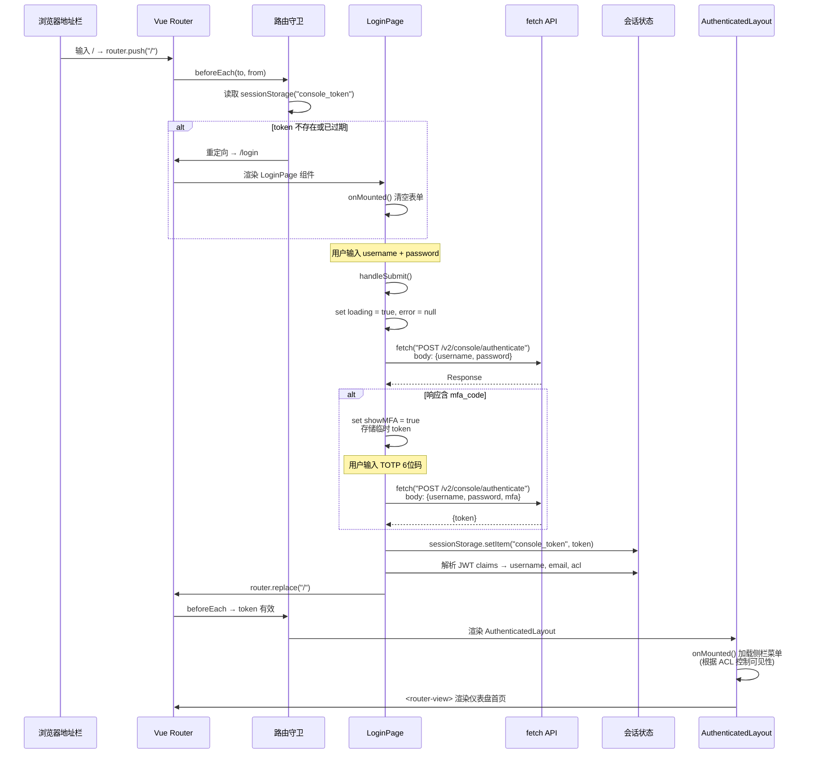
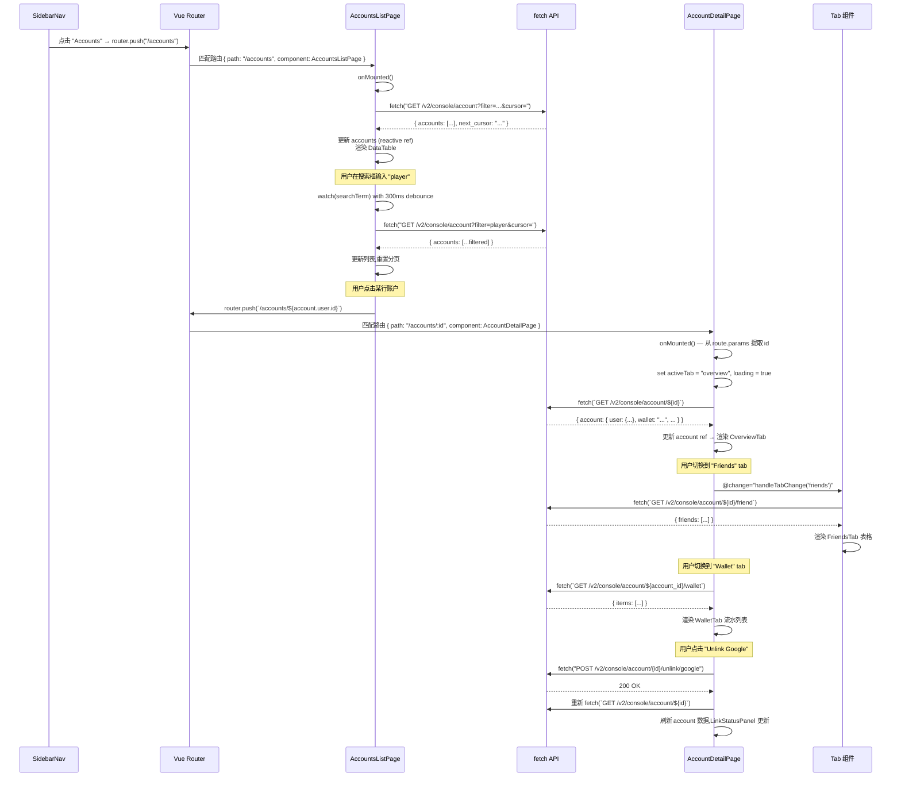
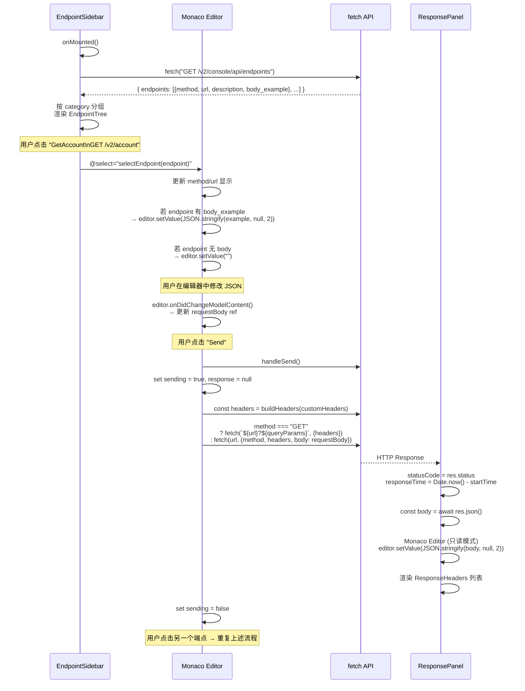

# Nakama 前端调用链详解 (Console SPA)

> 后端调用链请参见 [call-chains-backend.md](call-chains-backend.md) — 包含 HTTP/gRPC/WebSocket 三种协议的后端完整处理链路。

本文追踪 Console Vue SPA 中的典型用户交互在前端侧的完整调用链: 路由导航、组件渲染、API 调用、状态更新和视图刷新。前端与后端的对接点标注了指向后端文档的超链接。

## 1. 用户登录 (前端视角)

> 此场景对应的后端调用链: [后端: Console 用户登录](call-chains-backend.md#1-console-用户登录)

**场景**: 用户在浏览器输入 Console URL,看到登录页,输入凭据点击登录。



#### 分步骤追踪

| # | 层面 | 操作 | 说明 |
|---|------|------|------|
| 1 | Router | `createRouter({ history: createWebHashHistory() })` | 使用 hash 模式路由 (`/#/login`),无需服务端路由支持 |
| 2 | Guard | `router.beforeEach(to, from)` | 全局前置守卫,每次路由变化触发 |
| 3 | Guard | `sessionStorage.getItem("console_token")` | 读取持久化的 JWT token |
| 4 | Guard | 解析 token — 无 token / exp < now | 未认证或 token 过期 → `next("/login")` |
| 5 | Router | `{ path: "/login", component: LoginPage }` | 路由匹配,异步加载 LoginPage 组件 |
| 6 | Component | `LoginPage` setup | `ref(username)`, `ref(password)`, `ref(loading)`, `ref(error)`, `ref(showMfa)` |
| 7 | Component | `<form @submit.prevent="handleSubmit">` | 表单提交阻止默认行为 |
| 8 | API | `fetch("/v2/console/authenticate", ...)"` | 调用 gRPC-Gateway 端点 → 进入 [后端登录流程](call-chains-backend.md#1-console-用户登录) |
| 9 | Response | `res.json()` → `{ token: "eyJ...", mfa_code?: "..." }` | 解析 JSON 响应 |
| 10 | Branch | `if (data.mfa_code)` | MFA 未配置: 显示 TOTP 设置界面,存储临时 token |
| 11 | API | 再次 `fetch("/v2/console/authenticate", { body: {username, password, mfa} })` | 提交 TOTP 码完成 MFA 验证 |
| 12 | Store | `sessionStorage.setItem("console_token", data.token)` | 持久化 token (关闭标签页后清除) |
| 13 | Store | 解析 token payload: `JSON.parse(atob(token.split(".")[1]))` | 提取 `uid`, `usn` (username), `ema` (email), `acl` (权限位图) |
| 14 | Router | `router.replace("/")` | 替换历史记录,防止用户返回到登录页 |
| 15 | Guard | `beforeEach` → token 有效 → `next()` | 放行路由 |
| 16 | Layout | `AuthenticatedLayout` 渲染 | 显示 SidebarNav + TopBar + `<router-view>` |
| 17 | Component | `SidebarNav` | 根据 `acl` 值控制菜单项可见性 (read=1, write=2, delete=4) |
| 18 | Router | `<router-view>` 渲染 DashboardPage | 默认首页,调用 `GET /v2/console/status` 获取节点状态 |

### 2. 账户列表 → 详情导航

**场景**: 管理员点击侧栏 "Accounts",浏览列表,点击某个用户查看详情。



#### 分步骤追踪

| # | 层面 | 操作 | 说明 |
|---|------|------|------|
| 1 | Router | `router.push("/accounts")` | 侧栏导航触发路由跳转 |
| 2 | Router | 懒加载 `() => import("./pages/AccountsList.vue")` | Vite 代码分割 |
| 3 | Component | `AccountsListPage` setup | 初始化 `accounts = ref([])`, `loading = ref(false)`, `searchTerm = ref("")`, `cursor = ref(null)` |
| 4 | Lifecycle | `onMounted(() => fetchAccounts())` | 组件挂载后立即加载数据 |
| 5 | API | `fetchAccounts()` → `fetch("/v2/console/account?cursor=")` | 首次加载不带 filter,使用默认排序 |
| 6 | Reactivity | `accounts.value = data.accounts` | 响应式赋值,触发 DataTable 重新渲染 |
| 7 | Pagination | 检查 `data.next_cursor` | 有值 → 显示 "Load More" 按钮,点击追加数据 |
| 8 | Debounce | `watch(searchTerm, () => { clearTimeout(timer); timer = setTimeout(fetchAccounts, 300) })` | 搜索防抖,避免每次按键都请求 |
| 9 | Route | 行点击 → `router.push({ path: \`/accounts/${id}\` })` | 导航到详情页 |
| 10 | Detail | `AccountDetailPage` setup | `route = useRoute()`; `account = ref(null)`; `activeTab = ref("overview")` |
| 11 | Lifecycle | `onMounted(() => fetchAccount(route.params.id))` | 提取路由参数,请求详情 |
| 12 | Watcher | `watch(() => route.params.id, (newId) => fetchAccount(newId))` | 监听路由参数变化 (从详情页导航到另一个详情页) |
| 13 | API | `fetch(\`/v2/console/account/${id}\`)` | 获取账户完整信息 |
| 14 | Tab | `handleTabChange(tab)` | 切换 tab 时按需加载: friends/groups/wallet/storage/notes |
| 15 | Action | `unlinkProvider(provider)` → `fetch(\`POST /v2/console/account/${id}/unlink/${provider}\`)` | 解除社交登录绑定 |
| 16 | Refresh | `unlink` 成功后重新 `fetchAccount(id)` | 乐观更新或请求后刷新 |
| 17 | Back | 点击 BackButton → `router.back()` 或 `router.push("/accounts")` | 返回列表; 列表数据保留在组件缓存中 (若使用 `<keep-alive>`) |

### 3. API Explorer 请求构造与发送

**场景**: 管理员在 API Explorer 中选择端点、编辑请求体、发送请求并查看响应。



#### 分步骤追踪

| # | 层面 | 操作 | 说明 |
|---|------|------|------|
| 1 | Lifecycle | `onMounted(() => loadEndpoints())` | APIExplorerPage 挂载时加载端点列表 |
| 2 | API | `fetch("GET /v2/console/api/endpoints")` | 获取所有可调用的 API 端点描述 |
| 3 | Data | 响应含 `method`, `url`, `description`, `body_example` | 每个端点带请求体示例 (来自 proto 定义) |
| 4 | Component | `EndpointTree` 渲染 | 按首段路径分组: `account`, `leaderboard`, `match`, `group`, `user`, `storage`, ... |
| 5 | Event | `@select` → `selectedEndpoint = endpoint` | 选中端点,触发 RequestPanel 更新 |
| 6 | Monaco | `editor.setValue(prettyPrint(endpoint.body_example))` | Monaco Editor 显示预格式化的 JSON 模板 |
| 7 | Monaco | `editor.onDidChangeModelContent(() => { requestBody.value = editor.getValue() })` | 监听编辑内容变化,同步到响应式状态 |
| 8 | Headers | 自定义 Key-Value 编辑器 | 可添加/删除 HTTP 头 (如 `Authorization` 覆盖) |
| 9 | Send | `handleSend()` | 构造并发送请求 |
| 10 | Send | `startTime = Date.now()` | 开始计时 |
| 11 | API | `fetch(url, { method, headers, body: method !== "GET" ? requestBody : undefined })` | 实际 HTTP 请求 |
| 12 | Response | `responseTime = Date.now() - startTime` | 计算耗时 (ms) |
| 13 | Response | `responseBody = await res.json()` | 解析 JSON 响应体 |
| 14 | Response | 右侧 Monaco Editor (`readOnly: true`) 显示格式化 JSON | 语法高亮,支持折叠/搜索 |
| 15 | Response | ResponseHeaders 列表渲染 | 逐行显示 `Content-Type`, `Grpc-Status` 等 |
| 16 | History | `localStorage.setItem("api_explorer_history", JSON.stringify(history))` | 请求历史持久化 (可选) |

### 4. 前端组件通信模式

以下是 Console SPA 中主要的组件通信模式:

```
1. Props down / Events up (父 → 子 → 父)
   AuthenticatedLayout
     │  :acl="acl"
     ▼
   SidebarNav
     │  @navigate="handleNavigate"
     ▼
   AuthenticatedLayout → router.push(...)

2. Provide / Inject (祖先 → 后代, 跨层级)
   App.vue
     │  provide("consoleConfig", { nt, ... })
     │  provide("currentUser", user)
     ▼  (任意深度的子组件)
   AnyNestedComponent
     │  const user = inject("currentUser")

3. Route params (页面间通信)
   AccountsListPage → router.push(`/accounts/${id}`)
     │
     ▼
   AccountDetailPage → const id = useRoute().params.id

4. sessionStorage (跨标签页/刷新持久化)
   LoginPage → sessionStorage.setItem("console_token", token)
     │  (页面刷新后)
     ▼
   router.beforeEach → sessionStorage.getItem("console_token")

5. Composition API ref/reactive (组件内状态)
   const accounts = ref([])
   const loading = ref(false)
   watch(searchTerm, debounce(fetchAccounts, 300))
```

### 5. 前后端调用链对接

将前端调用链与后端调用链拼接,形成完整的端到端链路。以账户详情页为例:

```
前端 (Vue SPA)                              后端 (Go Server)
═══════════════                             ═══════════════
                                             详见 call-chains-backend.md

AccountDetailPage.onMounted()
  │
  ├─ fetch("/v2/console/account/{id}") ──── → [后端: Console API 认证拦截](call-chains-backend.md#2-客户端-api-调用-getaccount)
  │                                            ├─ gorilla/mux → gRPC-Gateway
  │                                            ├─ consoleAuthInterceptor
  │                                            ├─ ConsoleServer.GetAccount()
  │                                            └─ SELECT ... FROM users
  │                                           │
  ◄──────────────────── JSON Response ────────┘
  │
  ├─ account.value = data.account
  ├─ 渲染 OverviewTab
  │
  ├─ 用户点击 FriendsTab
  │
  ├─ fetch("/v2/console/account/{id}/friend") ──── → 后端 GetFriends RPC
  │                                           │
  ◄──────────────────── JSON Response ────────┘
  │
  └─ friends.value = data.friends
     └─ 渲染 FriendsTable
```

前端 Vue SPA 中的一个"页面"可能触发多个后端 API 调用 (详情页首次加载调用 1 个,切换 Tab 各调用 1 个),每个调用都是独立的 HTTP 请求,经过完整的后端中间件链和 gRPC 调用链。后端的详细处理步骤参见 [后端调用链 §2](call-chains-backend.md#2-客户端-api-调用-getaccount)。

### 6. 前端错误处理

| 场景 | 处理方式 |
|------|---------|
| 401 未认证 | 全局 `fetch` 拦截器 → 清除 token → `router.push("/login")` |
| 403 权限不足 | 显示 toast 提示 "Insufficient permissions" |
| 404 不存在 | 页面显示空状态或 "Not found" 占位 |
| 500 服务端错误 | 显示 toast 提示 + 服务端返回的 error_message |
| 网络错误 | 显示 toast "Network error, please try again" + RetryButton |
| token 临近过期 | 全局定时器检测 exp → 弹出续期提示或自动跳转登录 |
| 表单校验失败 | 字段级 inline 错误提示 (红色边框 + 文字) |
