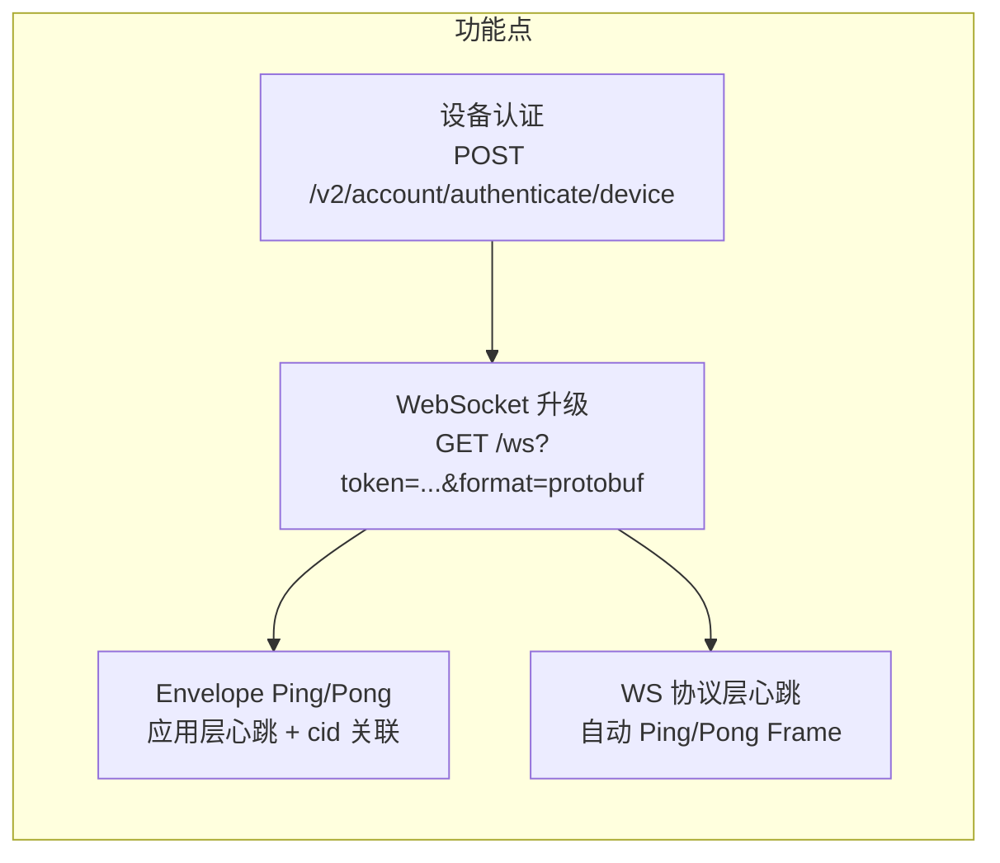
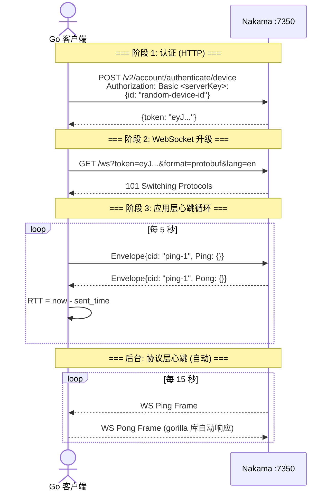
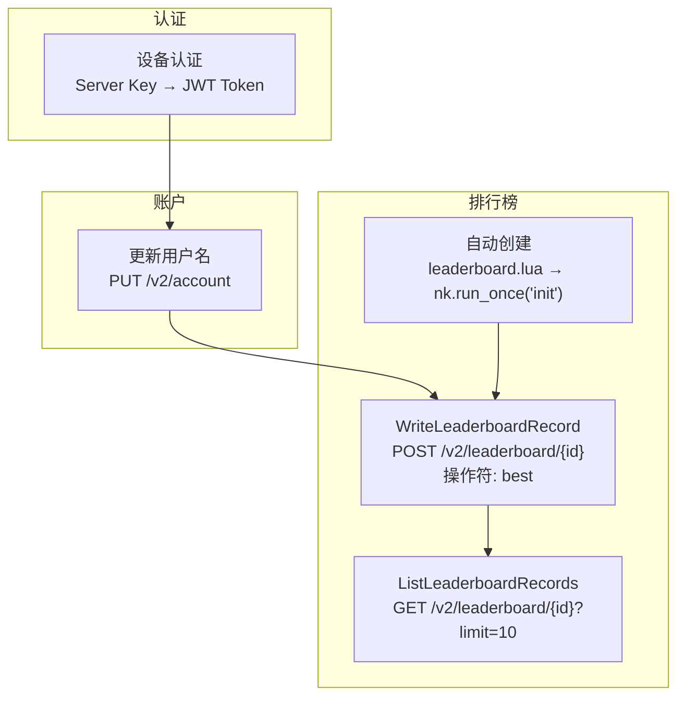
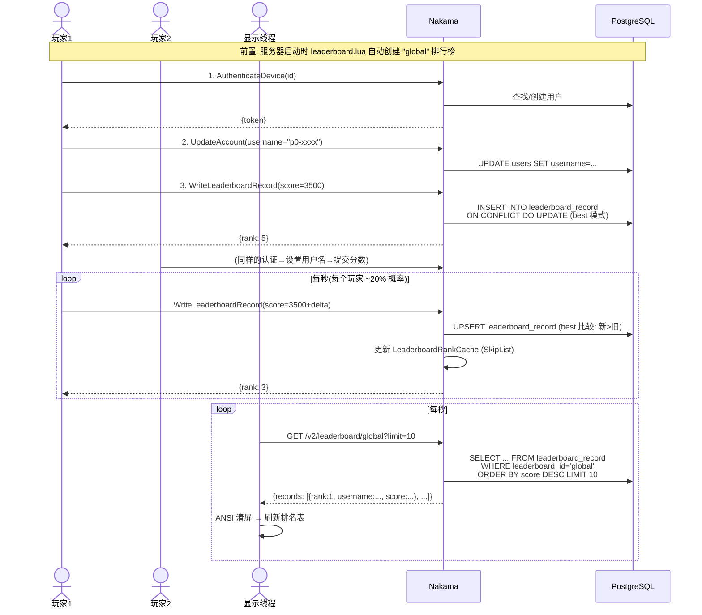
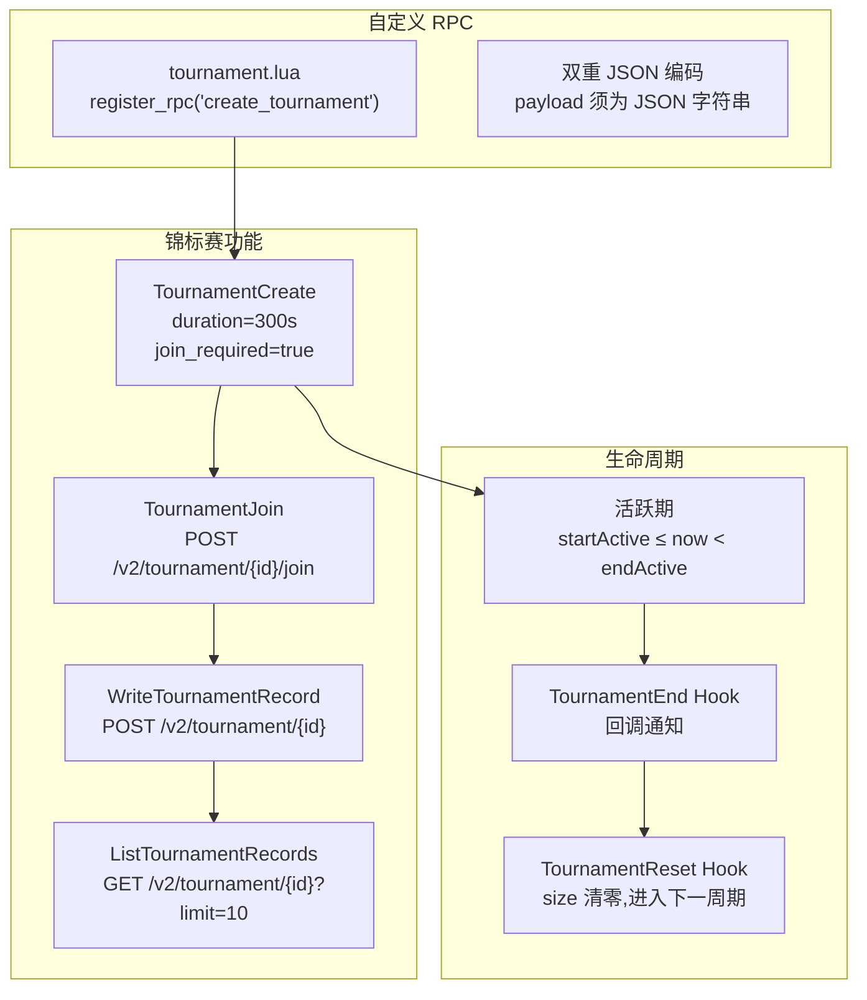
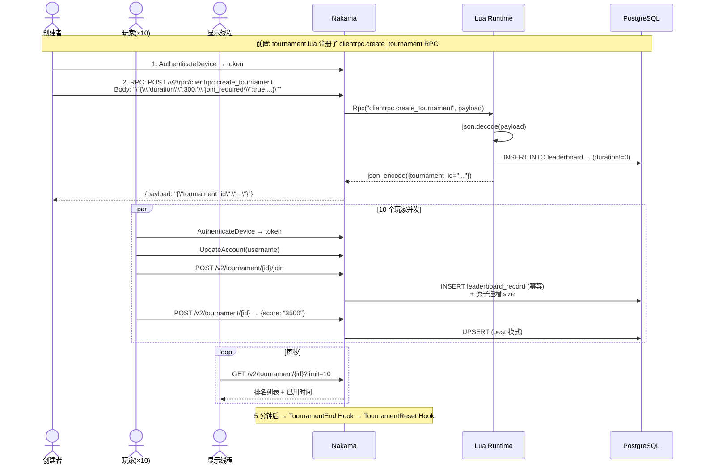
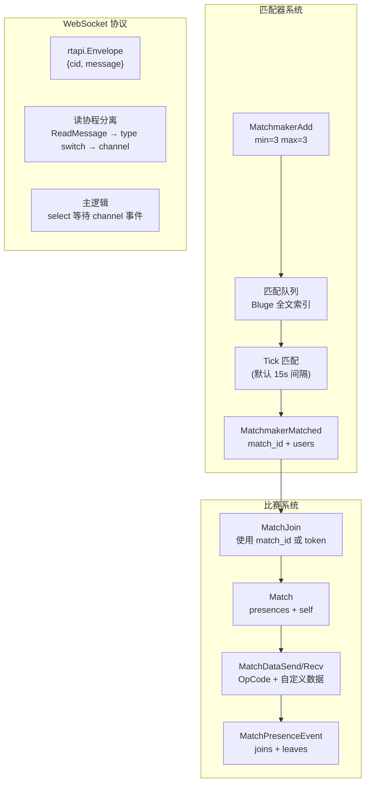
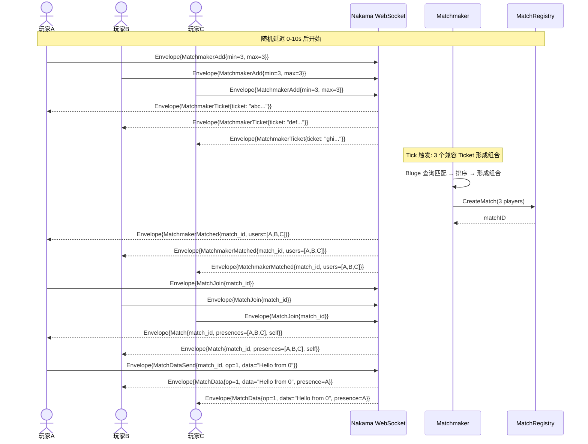
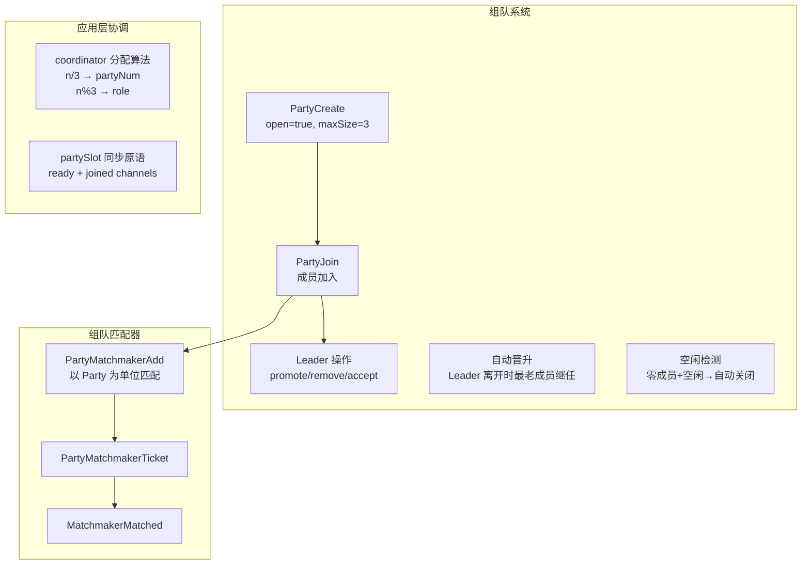
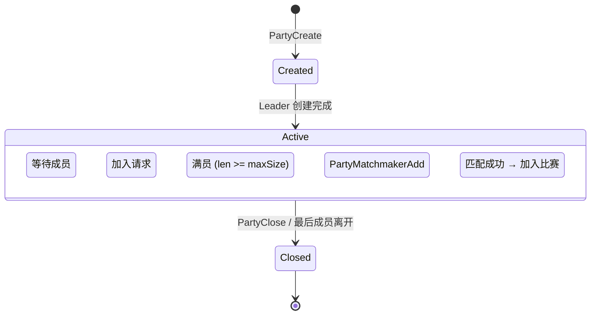

# Nakama 功能案例详解

> 以 `examples/` 目录中的 5 个客户端示例为主线,端到端介绍 Nakama 的核心功能。

## 1. 阅读指引

本文档以**可运行的代码案例**为切入点,逐个介绍 Nakama 的功能点。每个案例遵循统一结构: 功能目标 → 涉及功能点 → 端到端流程 → 关键代码 → 运行观察。

**建议阅读顺序:** 案例难度递进,前一个案例中介绍过的概念(如设备认证)在后续案例中不再重复展开。

| 案例 | 难度 | 协议 | 核心功能 |
|------|------|------|---------|
| [案例一: 心跳与 RTT 测量](#2-案例一-心跳与-rtt-测量) | ★ | WebSocket | 连接建立、双层心跳、Envelope 协议 |
| [案例二: 排行榜](#3-案例二-排行榜) | ★★ | HTTP REST | 设备认证、分数提交、排名查询、ANSI 终端刷新 |
| [案例三: 锦标赛](#4-案例三-锦标赛) | ★★★ | HTTP REST + RPC | 自定义 RPC、锦标赛生命周期、RPC 双重编解码 |
| [案例四: 匹配器](#5-案例四-匹配器) | ★★★ | WebSocket | 匹配队列、比赛加入、比赛内数据交换、读写协程分离 |
| [案例五: 组队](#6-案例五-组队) | ★★★★ | WebSocket | 组队状态机、Party Matchmaker、Leader/Member 协调 |

**配套文档:**

| 想深入了解 | 阅读 |
|-----------|------|
| 案例中的具体代码 | [examples/ 源码](../examples/) 和 [examples.md](examples.md) |
| HTTP/gRPC API 细节 | [api.md](api.md) |
| WebSocket 实时通信细节 | [realtime.md](realtime.md) |
| 排行榜/锦标赛原理 | [leaderboard.md](leaderboard.md) |
| 后端请求处理链路 | [call-chains-backend.md](call-chains-backend.md) |

### 1.1 准备工作

```bash
# 1. 启动 Nakama (含 PostgreSQL)
docker compose up

# 2. 排行榜和锦标赛示例需要内置 Lua 模块
cp data/modules/leaderboard.lua data/modules/
cp data/modules/tournament.lua data/modules/

# 3. WebSocket 示例需要依赖 (已通过 go.mod 管理)
#    github.com/gorilla/websocket
#    github.com/heroiclabs/nakama-common
#    google.golang.org/protobuf
```

所有示例假设 Nakama 运行在 `localhost:7350`,使用默认密钥 `defaultkey`。无需手动注册用户——设备认证自动创建。

---

## 2. 案例一: 心跳与 RTT 测量

### 2.1 功能目标

建立一个 WebSocket 长连接,每 5 秒发送应用层 Ping,测量 Nakama 服务器的往返延迟(RTT),同时依赖 WebSocket 协议层的自动心跳保持连接存活。

### 2.2 涉及的 Nakama 功能点



### 2.3 端到端流程



**阶段 1: 设备认证** — 客户端向 Nakama 发送设备 ID,用 Server Key 做 Basic Auth。Nakama 查找或创建设备对应的用户,返回一个 JWT Session Token。这个 Token 是后续所有操作的身份凭证。

**阶段 2: WebSocket 升级** — 客户端发起 HTTP Upgrade 请求,在查询参数中携带 Token。Nakama 验证 Token 后将连接升级为 WebSocket,创建 Session 并注册到 Tracker(在线状态追踪系统)。

**阶段 3: 应用层心跳** — 客户端主动发送 `Envelope_Ping`,服务端立即回复 `Envelope_Pong`。Ping 中携带的 `cid`(Correlation ID)被回传,客户端据此匹配请求-响应对,计算 RTT。

**后台: 协议层心跳** — Nakama 每 15 秒自动发送 WebSocket 协议层的 Ping Frame,gorilla/websocket 库自动回复 Pong。如果 25 秒内未收到 Pong,服务端关闭连接。

### 2.4 关键代码

**WebSocket 连接:**
```go
url := fmt.Sprintf("ws://localhost:7350/ws?lang=en&status=true&format=protobuf&token=%s", token)
conn, _, err := websocket.DefaultDialer.Dial(url, nil)
```

**发送应用层 Ping:**
```go
cid := fmt.Sprintf("ping-%d", seq)
env := &rtapi.Envelope{
    Cid:     cid,
    Message: &rtapi.Envelope_Ping{Ping: &rtapi.Ping{}},
}
data, _ := proto.Marshal(env)
start := time.Now()
conn.WriteMessage(websocket.BinaryMessage, data)
// 等待 Envelope_Pong 回传 → RTT = time.Since(start)
```

**接收消息 (读协程):**
```go
_, raw, _ := conn.ReadMessage()
var env rtapi.Envelope
proto.Unmarshal(raw, &env)
switch env.Message.(type) {
case *rtapi.Envelope_Pong:
    // 通过 env.Cid 匹配到发送请求,计算 RTT
}
```

### 2.5 运行观察

```bash
go run ./examples/ping-pong/
```

输出示例:
```
Device ID: xxxxxxxx
Token obtained: eyJhbGciOiJIUzI1NiIsInR5cCI6IkpXVCJ9...
WebSocket connected (protobuf format)
Status presence received (initial sync)
seq=1 RTT=1.5ms (sent at 10:30:01.000)
seq=2 RTT=0.8ms (sent at 10:30:06.000)
seq=3 RTT=2.1ms (sent at 10:30:11.000)
```

---

## 3. 案例二: 排行榜

### 3.1 功能目标

启动 10 个模拟玩家,各自提交随机分数到同一个排行榜,一个独立的显示线程每秒轮询 Top-10 排名并实时刷新终端。

### 3.2 涉及的 Nakama 功能点



### 3.3 端到端流程



**功能点 1: 设备认证** — 与案例一相同,POST 到 `/v2/account/authenticate/device`,用 Server Key 做 Basic Auth,获取 JWT Session Token。

**功能点 2: 更新用户名** — PUT `/v2/account`,请求体直接映射到 proto 消息字段(body: `*`),无需外层封装:
```go
payload, _ := json.Marshal(map[string]string{"username": username})
req.Header.Set("Authorization", "Bearer "+token)
```

**功能点 3: 提交分数** — POST `/v2/leaderboard/{id}`,关键细节是 proto3 中 int64 在线路上序列化为**字符串**:
```go
payload, _ := json.Marshal(map[string]any{
    "score":    fmt.Sprintf("%d", score),  // int64 → string
    "subscore": "0",
})
```

写入使用 `best` 操作符: 仅当新分数优于旧分数时才更新(降序排行中新值 > 旧值)。底层是 PostgreSQL 的 `INSERT ... ON CONFLICT DO UPDATE ... WHERE score < $new_score`。

**功能点 4: 排行榜自动创建** — `leaderboard.lua` 在服务器启动时通过 `nk.run_once("init")` 创建排行榜。`run_once` 保证集群多节点部署时只执行一次:
```lua
if nk.run_once("init") then
    nk.leaderboard_create("global", false, "desc", "best")
end
```

**功能点 5: 排名查询** — GET `/v2/leaderboard/{id}?limit=10`,返回 JSON 中含 `rank` 字段(字符串格式的 int64)。支持游标分页(`next_cursor`/`prev_cursor`),但本案例不使用。

### 3.4 关键代码

**解析响应中的 int64:**
```go
type leaderboardRecord struct {
    Score    int64 `json:"score,string"`    // json:",string" 处理 proto3 int64
    Rank     int64 `json:"rank,string"`
}
```

**ANSI 终端实时刷新 (无闪烁):**
```go
fmt.Print("\033[H\033[2K")   // 光标回首页,清除当前行
fmt.Println("=== LEADERBOARD ===")
for _, r := range list.Records {
    fmt.Print("\033[K")       // 清除当前行
    fmt.Printf("%-6d %-14s %10d\n", r.Rank, r.Username, r.Score)
}
fmt.Print("\033[J")           // 清除屏幕剩余部分
```

### 3.5 运行观察

```bash
go run ./examples/leaderboard/
```

输出示例:
```
=== LEADERBOARD === (Ctrl+C to quit)

RANK   PLAYER              SCORE
------ ------------     ----------
1      p7-xyza                4820
2      p3-abcd                4510
3      p0-mnop                3500
4      p9-qrst                2980
5      p1-uvwx                2100
...
```

观察要点: 排名动态变化(分数随机增长),但终端无闪烁(ANSI 转义序列原地刷新)。

---

## 4. 案例三: 锦标赛

### 4.1 功能目标

一个客户端通过**自定义 RPC** 创建 5 分钟锦标赛,10 个玩家加入并提交分数,显示线程实时展示排名。锦标赛结束后排名定格。

### 4.2 涉及的 Nakama 功能点



### 4.3 端到端流程



**功能点 1: 自定义 RPC** — 这是锦标赛案例的核心。Nakama 通过 Runtime 支持客户端调用自定义逻辑。RPC 的 HTTP 入口有特殊的序列化要求:

```
客户端 Go:
  argsJSON = json.Marshal({duration: 300, join_required: true, ...})
              → {"duration":300,"join_required":true,...}
  payload  = json.Marshal(string(argsJSON))
              → "\"{\\\"duration\\\":300,...}\""  (一个 JSON 字符串!)

Nakama 端:
  gRPC-Gateway: body → Rpc.payload (proto string field)
  Lua Runtime:   json.decode(payload) → {duration=300, ...}
```

**为什么需要双重编码?** gRPC-Gateway 的 proto 注解 `body: "payload"` 将 HTTP body 直接映射到 `Rpc` 消息的 `string payload` 字段。所以线路上必须是一个 JSON 字符串,而非 JSON 对象。

**接收 RPC 响应同样需要双重解码:**
```go
var rpcResp struct{ Payload string `json:"payload"` }
json.NewDecoder(resp.Body).Decode(&rpcResp)       // 第一层: 提取字符串
var result tournamentCreateResponse
json.Unmarshal([]byte(rpcResp.Payload), &result)    // 第二层: 解析业务数据
```

**功能点 2: 锦标赛加入** — 当 `join_required=true` 时,玩家必须显式调用 `POST /v2/tournament/{id}/join` 后才能提交分数。Join 操作是幂等的(`ON CONFLICT DO NOTHING`),有 `max_size` 限制时通过原子 SQL 控制人数。

**功能点 3: 锦标赛生命周期** — 锦标赛有明确的时间线:
- `startActive` → 可加入和提交分数
- `endActive` → 触发 `TournamentEnd` Hook(Runtime 回调),排行榜名次固定
- `expiry` → 触发 `TournamentReset` Hook,`size` 清零,可进入下一周期

### 4.4 运行观察

```bash
go run ./examples/tournament/
```

输出示例:
```
Tournament created: a1b2c3d4-... (duration: 5m0s)
[p3-xxxx] Joined tournament
[p3-xxxx] Initial score: 4200
...
=== TOURNAMENT LEADERBOARD ===  elapsed: 2m30s  (Ctrl+C to quit)
RANK   PLAYER              SCORE
------ ------------     ----------
1      p7-xyza                4820
2      p3-abcd                4510
...
=== TOURNAMENT LEADERBOARD ===  elapsed: 5m0s  (Ctrl+C to quit)
*** TOURNAMENT HAS ENDED — final standings below ***
```

---

## 5. 案例四: 匹配器

### 5.1 功能目标

10 个玩家通过 WebSocket 连接,随机延迟后进入匹配队列(3人一组)。凑齐 3 人后 Nakama 自动匹配并创建比赛,玩家加入比赛后互相发送消息。

### 5.2 涉及的 Nakama 功能点



### 5.3 端到端流程



**功能点 1: 匹配器** — 这是 Nakama 最核心的实时功能之一:

- **MatchmakerAdd:** 客户端发送 `min=3, max=3` 表示想匹配恰好 3 人。`query` 字段为空表示接受任何对手。
- **MatchmakerTicket:** 服务端确认已进入队列,返回票据 ID。
- **MatchmakerMatched:** 匹配成功后服务端推送,包含 `match_id`(或 `token`)和匹配到的用户列表。

**匹配算法:** 默认使用 Bluge 全文索引,每 `IntervalSec`(默认 15s) Tick 一次:
1. 遍历所有活跃 Ticket,构建 Bluge 查询
2. 搜索结果按 `_score desc, created_at asc` 排序
3. 尝试形成满足 `min/max count` 和 `countMultiple` 的组合
4. 到达 `MaxIntervals`(默认 2) 后,即使 `count < minCount` 也允许匹配

**功能点 2: 比赛加入与数据交换** — 匹配成功后进入 Nakama 比赛系统:

- **MatchJoin:** 使用 `match_id` 或 `token` 加入比赛
- **Match:** 服务端返回比赛信息,包含当前参与者列表(`presences`)和自己在列表中的位置(`self`)
- **MatchDataSend:** 向比赛中所有玩家发送自定义数据(二进制 payload + OpCode)
- **MatchData:** 收到其他玩家发送的数据,包含发送者 `presence` 信息

这是一个**中继比赛**(Relayed Match, `StreamModeMatchRelayed`),服务端只负责转发消息,不运行游戏逻辑。权威比赛(Authoritative Match)由 Runtime 脚本控制游戏状态。

**功能点 3: 读写协程分离** — WebSocket 示例的通用架构:

```
IncomingLoop (读协程)              Main (主逻辑)
     │                                  │
     │  ReadMessage()                    │  select {
     │    │                              │  case ticket := <-ev.ticket:
     │    ▼                              │      // 票据到手,等待匹配
     │  proto.Unmarshal → Envelope       │  case matched := <-ev.matched:
     │    │                              │      // 匹配成功,加入比赛
     │    ▼                              │  case data := <-ev.data:
     │  type switch:                     │      // 收到比赛数据
     │    MatchmakerTicket → ev.ticket   │  }
     │    MatchmakerMatched → ev.matched  │
     │    Match → ev.match               │
     │    MatchData → ev.data            │
     │    ...                            │
```

```go
type playerEvents struct {
    ticket   chan string                    // 容量1: 只需一次票据
    matched  chan *rtapi.MatchmakerMatched  // 容量1: 只需一次匹配
    match    chan *rtapi.Match              // 容量1: 只需一次比赛确认
    data     chan *rtapi.MatchData          // 容量5: 多条数据消息
    presence chan *rtapi.MatchPresenceEvent // 容量5: 多条 Presence 事件
}
```

### 5.4 运行观察

```bash
go run ./examples/matchmaker/
```

输出示例:
```
Starting 10 players, match size = 3
[Player 5] waiting 2.3s before matchmaker
[Player 0] waiting 7.1s before matchmaker
...
[Player 5] joined matchmaker (min=3 max=3)
[Player 5] got ticket abc123def456...
[Player 5] matched! match_id=a1b2c3d4... users=3
[Player 5] joining match...
[Player 5] entered match a1b2c3d4... (size=3)
[Player 5] got data from Player 7 (op=1): Hello from player 7!
[Player 5] got data from Player 3 (op=1): Hello from player 3!
```

---

## 6. 案例五: 组队

### 6.1 功能目标

10 个玩家在应用层协调分配为 3 人一组。Leader 创建 Party,Members 加入,满员后 Leader 发起 Party Matchmaker。匹配成功后全员加入比赛并在比赛内通信。剩余无法凑成 3 人的玩家走 solo 匹配器。

### 6.2 涉及的 Nakama 功能点



### 6.3 端到端流程

```mermaid
sequenceDiagram
    actor L as Leader(P0)
    actor M1 as Member(P1)
    actor M2 as Member(P2)
    actor Solo as Solo(P9)
    participant Coord as Coordinator
    participant Nakama

    Note over Coord: 分配: P0=Leader, P1/P2=Member, P9=剩余solo

    L->>Nakama: Envelope{PartyCreate{open=true, maxSize=3}}
    Nakama-->>L: Envelope{Party{party_id: "xxx", presences: [P0], self: P0}}

    L->>Coord: slot.partyID = "xxx"; close(slot.ready)

    M1->>Coord: 等待 slot.ready
    M2->>Coord: 等待 slot.ready

    M1->>Nakama: Envelope{PartyJoin{party_id: "xxx"}}
    M2->>Nakama: Envelope{PartyJoin{party_id: "xxx"}}

    Nakama-->>M1: Envelope{Party{party_id: "xxx", presences: [P0,M1]}}
    Nakama-->>M2: Envelope{Party{party_id: "xxx", presences: [P0,M1,M2]}}

    M1->>Coord: slot.joined ← signal
    M2->>Coord: slot.joined ← signal

    Note over L: slot.joined 计数 = 2<br/>Party 满员! 发起匹配

    L->>Nakama: Envelope{PartyMatchmakerAdd{party_id: "xxx", min=3, max=3}}
    Nakama-->>L: Envelope{PartyMatchmakerTicket{ticket}}
    Nakama-->>M1: Envelope{PartyMatchmakerTicket{ticket}}
    Nakama-->>M2: Envelope{PartyMatchmakerTicket{ticket}}

    Note over Nakama: 匹配成功后

    Nakama-->>L: Envelope{MatchmakerMatched{match_id, users=[P0,M1,M2]}}
    Nakama-->>M1: Envelope{MatchmakerMatched{match_id, users=[P0,M1,M2]}}
    Nakama-->>M2: Envelope{MatchmakerMatched{match_id, users=[P0,M1,M2]}}

    par Leader + Members 加入比赛
        L->>Nakama: Envelope{MatchJoin{match_id}}
        M1->>Nakama: Envelope{MatchJoin{match_id}}
        M2->>Nakama: Envelope{MatchJoin{match_id}}
    end

    L->>Nakama: MatchDataSend → 广播消息
    M1->>Nakama: MatchDataSend → 广播消息

    Note over Solo: 剩余玩家走 solo matchmaker
    Solo->>Nakama: Envelope{MatchmakerAdd{min=3, max=3}}
    Note over Solo: (需等其他 solo 玩家凑齐 3 人<br/>或超时放弃)
```

**功能点 1: Party 状态机** — Party 是 Nakama 的组队功能,支持完整的生命周期:



**关键规则:**
- Leader 创建 Party 时自动成为成员
- `open=true` 时 Join 请求自动通过
- Leader 离开时自动晋升最老成员
- 零成员 + 空闲 → 自动关闭

**功能点 2: Party Matchmaker** — 与个人匹配器的关键区别: 以整个 Party 为匹配单元。所有成员共享同一个 PartyMatchmakerTicket,匹配成功后全员收到同一个 MatchmakerMatched 通知。

**功能点 3: 应用层协调** — 因为 Nakama 没有内置的"创建 Party 并邀请特定玩家"的 API(Party ID 需要应用层传递),示例使用 coordinator 模式:

```go
type coordinator struct {
    mu    sync.Mutex
    seq   int                    // 全局递增序号
    slots []*partySlot           // 每队一个 slot
}

type partySlot struct {
    partyID string              // Leader 创建后填充
    ready   chan struct{}       // Leader close → 通知 Members partyID 就绪
    joined  chan struct{}       // Member send → 通知 Leader 有人加入
}

// 分配算法
func (c *coordinator) assign() (slot, role, partyNum) {
    n := c.seq; c.seq++
    pn := n / 3                  // 队伍编号
    pos := n % 3                 // 0=Leader, 1-2=Member
    if n >= 10 - 10%3 {
        return nil, roleSolo, 0  // 剩余 → solo
    }
    ...
}
```

**同步流程:**
1. Leader 创建 Party 后 `close(slot.ready)` — 唤醒所有阻塞的 Members
2. 每个 Member 加入后 `slot.joined <- struct{}{}` — 通知 Leader
3. Leader 计数到 `partySize-1` 后发起 PartyMatchmakerAdd

### 6.4 运行观察

```bash
go run ./examples/party/
```

输出示例:
```
Starting 10 players, party size = 3
[P0] waiting 2.1s before starting
[P5] waiting 8.7s before starting
...
[P0] creating party #0
[P0] party #0 created: a1b2c3d4-...
[P1] joining party #0 (a1b2c3d4...)
[P2] joining party #0 (a1b2c3d4...)
[P1] joined party #0 (members=2)
[P2] joined party #0 (members=3)
[P0] party #0 full, starting matchmaker
[P0] got ticket abc123...
[P1] got ticket abc123...
[P2] got ticket abc123...
[P0] matched! match_id=xxx users=3
[P0] entered match xxx (size=3)
[P1] got data from P0 (op=1): Hello from player P0 (party #0)
...
```

---

## 7. 功能全景总结

### 7.1 功能-案例矩阵

| 功能 | 案例一<br/>ping-pong | 案例二<br/>leaderboard | 案例三<br/>tournament | 案例四<br/>matchmaker | 案例五<br/>party |
|------|:---:|:---:|:---:|:---:|:---:|
| 设备认证 | ✓ | ✓ | ✓ | ✓ | ✓ |
| HTTP REST API | | ✓ | ✓ | | |
| WebSocket 实时 | ✓ | | | ✓ | ✓ |
| Envelope 协议 | ✓ | | | ✓ | ✓ |
| Session Token | ✓ | ✓ | ✓ | ✓ | ✓ |
| 应用层心跳 | ✓ | | | | |
| 排行榜写入 | | ✓ | ✓ | | |
| 排名查询 | | ✓ | ✓ | | |
| int64 字符串序列化 | | ✓ | ✓ | | |
| 自定义 RPC | | | ✓ | | |
| RPC 双重编解码 | | | ✓ | | |
| 锦标赛生命周期 | | | ✓ | | |
| 匹配队列 | | | | ✓ | ✓ |
| MatchmakerAdd | | | | ✓ | ✓ |
| 比赛加入/数据交换 | | | | ✓ | ✓ |
| 中继比赛 | | | | ✓ | ✓ |
| Party 状态机 | | | | | ✓ |
| Party Matchmaker | | | | | ✓ |
| Leader/Member 协调 | | | | | ✓ |
| 读协程分离 | ✓ | | | ✓ | ✓ |

### 7.2 学习路径建议

```
案例一 (ping-pong)
  │  掌握: WebSocket 连接、Envelope 协议、心跳机制
  │
  ├──→ 案例二 (leaderboard)
  │     新增: HTTP REST API、设备认证、int64 序列化、排行榜操作
  │
  ├──→ 案例三 (tournament)
  │     新增: 自定义 RPC、RPC 双重编解码、锦标赛生命周期
  │
  ├──→ 案例四 (matchmaker)
  │     新增: WebSocket 实时交互、匹配器、比赛数据交换、读写协程分离
  │
  └──→ 案例五 (party)
        新增: 组队状态机、Party Matchmaker、应用层协调
```

从案例一到案例五,复杂度逐步增加,每个案例在前一个基础上引入新概念。建议按顺序阅读和运行。

### 7.3 从示例到生产

这 5 个示例展示了 Nakama 的核心 API 用法,但要构建生产级游戏还需要:

| 需求 | Nakama 方案 | 参考 |
|------|-----------|------|
| 服务端游戏逻辑(反作弊) | 权威比赛 (Authoritative Match) — Runtime 脚本控制游戏状态 | [runtime.md](runtime.md), `data/modules/match.lua` |
| 服务端验证收据 | IAP 验证 — Apple/Google/Huawei 收据校验 | [api.md §2.1](api.md), `data/modules/iap_verifier.lua` |
| 社交登录 | AuthenticateGoogle/Apple/Facebook/Steam | [security.md §6](security.md) |
| 好友系统 | Add/Block/Delete/List Friends | [api.md §2.1](api.md) |
| 群组/公会 | Groups CRUD + 群组聊天 | [api.md §2.1](api.md), [realtime.md §6](realtime.md) |
| 聊天持久化 | Channel Messages 历史查询 | [realtime.md §6](realtime.md) |
| 推送通知 | SendNotification + 设备 Push Token | [api.md §2.1](api.md) |
| 管理后台 | Console — 账户管理/审计日志/数据导入导出 | [console.md](console.md) |
| 自定义逻辑 | Runtime (Lua/JS/Go) — Before/After Hooks | [runtime.md](runtime.md) |
