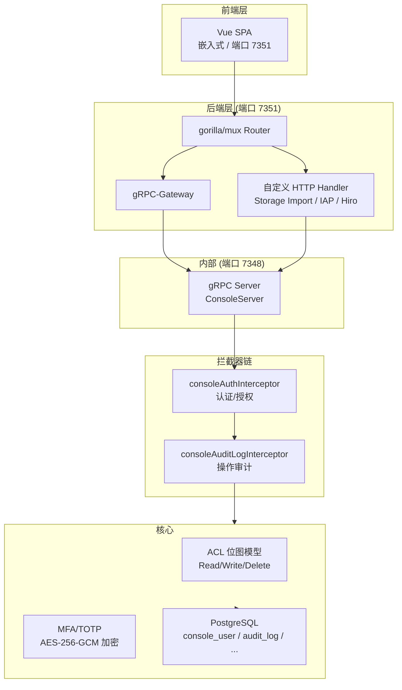
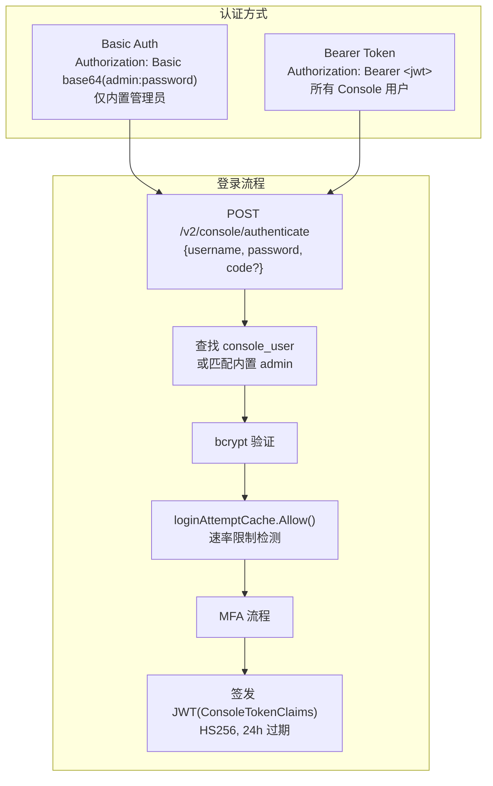
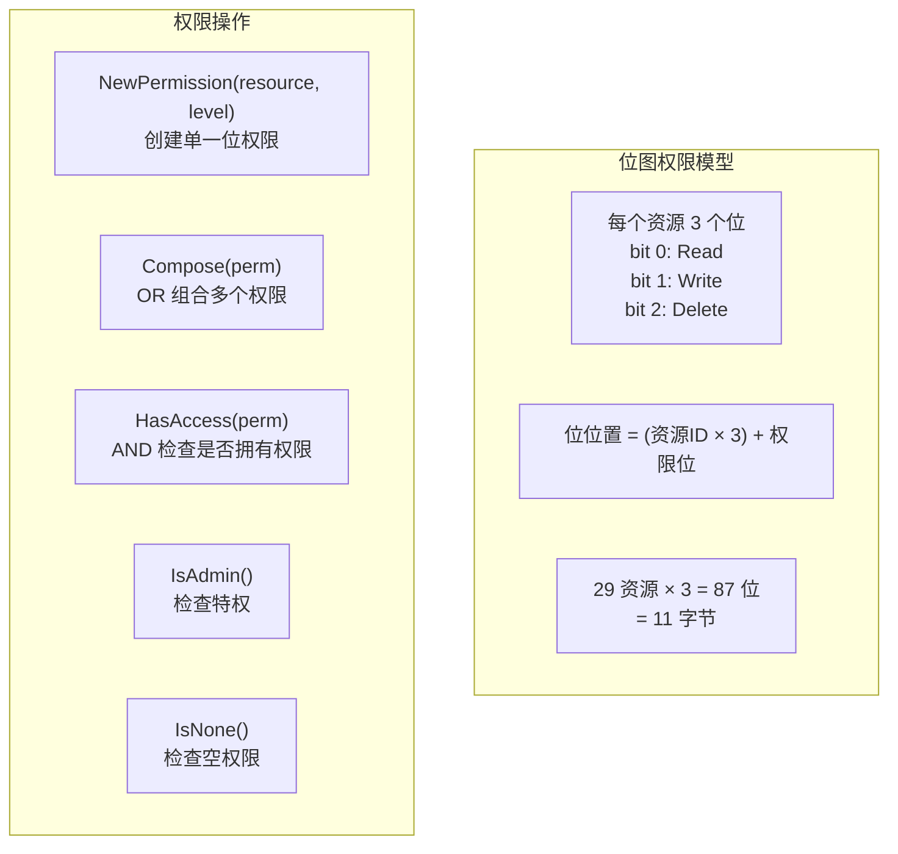
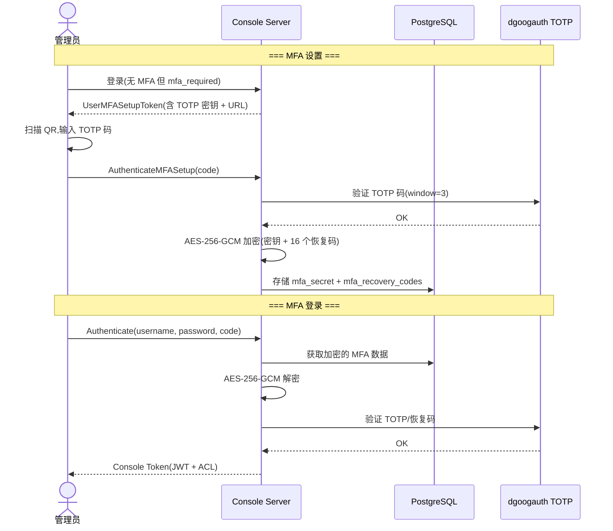

# Nakama 控制台设计文档

## 1. 概述

Nakama 控制台( Console )是一个基于 Web 的管理后台,运行在端口 7351,包含嵌入式 Vue SPA 前端、gRPC API 后端、ACL 权限管理、审计日志和 MFA 多因素认证。

### 1.1 控制台架构



---

## 2. 嵌入式 Vue SPA

### 2.1 嵌入机制

**文件:** `console/ui.go`

```go
//go:embed ui/dist/*
var embedFS embed.FS

var UIFS = &uiFS{}
var UI = http.FileServer(http.FS(UIFS))
```

前端资源通过 Go 的 `//go:embed` 指令编译进二进制,无需外部文件。

### 2.2 静态资源

| 路径 | 说明 | 缓存策略 |
|------|------|---------|
| `/` | `index.html`(注入 `nt` 模板变量) | `no-cache` |
| `/static/js/*` | 主 JS Bundle(带 hash) | `public, max-age=31536000, immutable` |
| `/static/css/*` | 主 CSS(带 hash) | 同上 |
| `/static/fonts/*` | 字体(Inter, Roboto Mono, Codicon) | 同上 |
| `/static/*.worker.js` | Monaco Editor Workers | 同上 |
| `/*` (fallback) | `index.html`(SPA 路由) | `no-cache` |

### 2.3 模板注入

`index.html` 中的 `{{nt}}` 占位符被替换为 `console.UIFS.Nt` 的布尔值,注入为:
```javascript
window.CONSOLE_CONFIG = { nt: "true/false" }
```

### 2.4 Gzip 支持

所有静态资源提供 `.gz` 预压缩版本,自动选用:
```go
if strings.HasSuffix(r.URL.Path, ".gz") { return }
// 如果客户端支持 gzip,返回 .gz 文件
```

---

## 3. 认证流程

### 3.1 双认证模式



### 3.2 ConsoleTokenClaims

```go
type ConsoleTokenClaims struct {
    ID        string `json:"id"`    // 用户 UUID
    Username  string `json:"usn"`
    Email     string `json:"ema"`
    Acl       string `json:"acl"`   // Base64(RawURL) ACL 位图
    ExpiresAt int64  `json:"exp"`
    Cookie    string `json:"cki"`   // 遥测 Cookie
}
```

### 3.3 内置管理员

- **用户名:** `console.username`(默认 `"admin"`)
- **密码:** `console.password`(默认 `"password"`)
- **ACL:** `acl.Admin()`(全部权限位 0xFF)
- **首次登录:** 自动写入 `console_user` 表(ID 为 `00000000-0000-0000-0000-000000000000`)
- **MFA:** 可通过 `mfa.admin_account_enabled` 启用

### 3.4 密码变更流程

1. `ResetUserPassword` → 生成随机临时密码,返回一次性 JWT
2. `AuthenticatePasswordChange` → 使用一次性 JWT,验证 `update_time` 时序防重放
3. bcrypt 哈希新密码,更新 `console_user`

---

## 4. ACL 权限模型

### 4.1 位图权限



### 4.2 资源列表(29 个)

| ID | 资源 | 说明 |
|----|------|------|
| 0 | ACCOUNT | 单个玩家账户 |
| 1 | ACCOUNT_WALLET | 钱包操作 |
| 2 | ACCOUNT_EXPORT | 账户导出 |
| 3 | ACCOUNT_FRIENDS | 好友管理 |
| 4 | ACCOUNT_GROUPS | 群组成员管理 |
| 5 | ACCOUNT_NOTES | 账户备注 |
| 6 | ACL_TEMPLATE | ACL 模板管理 |
| 7 | ALL_ACCOUNTS | 批量账户操作 |
| 8 | ALL_DATA | 全部数据删除 |
| 9 | ALL_STORAGE | 批量存储操作 |
| 10 | API_EXPLORER | API 浏览器 |
| 11 | AUDIT_LOG | 审计日志 |
| 12 | CONFIGURATION | 配置查看 |
| 13 | CHANNEL_MESSAGE | 频道消息管理 |
| 14 | USER | 控制台用户管理 |
| 15 | GROUP | 群组管理 |
| 16 | IN_APP_PURCHASE | 内购管理 |
| 17 | LEADERBOARD | 排行榜管理 |
| 18 | LEADERBOARD_RECORD | 排行榜记录管理 |
| 19 | MATCH | 比赛管理 |
| 20 | NOTIFICATION | 通知管理 |
| 21 | SATORI_MESSAGE | Satori 消息 |
| 22 | SETTINGS | 设置管理 |
| 23 | STORAGE_DATA | 存储数据 |
| 24 | STORAGE_DATA_IMPORT | 存储导入 |
| 25-29 | HIRO_* | Hiro 游戏服务 |

### 4.3 序列化格式

| 存储位置 | 格式 | 示例 |
|---------|------|------|
| 数据库(console_user.acl) | JSONB | `{"admin":true}` 或 `{"acl":{"ACCOUNT":{"read":true,...}}}` |
| JWT Token (ConsoleTokenClaims.Acl) | Base64(RawURL) | 原始位图字节 |
| API 传输 | JSON | `{"ACCOUNT":{"read":true,"write":false,"delete":false}}` |

### 4.4 端点权限映射

`CheckACL(path, permissions)` 覆盖所有 ~75 个 Console gRPC 端点:
- 只读端点 → `PermissionRead`
- 写入端点 → `PermissionWrite`
- 删除端点 → `PermissionDelete`
- 未知端点 → Admin only(安全兜底)

`CheckACLHttp(method, path, permissions)` 对应 HTTP 方法:
- `GET` → Read
- `POST/PUT/PATCH` → Write
- `DELETE` → Delete

---

## 5. MFA 多因素认证

### 5.1 MFA 架构



### 5.2 TOTP 参数

| 参数 | 值 | 说明 |
|------|-----|------|
| 算法 | HMAC-SHA1 | dgoogauth |
| 时间步长 | 30秒 | 标准 TOTP |
| 窗口大小 | 3 | 允许 ±90 秒时钟偏差 |
| 密钥长度 | 80位 | Base32 编码,无填充 |
| Issuer | "HeroicLabs" | 显示在认证器应用中 |
| 恢复码 | 16个 | 每个 8 位数字(10000000-99999999) |

### 5.3 加密存储

```
算法: AES-256-GCM
密钥: config.GetMFA().StorageEncryptionKey (恰好 32 字节)
加密对象: MFA 密钥 + 16 个恢复码
存储位置: console_user.mfa_secret (BYTEA)
         console_user.mfa_recovery_codes (BYTEA)
```

---

## 6. 审计日志

### 6.1 审计拦截器

`consoleAuditLogInterceptor` 在每次成功的 gRPC 调用后自动记录:

```go
type AuditLogEntry struct {
    ID               uuid.UUID
    CreateTime       time.Time
    ConsoleUserID    uuid.UUID
    ConsoleUsername  string
    Email            string
    Action           string   // CREATE, UPDATE, DELETE, INVOKE, IMPORT, EXPORT
    Resource         string   // ACCOUNT, GROUP, LEADERBOARD, ...
    Message          string   // 人类可读的操作描述
    Metadata         JSONB    // 请求 Proto 的 JSON 序列化
}
```

### 6.2 操作类型映射

| 操作类型 | 说明 | 示例 |
|---------|------|------|
| CREATE | 创建操作 | AddUser, AddAclTemplate, SendNotification |
| UPDATE | 更新操作 | UpdateAccount, BanAccount, WriteStorageObject |
| DELETE | 删除操作 | DeleteAccount, DeleteGroup, DeleteLeaderboard |
| INVOKE | 调用 | CallApiEndpoint, CallRpcEndpoint |
| IMPORT | 导入 | ImportAccount, ImportAccountFull, Storage Import |
| EXPORT | 导出 | ExportAccount, ExportGroup |

### 6.3 审计日志查询

`ListAuditLogs` 支持:
- **过滤:** username, resource, action, 时间范围(after/before)
- **分页:** 双向游标分页(1-100 条/页)
- **游标:** gob 编码的 keyset pagination

---

## 7. Console 用户管理

### 7.1 console_user 表

| 列 | 类型 | 说明 |
|----|------|------|
| id | UUID | 主键 |
| username | VARCHAR(128) | UNIQUE,3-20 字符 |
| email | VARCHAR(255) | UNIQUE,3-254 字符 |
| password | BYTEA | bcrypt 哈希,CHECK(length < 32000) |
| acl | JSONB | ACL 权限定义,v2025-09-26 替代 role |
| mfa_secret | BYTEA | MFA 密钥(AES-256-GCM 加密) |
| mfa_recovery_codes | BYTEA | MFA 恢复码(AES-256-GCM 加密) |
| mfa_required | BOOLEAN | 是否强制 MFA |
| metadata | JSONB | 元数据 |
| disable_time | TIMESTAMPTZ | 禁用时间(软删除) |
| create_time | TIMESTAMPTZ | 创建时间 |
| update_time | TIMESTAMPTZ | 更新时间 |

### 7.2 用户操作

| 操作 | 说明 |
|------|------|
| `AddUser` | 创建新用户,生成邀请 JWT 用于设置密码 |
| `UpdateUser` | 更新 ACL。不能修改自己的权限。授予的权限不能超出操作者的权限范围 |
| `DeleteUser` | 不能删除自己。删除记录并清除所有会话 |
| `GetUser` / `ListUsers` | 查询用户信息 |
| `ResetUserPassword` | 生成随机临时密码,返回一次性 JWT |
| `RequireUserMfa` | 设置 `mfa_required = true` |
| `ResetUserMfa` | 清除 MFA 机密和恢复码 |

### 7.3 权限传递约束

`UpdateUser` 时验证操作者权限:
```go
// 操作者必须拥有所授予的全部权限
if !creatorAcl.HasAccess(newAcl) {
    return PermissionDenied
}
// 用户不能修改自己的 ACL
if updatingSelf {
    return PermissionDenied
}
```

---

## 8. ACL 模板

### 8.1 console_acl_template 表

| 列 | 类型 | 说明 |
|----|------|------|
| id | UUID | 主键 |
| name | VARCHAR(64) | UNIQUE,模板名 |
| description | VARCHAR(64) | 描述 |
| acl | JSONB | ACL 权限定义 |
| create_time | TIMESTAMPTZ | 创建时间 |
| update_time | TIMESTAMPTZ | 更新时间 |

### 8.2 设计目的

- 预设权限组合,快速分配给管理员
- 例如: "Readonly Admin"(全读), "Developer"(读写,无删除), "Support"(账户查阅+钱包)
- 创建用户时可以引用模板,ACL 被展开为位图存储

---

## 9. 账户备注

### 9.1 users_notes 表

| 列 | 类型 | 说明 |
|----|------|------|
| id | UUID | UNIQUE |
| user_id | UUID | 关联用户,CASCADE |
| note | TEXT | 备注内容 |
| create_id | UUID | 创建者 Console User ID |
| update_id | UUID | 更新者 Console User ID |
| create_time | TIMESTAMPTZ | 创建时间 |
| update_time | TIMESTAMPTZ | 更新时间 |

### 9.2 操作

- `AddAccountNote(id, userID, note)` — upsert(id 为空时生成新 UUID)
- `ListAccountNotes(userID, limit, cursor)` — 游标分页,JOIN console_user 显示创建者/更新者用户名
- `DeleteAccountNote(noteID)` — 按 ID 删除

---

## 10. Console Settings

### 10.1 setting 表

| 列 | 类型 | 说明 |
|----|------|------|
| name | VARCHAR(64) | PRIMARY KEY,UNIQUE |
| value | JSONB | 设置值 |
| update_time | TIMESTAMPTZ | 更新时间 |

### 10.2 允许的设置

```go
var allowedSettings = []string{"utc_toggle"}
```

- **utc_toggle:** 控制 Console UI 时间显示格式(UTC 或本地时间)
- 设置名前缀校验防止未定义设置

---

## 11. API Explorer

Console 内置的 API 浏览器:

- `ListApiEndpoints` — 列出所有 API 端点(gRPC 方法反射)
- `CallApiEndpoint(method, body)` — 以 Console 用户身份调用任意 API 端点
- `CallRpcEndpoint(method, body)` — 以 Console 用户身份调用 RPC

实现使用 `rpcReflectCache` 缓存的 gRPC 服务描述符。

---

## 12. 自定义 HTTP Handler

### 12.1 Hiro 运行时处理器

Console 支持注册自定义 HTTP 端点(通过 Runtime):

| 路径前缀 | 说明 |
|---------|------|
| `/v2/console/hiro/inventory/{user_id}/*` | 库存管理(list/add/delete/update/codex) |
| `/v2/console/hiro/progression/{user_id}/*` | 进度管理(list/reset/unlock/update/purchase) |
| `/v2/console/hiro/economy/{user_id}` | 货币发放 |
| `/v2/console/hiro/stats/{user_id}/*` | 统计管理(list/update) |
| `/v2/console/hiro/energy/{user_id}/*` | 体力管理(grant) |

### 12.2 处理器包装链

```
customHttpMuxParamsFunc (提取路径变量)
  → customHttpAuditLogFunc (审计日志)
    → customHttpAuthFunc (Basic/Bearer 认证)
      → Handler
```

---

## 13. Console API 端点汇总

| 功能域 | 端点数量 | 包含 |
|--------|---------|------|
| 认证 | 4 | Authenticate / Logout / MFA Setup / Password Change |
| 管理员 CRUD | 8 | Add/Get/List/Update/Delete User, Reset Password/MFA/RequireMFA |
| ACL 模板 | 4 | Add/List/Update/Delete Template |
| 玩家账户 | 14 | Get/List/Update/Delete/Ban/Unban/Export/Import Accounts |
| 解绑 | 9 | Unlink × 9 种社交方式 |
| 账户备注 | 3 | Add/List/Delete Notes |
| 钱包 | 2 | Get/Delete Wallet Ledger |
| 群组 | 8 | List/Get/Update/Delete/Add/Members/Promote/Demote/Export |
| 存储 | 8 | List/Get/Write/Delete/Import Storage |
| 排行榜 | 5 | List/Get/Delete Leaderboard, List/Delete Records |
| 比赛 | 2 | List Matches, Get Match State |
| 通知 | 4 | Send/List/Get/Delete Notifications |
| IAP | 4 | List/Get Purchases, List/Get Subscriptions |
| 频道消息 | 2 | List/Delete Channel Messages |
| API Explorer | 3 | List Endpoints, Call API, Call RPC |
| 审计日志 | 2 | List Audit Logs, List Users |
| 设置 | 3 | Get/Update/List Settings |
| 系统 | 5 | Config, Runtime, Status, DeleteAllData, Extensions |
| Satori | 2 | List Templates, Send Direct Message |
