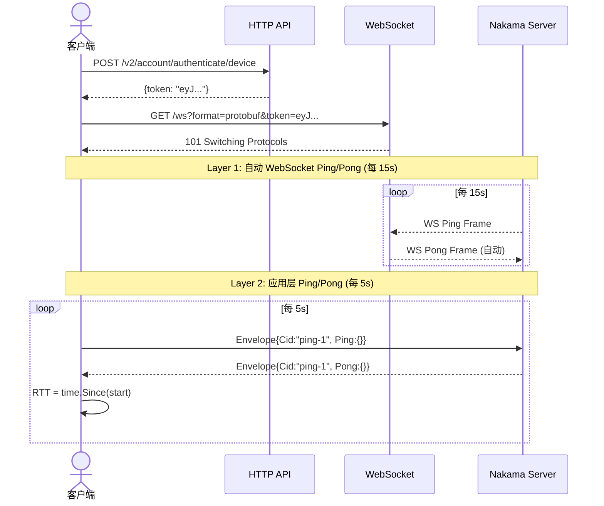
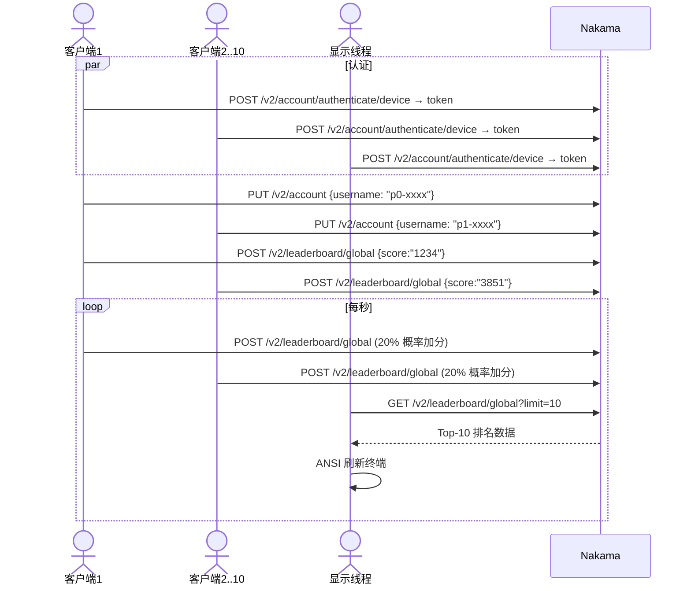
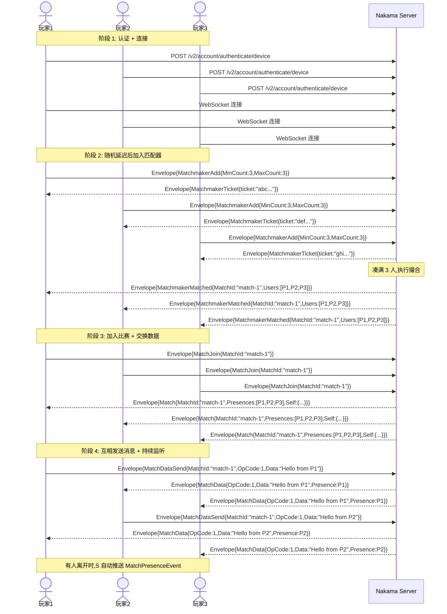
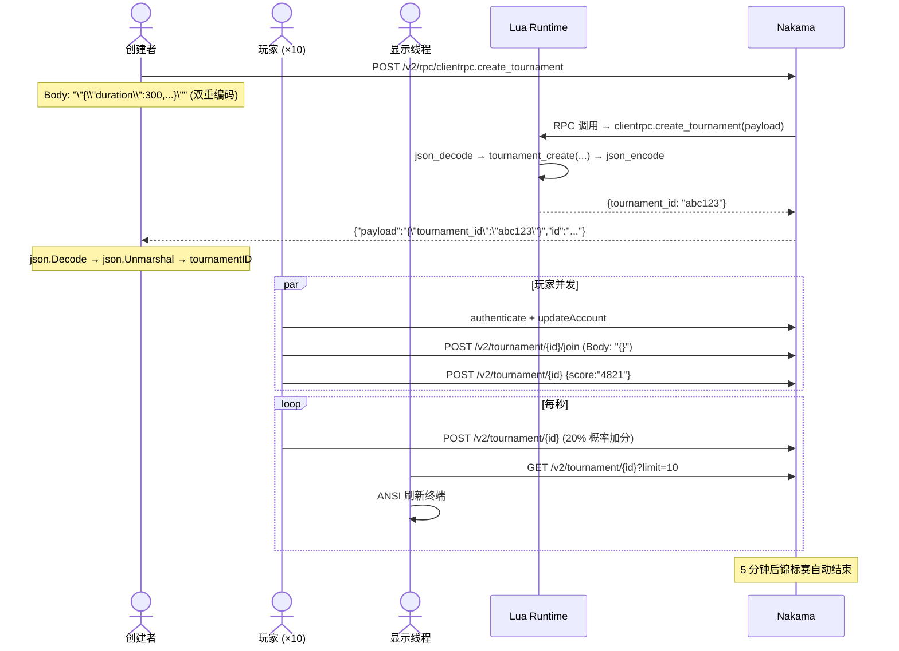
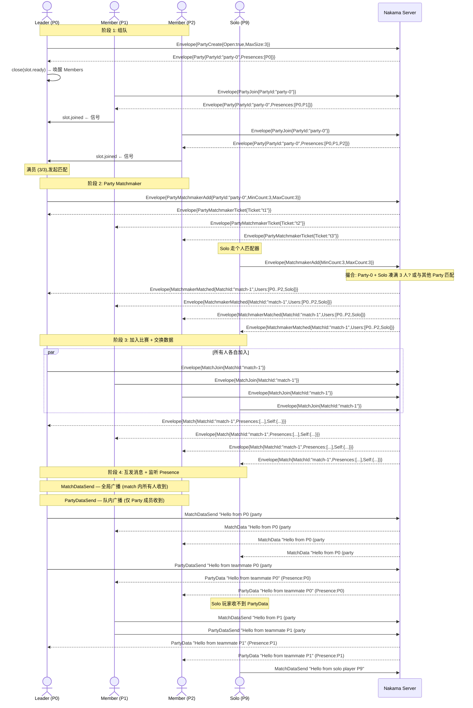

# Nakama 客户端示例文档

`examples/` 目录包含 5 个独立的 Go 客户端示例,演示如何通过 HTTP REST 和 WebSocket 协议调用 Nakama 的核心功能。每个示例是一个单文件 `main.go`,使用设备 ID 自动创建用户,无需手动注册。

示例按复杂度递增排列,建议按顺序阅读:

---

## 目录

1. [ping-pong — WebSocket 心跳示例](#1-ping-pong--websocket-心跳示例)
2. [leaderboard — 排行榜示例](#2-leaderboard--排行榜示例)
3. [matchmaker — 匹配器示例](#3-matchmaker--匹配器示例)
4. [tournament — 锦标赛示例](#4-tournament--锦标赛示例)
5. [party — 组队示例](#5-party--组队示例)
6. [共享模式详解](#6-共享模式详解)

---

## 1. ping-pong — WebSocket 心跳示例

**复杂度:** ★☆☆☆☆ (最简单)
**协议:** WebSocket (Protobuf)
**客户端数量:** 1
**依赖:** gorilla/websocket, nakama-common, protobuf
**前置条件:** 无

### 1.1 功能说明

演示 Nakama 的双层心跳系统,使用单个客户端测量与服务器之间的往返时间 (RTT)。

### 1.2 两层心跳机制

#### Layer 1: WebSocket 协议层心跳 (自动)

这是 WebSocket 协议 (RFC 6455) 内置的 Ping/Pong 帧机制,由 **gorilla/websocket 库自动处理**:

- **服务端** 每隔 `PingPeriodMs`(默认 15s) 发送一个 WebSocket Ping 控制帧
- **客户端 gorilla 库** 自动回复 WebSocket Pong 控制帧,无需任何应用层代码
- 如果服务端在 `PongWaitMs`(默认 25s) 内未收到 Pong,会关闭连接

这一层的作用是**检测死连接**:如果客户端崩溃或网络中断,服务端能及时发现并清理连接。示例代码中完全看不到这一层的处理,因为它是全自动的。

#### Layer 2: 应用层心跳 (显式)

这是 Nakama 自定义的 Envelope 级别 Ping/Pong,需要客户端显式发送和接收:

- **客户端** 每 5 秒发送 `Envelope_Ping` 消息,带一个唯一的 `cid`(correlation ID)
- **服务端** 收到后立即回复 `Envelope_Pong`,回传相同的 `cid`
- **客户端** 根据 `cid` 匹配请求-响应对,计算 RTT

这一层的作用是**测量应用层往返时间**,不受底层 WebSocket Ping/Pong 自动响应的影响。

### 1.3 整体架构

```
main()
  ├── authenticate()           → HTTP POST 设备认证,获取 session token
  ├── connectWS()              → WebSocket 连接,?format=protobuf&token=...
  ├── go pingSender()          → 协程:每 5s 发送 Envelope_Ping
  └── readLoop()               → 主协程:读取消息,匹配 Envelope_Pong
```

### 1.4 关键数据结构

```go
// pending 映射:关联 ID → 接收 RTT 的 channel
// 由 sync.Mutex 保护并发访问
var mu sync.Mutex
pending := make(map[string]chan time.Duration)
```

### 1.5 pingSender — 发送心跳

`pingSender` 运行在独立协程中,每 5 秒执行一次:

```
1. seq++ 生成序号
2. cid = "ping-{seq}"                          // 唯一关联 ID
3. 创建 ch = make(chan time.Duration, 1)       // 用于接收 RTT
4. mu.Lock(); pending[cid] = ch; mu.Unlock()    // 注册等待
5. proto.Marshal(Envelope{Cid: cid, Message: Ping{}})
6. conn.WriteMessage(BinaryMessage, data)       // 发送
7. select {
     case <-time.After(10s):  → 记录超时
     case rtt := <-ch:        → 记录 RTT
   }
8. mu.Lock(); delete(pending, cid); mu.Unlock() // 清理
```

关键点:
- `cid` 字段是匹配请求和响应的唯一标识,设置在 `Envelope.Cid` 而非内层消息中
- channel 容量为 1,防止 pong 到达时无接收者阻塞
- 10 秒超时后记录日志,不会阻塞后续 ping

### 1.6 readLoop — 接收消息

```go
for {
    _, raw, _ := conn.ReadMessage()        // 阻塞读取 WebSocket 消息
    var env rtapi.Envelope
    proto.Unmarshal(raw, &env)             // Protobuf 解码

    switch env.Message.(type) {
    case *rtapi.Envelope_Pong:
        // 根据 cid 查找对应的 pending channel
        mu.Lock()
        ch, ok := pending[env.Cid]
        mu.Unlock()
        if ok {
            ch <- 0  // 通知 pingSender
        }

    case *rtapi.Envelope_StatusPresenceEvent:
        // WebSocket 连接建立后服务端推送的初始状态同步,忽略
    }
}
```

### 1.7 运行

```bash
go run ./examples/ping-pong/
```

预期输出:
```
Device ID: xxxxxxxxxxxxxx
Token obtained: eyJ...
WebSocket connected (protobuf format)
Status presence received (initial sync)
seq=1 RTT=2.345ms (sent at 15:04:05.000)
seq=2 RTT=1.891ms (sent at 15:04:10.000)
...
```

### 1.8 完整消息流



---

## 2. leaderboard — 排行榜示例

**复杂度:** ★★☆☆☆
**协议:** HTTP REST
**客户端数量:** 10
**依赖:** 无 (仅标准库)
**前置条件:** `data/modules/leaderboard.lua` 在运行时路径

### 2.1 功能说明

启动 10 个模拟客户端,每个客户端:
1. 设备认证 → 更新用户名
2. 提交初始随机分数 (0-5000)
3. 每秒约 20% 概率增加分数 (0-200)

独立显示线程每秒轮询排行榜并终端实时刷新 Top-10 排名。

### 2.2 前置条件

```bash
# leaderboard.lua 在服务器启动时通过 nk.run_once("init") 自动创建 "global" 排行榜
cp data/modules/leaderboard.lua data/modules/
```

### 2.3 整体架构

```
main()
  ├── displayToken = authenticate()                → 显示线程用的认证 token
  │
  ├── [10 个协程并发] runClient()
  │     ├── deviceID = genDeviceID()                → 随机设备 ID
  │     ├── token = authenticate(deviceID)          → 设备认证
  │     ├── updateAccount(token, username)          → 设置用户名
  │     ├── submitScore(token, score)               → 提交初始分数
  │     └── loop (每秒):
  │           └── ~20% 概率: score += 0~200, submitScore()
  │
  └── [显示循环]
        └── loop (每秒):
              ├── fetchLeaderboard(displayToken)    → GET 获取 Top-10
              └── printLeaderboard(list)            → ANSI 刷新终端
```

### 2.4 关键代码路径

#### 认证

```go
// POST /v2/account/authenticate/device
// Header: Authorization: Basic base64(defaultkey:)
// Body: {"id": "<device_id>"}
// 返回: {"token": "eyJ..."}
func authenticate(deviceID string) (string, error)
```

认证端点使用 HTTP Basic Auth (Server Key),不需要 JWT token。成功后返回的 token 用于后续请求的 `Authorization: Bearer <token>` 头。

#### 更新用户名

```go
// PUT /v2/account
// Header: Authorization: Bearer <token>
// Body: {"username": "p3-xxxx"}
func updateAccount(token, username string) error
```

#### 提交分数

```go
// POST /v2/leaderboard/{leaderboard_id}
// Header: Authorization: Bearer <token>
// Body: {"score": "1234", "subscore": "0"}
func submitScore(token string, score int64) error
```

**关键点:** gRPC-Gateway 使用 proto3 JSON 映射,`int64` 字段在线路上序列化为**字符串**。虽然 protojson 也接受数字,但字符串是规范格式。构建请求体时使用 `fmt.Sprintf("%d", score)` 将分数转为字符串。

#### 查询排行榜

```go
// GET /v2/leaderboard/{leaderboard_id}?limit=10
// Header: Authorization: Bearer <token>
// 返回: {"records": [{"rank":"1","username":"p3-xxxx","score":"4821",...}, ...]}
func fetchLeaderboard(token string) *leaderboardRecordList
```

响应结构体使用 `json:",string"` 标签解码字符串形式的 int64:

```go
type leaderboardRecord struct {
    Score int64 `json:"score,string"`
    Rank  int64 `json:"rank,string"`
    // ...
}
```

#### 终端显示

```go
func printLeaderboard(list *leaderboardRecordList)
```

使用 ANSI 转义序列实现无闪烁实时刷新:

| 序列 | 含义 |
|------|------|
| `\033[H` | 光标移动到屏幕左上角 |
| `\033[2K` | 清除当前行 |
| `\033[J` | 清除光标到屏幕末尾 |

刷新流程:
1. 移动光标到左上角(不清屏,避免闪烁)
2. 逐行打印新数据,每行先 `\033[2K` 清除旧内容
3. 最后 `\033[J` 清除剩余行(如果排行榜缩短了)

### 2.5 运行

```bash
go run ./examples/leaderboard/
```

预期输出(终端实时刷新):
```
=== LEADERBOARD === (Ctrl+C to quit)

RANK   PLAYER              SCORE
------ ------------     ----------
1      p7-abcd               4821
2      p3-abcd               3754
3      p1-abcd               2901
...
```

### 2.6 完整消息流



---

## 3. matchmaker — 匹配器示例

**复杂度:** ★★★☆☆
**协议:** WebSocket (Protobuf)
**客户端数量:** 10
**依赖:** gorilla/websocket, nakama-common, protobuf
**前置条件:** 无

### 3.1 功能说明

10 个玩家通过 WebSocket 连接到 Nakama:
1. 随机延迟后加入匹配器 (matchmaker),声明需要 3 人一组 (`MinCount=3, MaxCount=3`)
2. 服务端 matchmaker 凑满 3 人后匹配成功,推送 `MatchmakerMatched` 消息
3. 玩家加入比赛 (match),互相发送 hello 消息
4. 持续监听比赛中的数据和人员变动事件

### 3.2 "满三人开赛"的完整逻辑

"满三人开赛"由**客户端声明条件,服务端执行撮合**两部分协作完成:

#### 第 1 步: 客户端声明匹配条件

```go
func sendMatchmakerAdd(conn *websocket.Conn, tag string) {
    env := &rtapi.Envelope{
        Message: &rtapi.Envelope_MatchmakerAdd{
            MatchmakerAdd: &rtapi.MatchmakerAdd{
                MinCount: 3,  // 最少 3 人
                MaxCount: 3,  // 最多 3 人 (等于 MinCount = 精确匹配)
                Query:    "", // 无额外筛选条件
            },
        },
    }
    data, _ := proto.Marshal(env)
    conn.WriteMessage(websocket.BinaryMessage, data)
}
```

`MinCount=3, MaxCount=3, Query=""` 的含义是:
- 我需要和另外 2 个人一起游戏 (总共 3 人)
- 不接受 2 人或 4 人的匹配
- 对匹配对象没有额外筛选条件 (Query 为空)

#### 第 2 步: 服务端撮合

服务端 matchmaker 维护一个匹配池。每当有新玩家加入:
1. 检查池中是否有其他玩家的条件可以与之匹配
2. 当池中凑满 3 个 `MinCount=3, MaxCount=3` 且 Query 兼容的玩家时
3. 将这 3 人撮合到一起,向每人推送 `MatchmakerMatched` 消息

#### 第 3 步: 客户端收到匹配结果

```go
// MatchmakerMatched 包含两种可能的标识:
switch id := matched.Id.(type) {
case *rtapi.MatchmakerMatched_MatchId:
    matchID = id.MatchId     // 服务端直接分配的 match ID
case *rtapi.MatchmakerMatched_Token:
    joinToken = id.Token     // 用于加入已存在 match 的 token
}
```

- `MatchId`: 服务端在撮合时直接创建了一个新的 match,并分配了 ID
- `Token`: 服务端返回一个 join token,客户端需要用这个 token 加入已存在的 match

#### 第 4 步: 加入比赛

```go
func sendMatchJoin(conn *websocket.Conn, tag, matchID, token string) {
    join := &rtapi.MatchJoin{}
    if matchID != "" {
        join.Id = &rtapi.MatchJoin_MatchId{MatchId: matchID}
    } else {
        join.Id = &rtapi.MatchJoin_Token{Token: token}
    }
    env := &rtapi.Envelope{
        Message: &rtapi.Envelope_MatchJoin{MatchJoin: join},
    }
    // ...
}
```

服务端确认后返回 `Match` 消息,包含 match ID、当前在场玩家列表和自己在其中的索引。

### 3.3 玩家互动 — 消息交换机制

进入比赛后,玩家通过两种机制互动:

#### 机制 1: MatchDataSend — 发送自定义数据

```go
func sendMatchData(conn *websocket.Conn, matchID string, opCode int64, payload []byte) {
    env := &rtapi.Envelope{
        Message: &rtapi.Envelope_MatchDataSend{
            MatchDataSend: &rtapi.MatchDataSend{
                MatchId: matchID,  // 比赛 ID
                OpCode:  opCode,   // 操作码,用于区分消息类型
                Data:    payload,  // 任意字节负载
            },
        },
    }
    // ...
}
```

参数说明:
- `MatchId`: 目标比赛 ID,服务端根据此 ID 确定广播范围
- `OpCode`: 操作码 (int64),由应用层自定义。例如 1=聊天, 2=游戏操作, 3=系统消息
- `Data`: 任意二进制数据 ([]byte),可以编码 JSON、Protobuf 或自定义格式

**注意:** `MatchDataSend` 是**广播**消息。客户端发送后,服务端将该消息转发给同一 match 内的**所有其他玩家**(不包括发送者自己)。如果需要在服务端进行权威处理(验证、修改后再广播),需要使用 authoritative match handler。

#### 机制 2: MatchPresenceEvent — 人员变动通知

服务端自动推送,无需客户端主动请求:

```go
case p := <-ev.presence:
    // p.Joins:  新加入的玩家列表
    // p.Leaves: 离开的玩家列表
    for _, j := range p.Joins {
        // j.Username, j.UserId, j.SessionId, j.Node
    }
```

当有人加入或离开 match 时,服务端向 match 内所有玩家广播 `MatchPresenceEvent`。

### 3.4 事件驱动的协程模型

matchmaker 示例引入了 **读协程分离** 和 **事件频道化** 的设计模式:

```go
type playerEvents struct {
    ticket   chan string                      // 容量 1 (一次性事件)
    matched  chan *rtapi.MatchmakerMatched    // 容量 1 (一次性事件)
    match    chan *rtapi.Match                // 容量 1 (一次性事件)
    data     chan *rtapi.MatchData            // 容量 5 (持续事件)
    presence chan *rtapi.MatchPresenceEvent   // 容量 5 (持续事件)
}
```

channel 容量的设计考量:
- `ticket`, `matched`, `match` 容量为 1: 这些事件在完整生命周期中只发生一次
- `data`, `presence` 容量为 5: 这些事件持续发生,缓冲避免读协程被短暂阻塞

#### 读协程 (readLoop)

```go
go readLoop(ctx, conn, tag, ev)
```

`readLoop` 在一个独立协程中持续阻塞读取 WebSocket 消息,解析 Envelope,根据消息类型将事件写入对应的 channel:

```
WebSocket Frame → proto.Unmarshal → Envelope → type switch → 写入对应 channel
                                                                  │
                                              ┌────────────────────┤
                                              │                    │
                                        Envelope_MatchmakerTicket → ev.ticket
                                        Envelope_MatchmakerMatched → ev.matched
                                        Envelope_Match → ev.match
                                        Envelope_MatchData → ev.data
                                        Envelope_MatchPresenceEvent → ev.presence
```

这种设计的优点:
- 读协程不关心业务逻辑,只负责 protobuf 解码和事件分发
- 主逻辑通过 `select` 语句线性等待事件,代码清晰如状态机
- 持续事件使用带缓冲 channel,读协程不会因消费慢而阻塞

#### 主逻辑的状态机

```go
// 阶段 1: 等待匹配器票据
select {
case <-ctx.Done():  return
case ticket = <-ev.ticket:
}

// 阶段 2: 等待匹配成功
select {
case <-ctx.Done():  return
case matched = <-ev.matched:
}

// 阶段 3: 加入比赛
sendMatchJoin(conn, tag, matchID, joinToken)
select {
case <-ctx.Done():  return
case m := <-ev.match:
}

// 阶段 4: 发送消息 + 持续监听
sendMatchData(conn, matchID, 1, []byte(msg))
for {
    select {
    case <-ctx.Done():  return
    case d := <-ev.data:      // 处理收到的数据
    case p := <-ev.presence:  // 处理人员变动
    }
}
```

### 3.5 随机延迟的目的

```go
delay := time.Duration(mathrand.Int64N(int64(maxWait)))  // 0~10s
```

每个玩家在加入匹配器前随机等待 0-10 秒。这是为了**错峰**,让玩家不是同时进入匹配池,从而:
- 模拟真实场景中玩家陆续进入的行为
- 有助于演示不同批次的匹配分组 (前 3 个到的人先成组)

### 3.6 完整消息流



### 3.7 MatchDataSend 的广播语义

服务端收到 `MatchDataSend` 后的转发规则:
- **不发送给** 发送者自己
- **发送给** 同一 match 内所有其他玩家
- 如果使用 **authoritative match** (服务端权威模式),消息会先发送到 match handler,Lua/JS/Go 代码可以验证、修改或拦截消息后再广播
- 如果没有 authoritative match handler (relayed match),服务端直接转发,不做任何处理

### 3.8 运行

```bash
go run ./examples/matchmaker/
```

预期输出:
```
[Player 3] waiting 2.1s before matchmaker
[Player 7] waiting 3.4s before matchmaker
[Player 1] waiting 5.9s before matchmaker
...
[Player 3] joined matchmaker (min=3 max=3)
[Player 3] got ticket abc123def456
[Player 7] joined matchmaker (min=3 max=3)
[Player 7] got ticket def789ghi012
[Player 1] joined matchmaker (min=3 max=3)
[Player 1] got ticket ghi345jkl678
...
[Player 3] matched! match_id=match-1 users=3
[Player 7] matched! match_id=match-1 users=3
[Player 1] matched! match_id=match-1 users=3
...
[Player 3] entered match match-1 (size=3)
[Player 1] got data from p7 (op=1): Hello from player 7!
[Player 7] got data from p1 (op=1): Hello from player 1!
```

---

## 4. tournament — 锦标赛示例

**复杂度:** ★★★★☆
**协议:** HTTP REST
**客户端数量:** 1 (创建者) + 10 (玩家) + 1 (显示线程) = 12
**依赖:** 无 (仅标准库)
**前置条件:** `data/modules/tournament.lua` 在运行时路径

### 4.1 功能说明

在 leaderboard 示例的基础上增加了:
1. 通过 **RPC 调用** 动态创建锦标赛 (而非依赖服务器启动时的静态配置)
2. 锦标赛有**时间限制** (5 分钟),结束后自动停止接受分数
3. 玩家需要先**加入** (join) 锦标赛才能提交分数
4. 引入 **RPC 双重编解码** — 这是所有示例中序列化最复杂的模式

### 4.2 前置条件

```bash
# tournament.lua 注册了 clientrpc.create_tournament RPC 函数
cp data/modules/tournament.lua data/modules/
```

`tournament.lua` 的关键代码:

```lua
local nk = require("nakama")

-- 注册 RPC 函数,可从客户端通过 /v2/rpc/clientrpc.create_tournament 调用
nk.register_rpc(function(context, payload)
    local args = nk.json_decode(payload)  -- payload 是 JSON 字符串
    local id = nk.tournament_create(args.title, args.description, ...)
    return nk.json_encode({tournament_id = id})
end, "clientrpc.create_tournament")
```

### 4.3 整体架构

```
main()
  ├── creatorToken = authenticate()
  ├── tournamentID = createTournament(creatorToken)  → RPC 双重编码创建锦标赛
  │
  ├── [10 个协程并发] runClient()
  │     ├── authenticate() + updateAccount()       → 认证 + 设置用户名
  │     ├── joinTournament(token, tournamentID)    → 加入锦标赛
  │     ├── submitTournamentScore(token, id, score)→ 提交初始分数
  │     └── loop (每秒): ~20% 概率加分
  │
  └── [显示循环] fetchTournamentRecords() + printLeaderboard()
```

### 4.4 锦标赛 vs 排行榜的关键区别

| 特性 | 排行榜 | 锦标赛 |
|------|--------|--------|
| 生命周期 | 持久存在 | 有开始/结束时间 |
| 加入方式 | 提交分数即参与 | 需要显式 join |
| 创建方式 | Lua `nk.run_once` 或管理 API | RPC + `nk.tournament_create()` |
| 分数重置 | 通过 reset_schedule 配置 | 自然结束,可创建新一轮 |
| join_required | 可选 | 可设为 true (本示例) |

### 4.5 RPC 双重编解码详解

这是 tournament 示例最核心也最复杂的技术点:

#### 请求编码

```
Go 代码 (客户端):
  argsJSON  = json.Marshal({authoritative, sort_order, duration, ...})
            → {"authoritative":false,"sort_order":"desc","duration":300,...}

  payload   = json.Marshal(string(argsJSON))
            → "\"{\\\"authoritative\\\":false,\\\"duration\\\":300,...}\""

HTTP 请求:
  POST /v2/rpc/clientrpc.create_tournament
  Body: "\"{\\"authoritative\\":false,\\"duration\\":300,...}\""
        ↑ 这是一个 JSON 字符串,不是 JSON 对象

为什么需要双重编码:
  gRPC-Gateway 将 HTTP body 映射到 Rpc 消息的 "payload" 字段 (body: "payload")
  Rpc.payload 的类型是 string
  所以 HTTP body 必须是 JSON 字符串格式
```

#### 请求在服务端的解码过程

```
1. gRPC-Gateway: HTTP Body → Rpc.payload (string)
   结果: Rpc.payload = "{\"authoritative\":false,\"duration\":300,...}"

2. Runtime 路由: 根据 RPC ID "clientrpc.create_tournament" 找到注册的函数

3. Lua 函数接收: payload 参数 = "{\"authoritative\":false,\"duration\":300,...}"
   nk.json_decode(payload) → {authoritative=false, duration=300, ...}
```

#### 响应编码

```
服务端 (Lua):
  nk.json_encode({tournament_id="abc123"})
  → "{\"tournament_id\":\"abc123\"}"

gRPC-Gateway:
  Rpc 响应 → {payload: "{\"tournament_id\":\"abc123\"}", id: "..."}

HTTP 响应 Body:
  {"payload":"{\"tournament_id\":\"abc123\"}","id":"..."}

客户端解码:
  json.Decode(body) → rpcResp  {Payload: "{\"tournament_id\":\"abc123\"}", Id: "..."}
  json.Unmarshal(rpcResp.Payload) → createResp  {TournamentID: "abc123"}
```

#### 代码实现

```go
func createTournament(token string) (string, error) {
    // 第一步:构建业务参数 → JSON 对象
    argsJSON, _ := json.Marshal(map[string]any{
        "authoritative":  false,
        "sort_order":     "desc",
        "operator":       "best",
        "duration":       300,
        "title":          "5-Minute Tournament",
        "join_required":  true,
        // ...
    })

    // 第二步:将 JSON 对象包装为 JSON 字符串 (双重编码)
    payload, _ := json.Marshal(string(argsJSON))

    // 发送
    req, _ := http.NewRequest("POST",
        "/v2/rpc/clientrpc.create_tournament",
        bytes.NewReader(payload))
    // ...

    // 第三步:解析响应 — 第一层解码
    var rpcResp struct {
        Id      string `json:"id"`
        Payload string `json:"payload"`
    }
    json.NewDecoder(resp.Body).Decode(&rpcResp)

    // 第四步:解析 Payload — 第二层解码
    var createResp struct {
        TournamentID string `json:"tournament_id"`
    }
    json.Unmarshal([]byte(rpcResp.Payload), &createResp)

    return createResp.TournamentID, nil
}
```

### 4.6 错误写法对比

```go
// ❌ 错误:直接将 JSON 对象作为 body
payload, _ := json.Marshal(map[string]any{"duration": 300, ...})
// Body: {"duration":300,...}
// 服务端报错: "cannot unmarshal object into Go value of type string"

// ✅ 正确:双重编码
argsJSON, _ := json.Marshal(map[string]any{"duration": 300, ...})
payload, _ := json.Marshal(string(argsJSON))
// Body: "\"{\\"duration\\":300,...}\""
```

### 4.7 其他 API 调用

#### 加入锦标赛

```go
func joinTournament(token, tournamentID string) error {
    // POST /v2/tournament/{id}/join
    // Body: {}  (空 JSON 对象,join 端点不需要额外参数)
    req, _ := http.NewRequest("POST", url, bytes.NewReader([]byte("{}")))
    // ...
}
```

#### 提交分数

```go
func submitTournamentScore(token, tournamentID string, score int64) error {
    // POST /v2/tournament/{id}
    // Body: {"score": "1234", "subscore": "0"}
    // 和 leaderboard 一样,int64 编码为字符串
    payload, _ := json.Marshal(map[string]any{
        "score":    fmt.Sprintf("%d", score),
        "subscore": "0",
    })
    // ...
}
```

#### 查询排名

```go
func fetchTournamentRecords(token, tournamentID string) *tournamentRecordList {
    // GET /v2/tournament/{id}?limit=10
    // 响应格式和 leaderboard 相同
}
```

### 4.8 运行

```bash
go run ./examples/tournament/
```

预期输出(终端实时刷新):
```
Tournament created: abc123-def456 (duration: 5m0s)
[p2-abcd] Joined tournament
[p2-abcd] Initial score: 2941
[p7-abcd] Joined tournament
[p7-abcd] Initial score: 4721
...

=== TOURNAMENT LEADERBOARD ===  elapsed: 2m30s  (Ctrl+C to quit)

RANK   PLAYER              SCORE
------ ------------     ----------
1      p7-abcd               5042
2      p3-abcd               4821
3      p1-abcd               3754
...

[5分钟后]
*** TOURNAMENT HAS ENDED — final standings below ***
```

### 4.9 完整消息流



---

## 5. party — 组队示例

**复杂度:** ★★★★★ (最复杂)
**协议:** WebSocket (Protobuf)
**客户端数量:** 10
**依赖:** gorilla/websocket, nakama-common, protobuf
**前置条件:** 无

### 5.1 功能说明

在所有示例中 party 是最复杂的,它综合了:
- **组队 (Party):** 玩家组成固定队伍,Leader 创建 Party,Members 加入
- **Coordinator 模式:** 应用层协调者分配角色和队伍
- **Party Matchmaker:** 以队伍为单位进行匹配,而非个人
- **Match 交互:** 匹配成功后加入比赛并交换数据
- **Solo 回退:** 无法凑成完整队伍的玩家通过个人匹配器加入

### 5.2 整体架构

```
main()
  └── [10 个协程并发] runPlayer()
        ├── authenticate() + connectWS()
        ├── go readLoop()                     → 读协程
        ├── 随机延迟 0~15s
        ├── coord.assign()                    → Coordinator 分配角色
        │
        ├── [roleCreate] runPartyLeader()
        │     ├── sendPartyCreate()           → 创建 Party
        │     ├── close(slot.ready)           → 通知 Members
        │     ├── 等待所有 Members 加入 (slot.joined)
        │     ├── sendPartyMatchmakerAdd()    → 以 Party 为单位匹配
        │     └── waitForMatch()              → 等匹配 + 加入比赛 + 数据交换
        │
        ├── [roleJoin] runPartyMember()
        │     ├── 等待 slot.ready             → 等 Leader 创建完成
        │     ├── sendPartyJoin()             → 加入 Party
        │     ├── slot.joined <- struct{}{}   → 通知 Leader
        │     └── waitForMatch()
        │
        └── [roleSolo] runSolo()
              ├── sendMatchmakerAdd()          → 个人匹配器
              └── 等待匹配 + 加入比赛 + 数据交换
```

### 5.3 Coordinator — 角色分配器

Coordinator 是应用层的同步协调者,负责将 10 个玩家分配到 3 人一组并为每组指定 Leader:

```go
type coordinator struct {
    mu    sync.Mutex
    seq   int              // 全局递增序号
    slots []*partySlot     // 每队一个 slot
}

func (c *coordinator) assign() (slot *partySlot, r role, partyNum int) {
    c.mu.Lock()
    defer c.mu.Unlock()

    n := c.seq
    c.seq++

    pn := n / partySize     // 队伍编号: 0, 0, 0, 1, 1, 1, 2, 2, 2
    pos := n % partySize    // 队内位置: 0(Leader), 1(Member), 2(Member)

    // 最后不满 3 人的玩家走 solo
    if n >= numPlayers - numPlayers%partySize {
        return nil, roleSolo, 0
    }

    // pos==0 的是 Leader,其余是 Member
    if pos == 0 {
        return c.slots[pn], roleCreate, pn
    }
    return c.slots[pn], roleJoin, pn
}
```

分配结果 (10 个玩家,partySize=3):
```
seq=0 → slot[0], roleCreate, partyNum=0   ← Leader of party 0
seq=1 → slot[0], roleJoin,   partyNum=0   ← Member of party 0
seq=2 → slot[0], roleJoin,   partyNum=0   ← Member of party 0
seq=3 → slot[1], roleCreate, partyNum=1   ← Leader of party 1
seq=4 → slot[1], roleJoin,   partyNum=1
seq=5 → slot[1], roleJoin,   partyNum=1
seq=6 → slot[2], roleCreate, partyNum=2   ← Leader of party 2
seq=7 → slot[2], roleJoin,   partyNum=2
seq=8 → slot[2], roleJoin,   partyNum=2
seq=9 → nil,      roleSolo,   partyNum=0   ← 剩余 1 人走 solo
```

### 5.4 PartySlot — 队内同步机制

```go
type partySlot struct {
    mu      sync.Mutex
    partyID string
    ready   chan struct{}    // Leader 关闭此通道通知 Members
    joined  chan struct{}    // Members 加入后向此通道发信号
}
```

两个 channel 实现了 Leader 和 Members 之间的同步:

#### ready channel (Leader → Members)

```
Leader:                                  Members:
  sendPartyCreate()                        <-slot.ready  (阻塞等待)
  收到 Party 响应
  slot.partyID = partyID
  close(slot.ready) ────────────────►     读取 slot.partyID
                                           sendPartyJoin(partyID)
```

`ready` 是一个 `chan struct{}`,Leader 创建 Party 成功后 `close(slot.ready)`。由于关闭的 channel 对所有等待者立即可读,所有 Member 同时被唤醒。**使用 `close` 而非 `send`** 的好处是一个 close 可以唤醒多个等待者。

#### joined channel (Members → Leader)

```
Members:                                 Leader:
  sendPartyJoin()                          等待所有 Members
  收到 Party 响应                           for range partySize-1 {
  slot.joined <- struct{}{} ────────►        <-slot.joined
                                            }
                                          全员到齐,开始匹配
```

`joined` 是一个容量为 `partySize` 的缓冲 channel。每个 Member (以及 Leader 自己)加入后发送一个信号。Leader 收集齐 partySize 个信号后发起 Party Matchmaker。

### 5.5 Party Matchmaker — 以队伍为单位匹配

```go
func sendPartyMatchmakerAdd(conn *websocket.Conn, partyID string) {
    env := &rtapi.Envelope{
        Message: &rtapi.Envelope_PartyMatchmakerAdd{
            PartyMatchmakerAdd: &rtapi.PartyMatchmakerAdd{
                PartyId:  partyID,
                MinCount: 3,   // 需要对手队伍的最少人数
                MaxCount: 3,   // 需要对手队伍的最多人数
                Query:    "*", // 匹配任意队伍
            },
        },
    }
    // ...
}
```

与个人匹配器的关键区别:
- **个人匹配器 (`MatchmakerAdd`):** 将 N 个独立的玩家撮合到一起
- **组队匹配器 (`PartyMatchmakerAdd`):** 将已经成型的 Party 视为一个整体参与匹配。服务端保证同一 Party 的所有成员被匹配到同一比赛中

当 Party Matchmaker 匹配成功时:
- Party 的**所有成员**都会收到 `MatchmakerMatched` 消息
- 每个成员需要**各自调用** `MatchJoin` 加入比赛 (不是只 Leader 加入)

### 5.6 Solo 回退机制

当玩家总数不能被 partySize 整除时,剩余玩家通过个人匹配器作为 solo 玩家参与:

```go
func runSolo(ctx context.Context, conn *websocket.Conn, tag string, ev *playerEvents) {
    sendMatchmakerAdd(conn)  // 个人匹配器,而非 Party Matchmaker

    // 等待匹配,但设置了超时(15s)
    select {
    case ticket = <-ev.ticket:
        // 继续...
    case <-time.After(15 * time.Second):
        // 超时退出:可能没有其他 solo 玩家可以匹配
        return
    }
    // ...
}
```

Solo 玩家设置了 15 秒超时,因为如果 solo 玩家数量不足 `MinCount`,他们永远无法匹配成功。

### 5.7 读协程中的 Envelope 类型

party 示例的 `readLoop` 处理的 Envelope 类型最丰富,反映了组队场景下可能收到的所有消息:

```go
switch msg := env.Message.(type) {
case *rtapi.Envelope_Party:                    // Party 创建/加入确认
case *rtapi.Envelope_PartyPresenceEvent:       // Party 成员加入/离开
case *rtapi.Envelope_PartyMatchmakerTicket:    // Party 匹配器票据
case *rtapi.Envelope_MatchmakerMatched:        // 匹配成功
case *rtapi.Envelope_MatchmakerTicket:         // 个人匹配器票据 (solo)
case *rtapi.Envelope_Match:                    // 加入比赛确认
case *rtapi.Envelope_MatchData:                // 比赛数据
case *rtapi.Envelope_MatchPresenceEvent:       // 比赛人员变动
case *rtapi.Envelope_PartyClose:               // Party 关闭
case *rtapi.Envelope_Error:                    // 错误
case *rtapi.Envelope_StatusPresenceEvent:      // 初始状态同步
case *rtapi.Envelope_Pong:                     // 心跳回复
}
```

注意 `PartyMatchmakerTicket` 和 `MatchmakerTicket` 是**两种不同的消息类型**,分别对应 Party 匹配器和个人匹配器的票据,但都写入同一个 `ev.ticket` channel。

### 5.8 PartyDataSend — 队内通信 vs 全局通信

party 示例在进入 match 后同时使用两种数据通道,以演示**队内通信**和**全局通信**的区别:

#### PartyDataSend — 队内通信

```go
func sendPartyData(conn *websocket.Conn, partyID string, opCode int64, payload []byte) {
    env := &rtapi.Envelope{
        Message: &rtapi.Envelope_PartyDataSend{
            PartyDataSend: &rtapi.PartyDataSend{
                PartyId: partyID,
                OpCode:  opCode,
                Data:    payload,
            },
        },
    }
    data, _ := proto.Marshal(env)
    conn.WriteMessage(websocket.BinaryMessage, data)
}
```

`PartyDataSend` 发送的消息**只被同一 Party 内的成员收到**,服务端根据 `PartyId` 确定广播范围。这适用于:
- 队内战术沟通 (不暴露给对手)
- 队伍状态同步

收到的是 `Envelope_PartyData`,包含 `Presence` 字段标识发送者:

```go
case pd := <-ev.partyData:
    log.Printf("%s got PARTY data from %s (op=%d): %s",
        tag, pd.Presence.Username, pd.OpCode, string(pd.Data))
```

#### MatchDataSend — 全局通信

`MatchDataSend` (已在 3.7 节详述) 发送的消息**被同一 Match 内所有其他玩家收到**,无论他们属于哪个 Party。这适用于:
- 全局聊天
- 游戏操作广播 (如"玩家 X 释放了技能")

#### 对比

| 消息类型 | 广播范围 | 是否包含发送者 Party 外的玩家 | 本示例用途 |
|---------|---------|---------------------------|-----------|
| `PartyDataSend` | 同一 Party 的成员 | 否 | 队内问候 |
| `MatchDataSend` | 同一 Match 的所有玩家 | 是 | 全局问候 |

在 10 个玩家 (3+3+3+1) 的运行中:
- 每个**有队伍的玩家**会收到 **2 条** `PARTY data` 消息 (来自同队另外 2 人)
- 每个玩家会收到 **9 条** `data` 消息 (来自 match 内所有其他 9 人)
- **Solo 玩家**只收到 match data,不会收到 party data

#### readLoop 中的新增类型

readLoop 中新增对 `Envelope_PartyData` 的处理:

```go
case *rtapi.Envelope_PartyData:
    select {
    case ev.partyData <- msg.PartyData:
    default:
    }
```

注意 `PartyData` (接收) 和 `PartyDataSend` (发送) 是**两种不同的消息类型**,分别对应 Envelope oneof 中的 `Envelope_PartyData` (field 48) 和 `Envelope_PartyDataSend` (field 49)。这与 `MatchData`/`MatchDataSend` 的命名模式一致。

### 5.9 Matchmaker 与 Party 的关键区别总结

| 维度 | matchmaker 示例 | party 示例 |
|------|----------------|------------|
| 匹配单位 | 个人 | Party(队伍) |
| 组队方式 | 无(随机撮合) | 应用层 Coordinator 分配 |
| 匹配消息 | `MatchmakerAdd` | `PartyMatchmakerAdd` |
| 匹配票据 | `MatchmakerTicket` | `PartyMatchmakerTicket` |
| Leader 角色 | 无(平等) | 有(创建 Party、发起匹配) |
| 同步机制 | 无(独立操作) | ready/joined channel |
| 剩余玩家 | 自然成组(如果人数是 3 的倍数) | Solo 回退机制 |
| Query 字段 | ""(空,无筛选) | "*"(通配,匹配任意) |
| 队内通信 | 无 | `PartyDataSend` (仅 Party 成员) |
| 全局通信 | `MatchDataSend` | `MatchDataSend` |

### 5.10 运行

```bash
go run ./examples/party/
```

### 5.11 完整消息流



---

## 6. 共享模式详解

所有示例共享以下编程模式:

### 6.1 设备认证

```go
func authenticate(deviceID string) (string, error) {
    payload, _ := json.Marshal(map[string]string{"id": deviceID})
    req, _ := http.NewRequest("POST",
        nakamaHost+"/v2/account/authenticate/device",
        bytes.NewReader(payload))
    req.Header.Set("Content-Type", "application/json")
    req.SetBasicAuth(serverKey, "")  // serverKey:defaultkey, 密码为空

    resp, err := http.DefaultClient.Do(req)
    // ...
    var session struct{ Token string }
    json.NewDecoder(resp.Body).Decode(&session)
    return session.Token, nil
}
```

要点:
- 认证端点使用 **HTTP Basic Auth** (`serverKey:`) 进行服务端认证,**不需要** Bearer token
- 请求体只需 `{"id": "<device_id>"}`,服务端自动创建用户 (如果不存在) 并返回 session token
- 返回的 `token` 用于后续请求的 `Authorization: Bearer <token>` 头
- 每次运行生成新的随机 device ID,因此每次运行都创建新用户,互不干扰

### 6.2 int64 在 JSON 中的编码

Nakama 使用 gRPC-Gateway 的 proto3 JSON 映射,其中 **int64 字段在线路上序列化为字符串**:

```go
// 请求: score/subscore 编码为字符串
payload, _ := json.Marshal(map[string]any{
    "score":    fmt.Sprintf("%d", score),  // "4821" 而不是 4821
    "subscore": "0",
})

// 响应: 使用 json:",string" 标签解码字符串形式的 int64
type leaderboardRecord struct {
    Score    int64 `json:"score,string"`
    Subscore int64 `json:"subscore,string"`
    Rank     int64 `json:"rank,string"`
}
```

这是 proto3 JSON 规范的要求: int64 可能超出 JavaScript Number 的安全范围 (2^53),因此使用字符串表示。虽然 gRPC-Gateway 的 protojson 实现也接受数字形式的 int64,但**字符串是规范格式**。

### 6.3 RPC 调用体编码 (双重编码)

RPC 端点是整个 Nakama API 中序列化最特殊的部分:

```
原因: gRPC-Gateway 使用 body: "payload" 注解
      → HTTP body 直接映射到 Rpc.payload (string 类型)
      → 所以 body 本身必须是 JSON 字符串,不能是 JSON 对象
```

**请求构造:**

```go
// 第 1 层:业务参数 → JSON 对象
argsJSON, _ := json.Marshal(map[string]any{
    "duration": 300,
    "title":    "My Tournament",
})

// 第 2 层:JSON 对象 → JSON 字符串 (包装为字符串)
payload, _ := json.Marshal(string(argsJSON))
// payload = "\"{\\"duration\\":300,\\"title\\":\\"My Tournament\\"}\""

req, _ := http.NewRequest("POST", "/v2/rpc/my_rpc_id", bytes.NewReader(payload))
```

**响应解析:**

```go
// 第 1 层:HTTP body → RPC 响应封装
var rpcResp struct {
    Id      string `json:"id"`
    Payload string `json:"payload"`  // 业务数据是字符串
}
json.NewDecoder(resp.Body).Decode(&rpcResp)

// 第 2 层:Payload 字符串 → 业务数据结构
var result MyResult
json.Unmarshal([]byte(rpcResp.Payload), &result)
```

**数据流图示:**

```
客户端                                        服务端
======                                        ======

业务参数                                     Rpc.payload (string)
  ↓                                                 ↓
json.Marshal (第1次)                         gRPC-Gateway 自动解析
  ↓                                                 ↓
JSON 对象                                    传入 Lua RPC 函数
  ↓                                                 ↓
json.Marshal (第2次, 包装为字符串)           nk.json_decode(payload)
  ↓                                                 ↓
HTTP Body (JSON 字符串)                      Lua table (业务参数)
  ↓                                                 ↓
POST /v2/rpc/...                             nk.tournament_create(...)
```

### 6.4 非 RPC API 调用

对于非 RPC 端点 (认证、排行榜、锦标赛加入/提交、账户更新等),HTTP body 是 inner request message 直接映射,**不需要**外层 Envelope 封装:

```go
// 认证:直接发送 AccountDevice 消息
{"id": "device_xxx"}

// 更新账户:直接发送 AccountUpdate 消息
{"username": "player1"}

// 提交排行榜分数:直接发送 LeaderboardRecordWrite 消息
{"score": "4821", "subscore": "0"}

// 加入锦标赛:空对象(join 端点不需要参数)
{}
```

### 6.5 WebSocket 通信模式

所有 WebSocket 示例 (ping-pong, matchmaker, party) 共享相同的通信模式:

#### 连接

```go
func connectWS(token string) (*websocket.Conn, error) {
    // format=protobuf → 使用 Protobuf 编码 (也可以用 format=json)
    // status=true → 连接后接收 StatusPresenceEvent (在线状态同步)
    // lang=en → 语言设置
    url := fmt.Sprintf("%s/ws?lang=en&status=true&format=protobuf&token=%s",
        nakamaWS, token)
    conn, _, err := websocket.DefaultDialer.Dial(url, nil)
    return conn, nil
}
```

#### 发送消息

```go
// 1. 构造 Envelope
env := &rtapi.Envelope{
    Cid:     "optional-correlation-id",  // 用于匹配请求-响应
    Message: &rtapi.Envelope_XXX{XXX: &rtapi.XXX{...}},
}

// 2. Protobuf 序列化
data, _ := proto.Marshal(env)

// 3. 发送 WebSocket 二进制帧
conn.WriteMessage(websocket.BinaryMessage, data)
```

#### 接收消息

```go
// 1. 读取 WebSocket 消息
_, raw, err := conn.ReadMessage()

// 2. Protobuf 反序列化
var env rtapi.Envelope
proto.Unmarshal(raw, &env)

// 3. 类型分派
switch msg := env.Message.(type) {
case *rtapi.Envelope_MatchData:
    // msg.MatchData.Data, msg.MatchData.OpCode, msg.MatchData.Presence
case *rtapi.Envelope_MatchPresenceEvent:
    // msg.MatchPresenceEvent.Joins, msg.MatchPresenceEvent.Leaves
// ...
}
```

### 6.6 Envelope 结构

每个 WebSocket 消息都包裹在 `Envelope` 中:

```
Envelope {
    cid:     string       // 关联 ID (可选),用于匹配请求-响应
    message: oneof {      // 消息体,使用 Protobuf oneof
        MatchmakerAdd
        MatchmakerTicket
        MatchmakerMatched
        MatchJoin
        Match
        MatchDataSend
        MatchData
        MatchPresenceEvent
        PartyCreate / PartyJoin / Party / PartyPresenceEvent
        PartyMatchmakerAdd / PartyMatchmakerTicket
        Ping / Pong
        StatusPresenceEvent
        Error
        ...
    }
}
```

### 6.7 生命周期管理

所有示例使用 `signal.NotifyContext` 实现优雅退出:

```go
ctx, cancel := signal.NotifyContext(context.Background(), os.Interrupt)
defer cancel()

// 所有 goroutine 通过 ctx.Done() 感知退出信号
select {
case <-ctx.Done():
    return
case result := <-someChannel:
    // 处理结果
}
```

HTTP 示例使用 `context.Background()` 的变体; WebSocket 示例还额外使用 `context.WithTimeout` 设置整体超时:

```go
timeoutCtx, timeoutCancel := context.WithTimeout(ctx, 60*time.Second)
defer timeoutCancel()
```

### 6.8 示例与设计文档的对应关系

| 设计文档 | 相关示例 | 涉及的技术点 |
|---------|---------|------------|
| 实时通信设计文档 | ping-pong, matchmaker, party | WebSocket 连接、Envelope 协议、读协程模式、心跳系统 |
| 排行榜与锦标赛 | leaderboard, tournament | 排行榜写入/查询、锦标赛创建/join/生命周期、int64 编码 |
| API 设计文档 | leaderboard, tournament | HTTP REST API 调用模式、RPC 双重编码、认证流程 |
| 安全设计文档 | 所有示例 | 设备认证、Server Key Basic Auth、Bearer Token |

### 6.9 运行环境

```bash
# 启动 Nakama
docker compose up

# 安装 WebSocket 示例的 Go 依赖
go get github.com/gorilla/websocket
go get github.com/heroiclabs/nakama-common/rtapi
go get google.golang.org/protobuf/proto

# 复制排行榜/锦标赛所需的 Lua 模块
cp data/modules/leaderboard.lua data/modules/
cp data/modules/tournament.lua data/modules/

# 运行示例 (按复杂度递增)
go run ./examples/ping-pong/     # 1 客户端, WebSocket 心跳
go run ./examples/leaderboard/   # 10 客户端, HTTP REST
go run ./examples/matchmaker/    # 10 客户端, WebSocket 匹配
go run ./examples/tournament/    # 12 客户端, HTTP REST + RPC
go run ./examples/party/         # 10 客户端, WebSocket 组队
```
