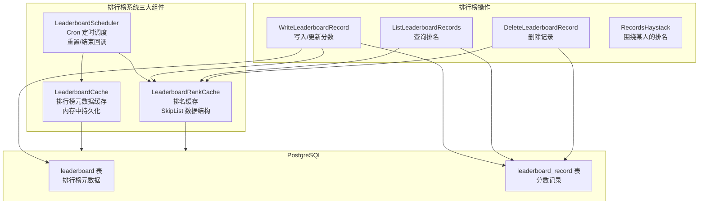
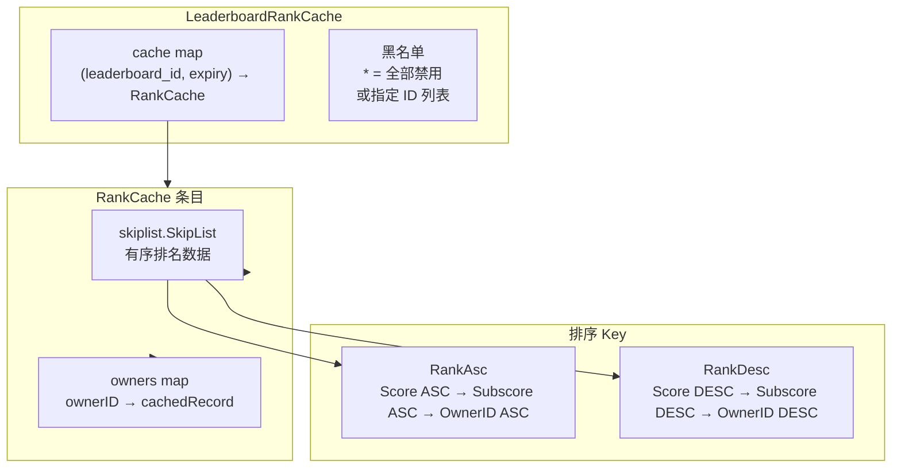
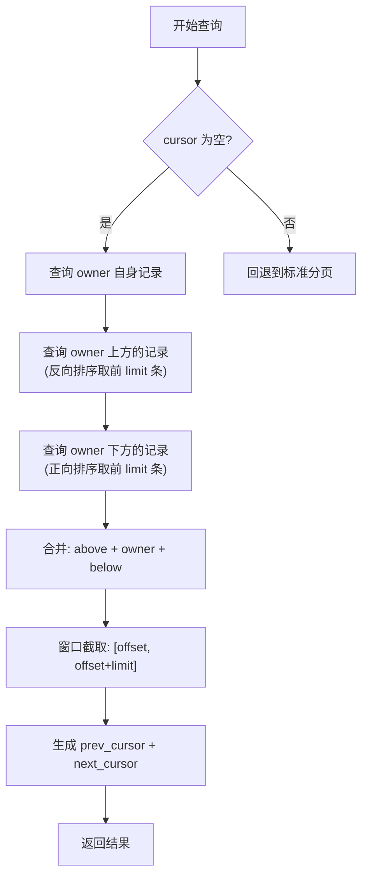
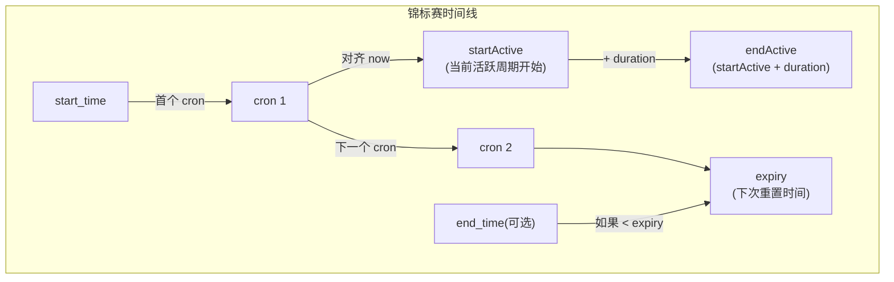
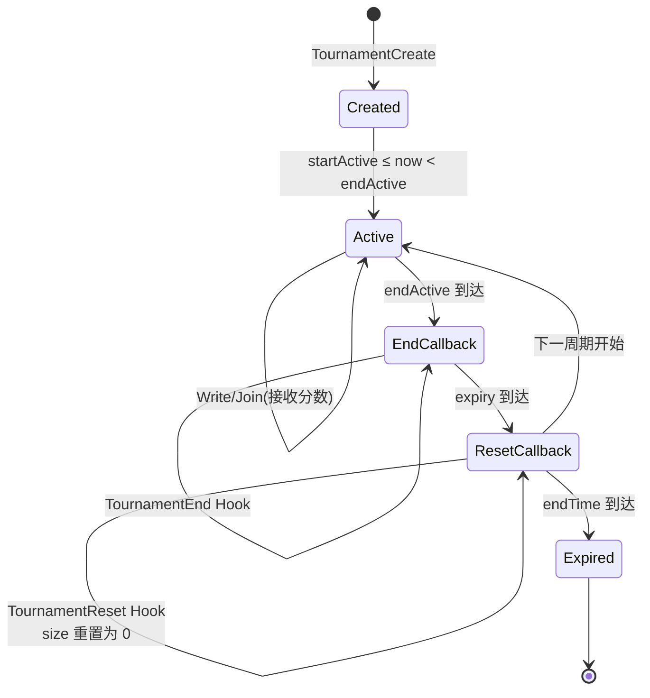
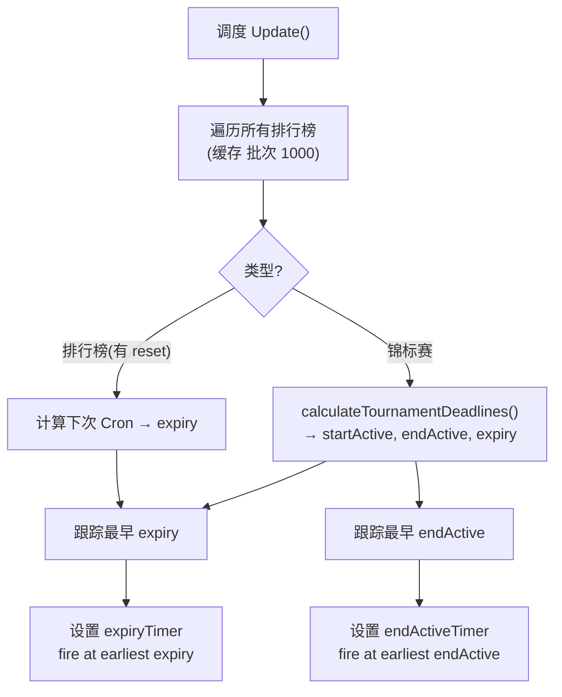

# Nakama 排行榜与锦标赛设计文档

## 1. 概述

Nakama 排行榜系统支持基于分数的玩家排名,包含权威/非权威两种模式、四种写入操作符、Cron 定时重置。锦标赛是排行榜的超集,增加了时间周期、最大人数、加入要求等机制。

### 1.1 系统架构



---

## 2. 排行榜核心概念

### 2.1 排序方式

| 常量 | 值 | 含义 |
|------|-----|------|
| `LeaderboardSortOrderAscending` | 0 | 升序(分数越低排名越高) |
| `LeaderboardSortOrderDescending` | 1 | 降序(分数越高排名越高) |

### 2.2 操作符

| 常量 | 值 | 写入行为 |
|------|-----|---------|
| `LeaderboardOperatorBest` | 0 | **最佳:** 仅当新分数优于旧分数时更新 |
| `LeaderboardOperatorSet` | 1 | **设值:** 无条件覆盖 |
| `LeaderboardOperatorIncrement` | 2 | **增量:** 新分数 = 旧分数 + 提交值 |
| `LeaderboardOperatorDecrement` | 3 | **减量:** 新分数 = max(旧分数 - 提交值, 0) |

### 2.3 排行榜与锦标赛判别

```go
func (l *Leaderboard) IsTournament() bool {
    return l.Duration != 0
}
```

锦标赛 = Duration != 0 的排行榜。锦标赛额外拥有: start_time, end_time, duration, category, join_required, max_size, title, description, size。

---

## 3. LeaderboardCache — 元数据缓存

### 3.1 数据结构

```go
type LocalLeaderboardCache struct {
    sync.RWMutex
    leaderboards     map[string]*Leaderboard  // ID → 元数据 快速查找
    allList          []*Leaderboard           // 全部(排行榜+锦标赛)
    leaderboardList  []*Leaderboard           // 仅排行榜
    tournamentList   []*Leaderboard           // 仅锦标赛(保持排序)
}
```

### 3.2 缓存策略

- **启动时加载:** `RefreshAllLeaderboards()` 批次 10,000 行全量加载
- **运行时更新:** Insert/Delete/InsertTournament/Remove 就地修改
- **无定期刷新:** 缓存与数据库保持最终一致
- **锦标赛列表排序:** `(start_time ASC, end_time DESC, category ASC, id ASC)`

### 3.3 内部结构

```go
type Leaderboard struct {
    Id               string
    Authoritative    bool
    SortOrder        int       // 0=asc, 1=desc
    Operator         int       // 0=best, 1=set, 2=incr, 3=decr
    ResetSchedule    *cronexpr.Expression  // 已解析的 Cron 表达式
    Metadata         string
    CreateTime       int64
    // 锦标赛专用字段
    Category         int
    Title, Description string
    Duration         int       // != 0 = 锦标赛
    StartTime, EndTime int64
    JoinRequired     bool
    MaxSize, MaxNumScore int
    EnableRanks      bool
}
```

---

## 4. LeaderboardRankCache — 排名缓存

### 4.1 基于 SkipList 的排名



### 4.2 SkipList 数据结构

```go
const (
    SKIPLIST_MAXLEVEL = 32   // 最大层数
    SKIPLIST_BRANCH   = 4    // 1/4 概率增加一层
)

type SkipList struct {
    r      *rand.Rand     // 确定性随机(seed=1)
    header *Element        // 哨兵头节点
    length int             // 元素数量
    level  int             // 当前最大层
}

type Element struct {
    Value Interface
    level []*skiplistLevel  // 每层的前向指针
}

type skiplistLevel struct {
    forward *Element        // 下一元素
    span    int             // 跨越元素数量(用于排名计算)
}
```

### 4.3 SkipList 操作复杂度

| 操作 | 预期时间 | 说明 |
|------|---------|------|
| Insert | O(log N) | 按排序插入,更新前向指针和 span |
| Delete | O(log N) | 按值查找后删除,更新指针 |
| GetRank | O(log N) | 从顶层向下累加 span |
| GetElementByRank | O(log N) | 从顶层向下,用 span 跳过元素 |

### 4.4 排名缓存操作

| 操作 | 说明 |
|------|------|
| `Get(leaderboardId, expiry, ownerID)` | 返回 owner 的排名(1-based) |
| `GetDataByRank(leaderboardId, expiry, sortOrder, rank)` | 按排名反查 owner/score |
| `Fill(leaderboardId, expiry, records)` | 批量填充 `Rank` 字段 |
| `Insert(leaderboardId, sortOrder, score, subscore, generation, expiry, ownerID)` | 插入记录,自动移除旧项 |
| `Delete(leaderboardId, expiry, ownerID)` | 从 SkipList 和 owners map 中移除 |
| `DeleteLeaderboard(leaderboardId, expiry)` | 移除整个排行榜缓存 |
| `TrimExpired(nowUnix)` | 清理过期记录(后台每小时执行) |

### 4.5 启动预加载

启动时启动 `RankCacheWorkers`(默认 1)个 worker,每个 worker:
1. 从 `leaderboard_record` 表批量读取(批次 10,000 行)
2. 按 `(leaderboard_id, expiry_time, score, subscore, owner_id)` 排序
3. 插入到 SkipList
4. 每 30 批触发 `runtime.GC()`

### 4.6 黑名单

```yaml
leaderboard:
  blacklist_rank_cache: ["*"]  # 禁用所有排行榜排名缓存
  # 或
  blacklist_rank_cache: ["weekly_score"]  # 仅禁用指定 ID
```

---

## 5. 核心写入操作

### 5.1 UPSERT 策略

使用 PostgreSQL `INSERT ... ON CONFLICT (owner_id, leaderboard_id, expiry_time) DO UPDATE SET ...`:

| 操作符 | WHERE 条件 | 更新公式 |
|--------|----------|---------|
| **BEST (ASC)** | `score > $new_score OR subscore > $new_subscore` | 用新值覆盖 |
| **BEST (DESC)** | `score < $new_score OR subscore < $new_subscore` | 用新值覆盖 |
| **SET** | `score <> $new_score OR subscore <> $new_subscore` | 直接用新值 |
| **INCREMENT** | `$delta <> 0` | `score = score + $delta` |
| **DECREMENT** | `$delta <> 0` | `score = GREATEST(score - $delta, 0)` |

所有操作都递增 `num_score`,更新 `update_time = now()`。

### 5.2 OVERRIDE OPERATOR

Runtime 调用时可以覆盖排行榜的默认操作符: `NO_OVERRIDE`, `INCREMENT`, `SET`, `BEST`, `DECREMENT`。

---

## 6. 排名查询

### 6.1 游标分页 (`LeaderboardRecordsList`)

```go
type leaderboardRecordListCursor struct {
    IsNext        bool
    LeaderboardId string    // 验证字段(防游标失效)
    ExpiryTime    int64     // 验证字段(防游标失效)
    Score         int64
    Subscore      int64
    OwnerId       string
    Rank          int64
}
```

SQL 模式:
```sql
WHERE (leaderboard_id, expiry_time, score, subscore, owner_id) > ($1, $2, $4, $5, $6)
ORDER BY score ASC/DESC, subscore ASC/DESC, owner_id ASC/DESC
LIMIT $3
```

### 6.2 围绕查询 (`LeaderboardRecordsHaystack`)



### 6.3 按排名游标 (`CursorFromRank`)

Runtime API `LeaderboardRecordsListCursorFromRank`:
1. `rankCache.GetDataByRank(rank-1)` → 获取该排名前一位的数据
2. 构造 `leaderboardRecordListCursor`(包含 score, subscore, ownerId)
3. 用于从指定排名开始的分页查询

---

## 7. 锦标赛系统

### 7.1 锦标赛特有字段

| 字段 | 说明 |
|------|------|
| `duration` | 每个活跃周期的持续时间(秒),非零即锦标赛 |
| `start_time` | 首个开始时间 |
| `end_time` | 永久结束时间(0=无结束) |
| `join_required` | 是否必须显式加入 |
| `max_size` | 最大参与人数(math.MaxInt32 = 无限制) |
| `max_num_score` | 每周期最大提交次数 |
| `category` | 分类标签(0-127) |
| `title / description` | 显示文本 |
| `size` | 当前参与人数(重置时清零) |

### 7.2 时间线计算 (`calculateTournamentDeadlines`)



**关键约束:**
- `endActive > expiry` 时 → `endActive = expiry`
- `startTime > endActive` 时 → 推进到下一周期
- `endTime > 0 && expiry > endTime` 时 → `expiry = endTime`

### 7.3 锦标赛生命周期



### 7.4 Join Required 模式

- **`JoinRequired = false`:** 首次写入分数时自动加入
- **`JoinRequired = true`:** 必须先调用 `TournamentJoin`,否则写入返回 `ErrTournamentWriteJoinRequired`
- Join 操作: `INSERT INTO leaderboard_record ... ON CONFLICT DO NOTHING`(幂等)
- 有 MaxSize 时: 原子递增 `leaderboard.size`(WHERE size < max_size),满员返回 `ErrTournamentMaxSizeReached`

---

## 8. LeaderboardScheduler — 定时调度

### 8.1 调度架构

```go
type LocalLeaderboardScheduler struct {
    endActiveTimer  *time.Timer  // 锦标赛结束事件
    expiryTimer     *time.Timer  // 排行榜/锦标赛重置事件
    queue           chan *Callback
    workers         int          // CallbackQueueWorkers(默认 8)
    active          *atomic.Uint32
}
```

### 8.2 调度算法 (`Update()`)



### 8.3 Timer 防重复

- `lastEnd` / `lastExpiry` 字段防止同一时间戳重复触发
- `queueEndActiveElapse` 内部会重新调用 `Update()`,但不会重置相同时间戳的 Timer

### 8.4 回调分发

- Queue 大小: `CallbackQueueSize`(默认 65536)
- Workers: `CallbackQueueWorkers`(默认 8)
- **Leaderboard Reset:** `fnLeaderboardReset(ctx, leaderboard, reset)`
- **Tournament Reset:** `fnTournamentReset(ctx, tournament, end, reset)` + DB 重置 `size = 0`
- **Tournament End:** `fnTournamentEnd(ctx, tournament, end, reset)`

### 8.5 后台清理

独立 goroutine 每 1 小时执行 `rankCache.TrimExpired(time.Now().Unix())`。

---

## 9. 权威排行榜

当 `Authoritative = true` 时:
- 客户端写入被拒绝(`ErrLeaderboardAuthoritative`)
- 只有 Runtime 调用(传入 `uuid.Nil` 作为 caller)可以写入
- 适用于完全服务端控制的排名(如匹配等级分)

---

## 10. Runtime API

### 10.1 排行榜 Runtime 函数

| 函数 | 说明 |
|------|------|
| `LeaderboardCreate(id, authoritative, sortOrder, operator, resetSchedule, metadata, enableRanks)` | 创建排行榜 |
| `LeaderboardDelete(id)` | 删除排行榜 |
| `LeaderboardRecordWrite(id, ownerID, username, score, subscore, metadata, overrideOperator)` | 写入记录 |
| `LeaderboardRecordDelete(id, ownerID)` | 删除记录 |
| `LeaderboardRecordsList(id, ownerIDs, limit, cursor, expiryOverride)` | 查询排名 |
| `LeaderboardRecordsHaystack(id, ownerID, limit, cursor, expiry)` | 围绕查询 |
| `LeaderboardRecordsListCursorFromRank(leaderboardID, rank, expiryOverride)` | 按排名生成游标 |
| `LeaderboardsGetId(IDs)` | 批量获取排行榜元数据 |
| `LeaderboardRanksDisable(id)` | 禁用排名 |

### 10.2 锦标赛 Runtime 函数

| 函数 | 说明 |
|------|------|
| `TournamentCreate(...)` | 创建锦标赛(参数包含 title/duration/maxSize 等) |
| `TournamentDelete(id)` | 删除锦标赛 |
| `TournamentJoin(id, ownerID, username)` | 加入锦标赛 |
| `TournamentAddAttempt(id, ownerID, count)` | 增加允许的提交次数 |
| `TournamentRecordWrite/Delete` | 同排行榜 |
| `TournamentRecordsList/Haystack` | 同排行榜 |
| `TournamentsGetId(IDs)` | 批量获取锦标赛元数据 |
| `TournamentList(category, startTime, endTime, limit, cursor)` | 列出锦标赛 |
| `TournamentRanksDisable(id)` | 禁用排名 |

### 10.3 回调钩子

```go
RuntimeLeaderboardResetFunction func(ctx, leaderboard *api.Leaderboard, reset int64) error
RuntimeTournamentResetFunction  func(ctx, tournament *api.Tournament, end, reset int64) error
RuntimeTournamentEndFunction    func(ctx, tournament *api.Tournament, end, reset int64) error
```

**优先级:** Go Plugin > Lua > JavaScript。只有一个运行时的回调会被注册。

---

## 11. 数据库表索引

**leaderboard 表索引:**
- `duration_start_time_end_time_category_idx` — 锦标赛列表查询
- `leaderboard_create_time_id_idx` — 排行榜配置列表分页

**leaderboard_record 表索引:**
- UNIQUE `(owner_id, leaderboard_id, expiry_time)` — 每个用户每周期仅一条记录
- `owner_id_expiry_time_leaderboard_id_idx` — 用户所有排行榜记录查询

**复合主键:** `(leaderboard_id, expiry_time, score, subscore, owner_id)` — 排名自然排序,无需额外索引。

---

## 12. 相关示例

以案例为主线端到端了解排行榜和锦标赛,请阅读 [功能案例详解](case-studies.md)。

`examples/` 目录包含排行榜和锦标赛的完整客户端示例,帮助理解本文档中的概念:

| 示例 | 涉及的排行榜/锦标赛概念 |
|------|----------------------|
| [leaderboard](../examples/leaderboard/) | WriteLeaderboardRecord (upsert + best 操作符), ListLeaderboardRecords (游标分页), 实时排名刷新 |
| [tournament](../examples/tournament/) | TournamentCreate (通过 RPC), JoinTournament, WriteTournamentRecord, 锦标赛生命周期 (5分钟 duration), LeaderboardRecordList 分页查询 |

详见 [examples.md](examples.md)。
