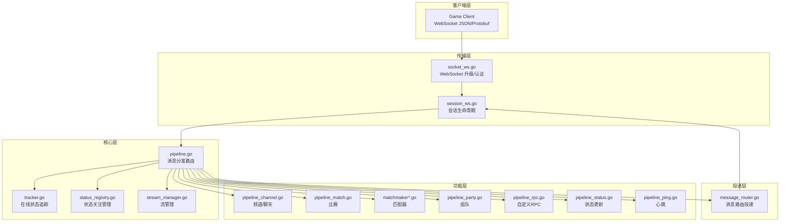
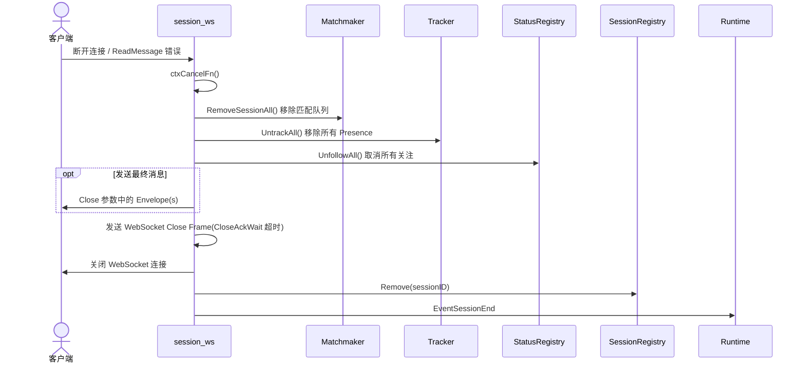
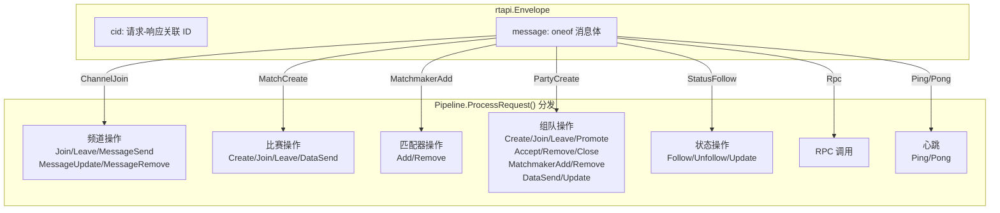
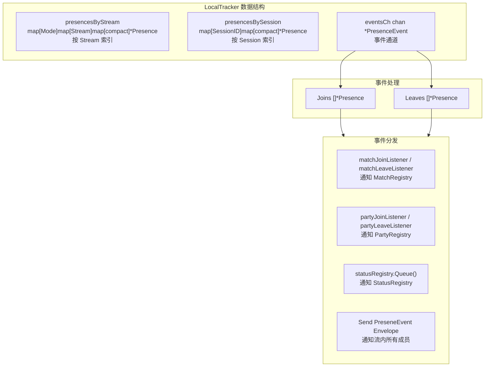
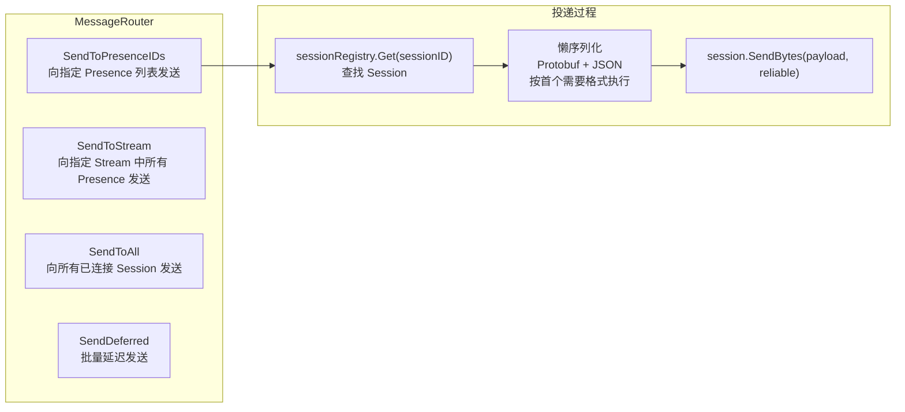
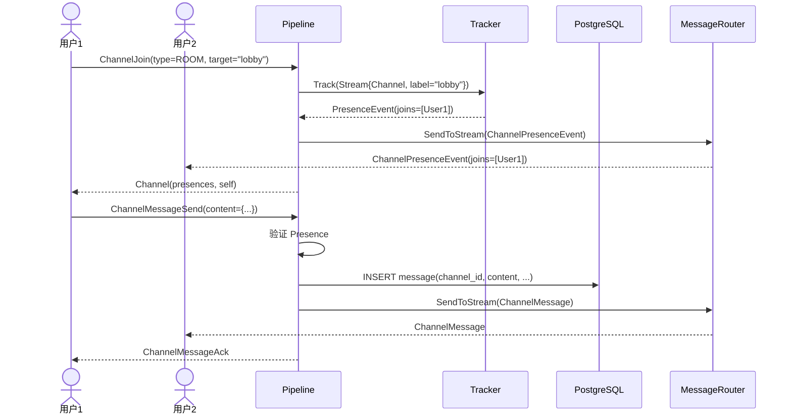
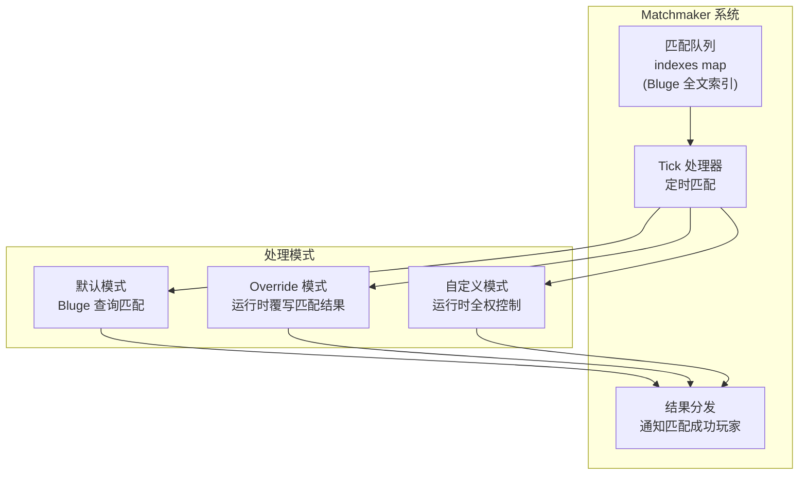
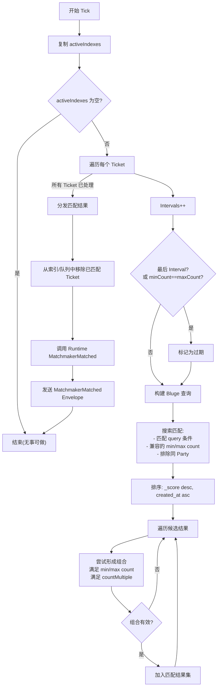
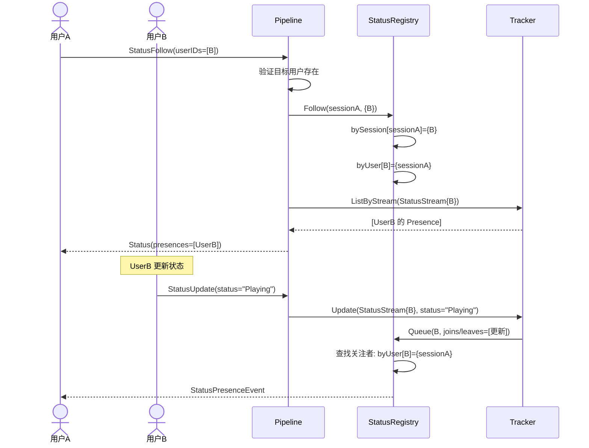
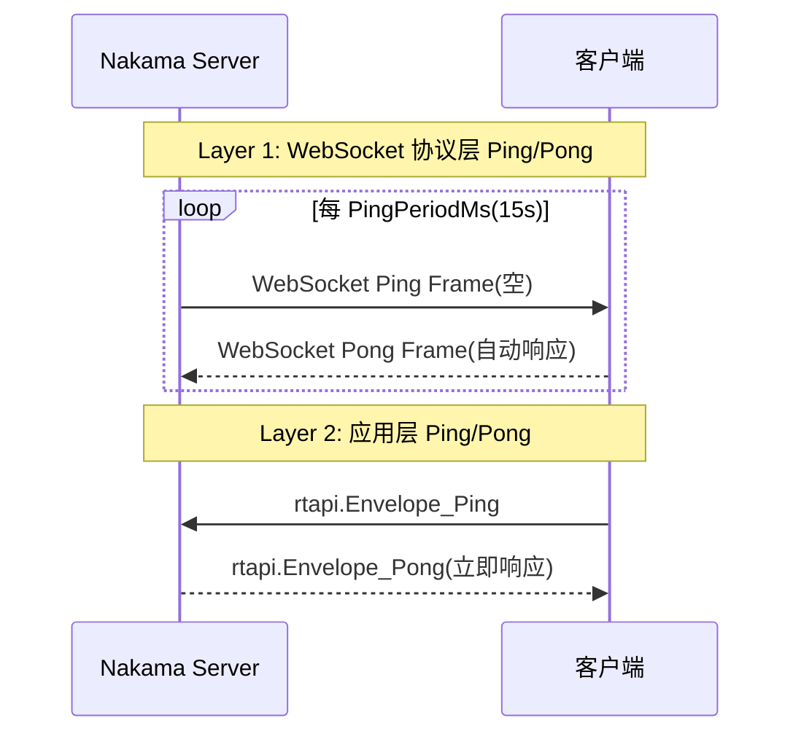

# Nakama 实时通信设计文档

## 1. 概述

Nakama 实时通信系统基于 WebSocket 协议,提供频道聊天、实时比赛、匹配器、组队、状态追踪等核心实时功能。系统采用事件驱动架构,通过 Pipeline 统一分发消息,使用 Tracker 维护在线状态,由 MessageRouter 负责消息投递。

### 1.1 实时通信架构总览



### 1.2 Stream 类型

Nakama 使用 8 种 Stream 模式组织在线用户:

| Stream 模式 | 值 | 用途 | 标识方式 |
|------------|-----|------|---------|
| `StreamModeNotifications` | 0 | 通知流(每个用户一个) | Subject=userID |
| `StreamModeStatus` | 1 | 状态流 | Subject=userID |
| `StreamModeChannel` | 2 | 聊天频道 | Label=room name |
| `StreamModeGroup` | 3 | 群组聊天 | Subject=groupID |
| `StreamModeDM` | 4 | 私聊(1对1) | Subject+Subcontext=two userIDs |
| `StreamModeMatchRelayed` | 5 | 中继比赛 | Subject=matchID, Label=node |
| `StreamModeMatchAuthoritative` | 6 | 权威比赛 | Subject=matchID, Label=node |
| `StreamModeParty` | 7 | 组队 | Subject=partyID, Label=node |

---

## 2. WebSocket 连接生命周期

### 2.1 连接建立流程

```mermaid
sequenceDiagram
    actor Client as 客户端
    participant Acceptor as SocketAcceptor
    participant SessionCache as SessionCache
    participant SessionReg as SessionRegistry
    participant StatusReg as StatusRegistry
    participant Tracker as Tracker
    participant Runtime as Runtime

    Client->>Acceptor: GET /ws?format=json&token=&lt;jwt&gt;
    Acceptor->>Acceptor: 解析 format 参数(json/protobuf)
    Acceptor->>Acceptor: 从 Authorization header 或?token 提取 JWT
    Acceptor->>SessionCache: 验证 token(parseToken + IsValidSession)
    
    alt token 无效
        Acceptor-->>Client: HTTP 401
    end
    
    Acceptor->>Acceptor: gorilla Upgrader.Upgrade()
    Acceptor->>Acceptor: 生成 UUID v1 Session ID(嵌入 node hash)
    Acceptor->>SessionReg: NewSessionWS(...)
    Acceptor->>SessionReg: Add(session)
    Acceptor->>StatusReg: Follow(sessionID, {userID})
    Acceptor->>Tracker: Track/TrackMulti(通知流 + 可选状态流)
    
    opt SingleSocket 配置
        Acceptor->>SessionReg: SingleSession(断开该用户旧连接)
    end
    
    Acceptor->>Runtime: EventSessionStart
    Acceptor->>Session: Consume() 阻塞读取消息
```

### 2.2 WebSocket 配置参数

| 参数 | 默认值 | 说明 |
|------|--------|------|
| `PingPeriodMs` | 15000 | 服务端 WebSocket Ping 间隔 |
| `PongWaitMs` | 25000 | 等待客户端 Pong 超时 |
| `WriteWaitMs` | 5000 | 写操作超时 |
| `CloseAckWaitMs` | 2000 | 等待关闭确认超时 |
| `PingBackoffThreshold` | 20 | 接收消息数阈值用于延迟 Ping 检测 |
| `OutgoingQueueSize` | 64 | 每个会话的出站消息缓冲 |
| `MaxMessageSizeBytes` | 4096 | 单条 WebSocket 消息最大字节数 |

### 2.3 连接断开与清理



---

## 3. Pipeline 消息路由

### 3.1 消息分发机制

Pipeline 是所有实时消息的核心路由器。每条 WebSocket 消息被反序列化为 `rtapi.Envelope` 后,通过 `ProcessRequest()` 进行类型分发。



### 3.2 全部 Envelope 消息类型(28种)

| 类别 | 方向 | 消息类型 |
|------|------|---------|
| 频道 | C→S | `ChannelJoin`, `ChannelLeave`, `ChannelMessageSend`, `ChannelMessageUpdate`, `ChannelMessageRemove` |
| 频道 | S→C | `Channel`, `ChannelMessage`, `ChannelMessageAck`, `ChannelPresenceEvent` |
| 比赛 | C→S | `MatchCreate`, `MatchJoin`, `MatchLeave`, `MatchDataSend` |
| 比赛 | S→C | `Match`, `MatchData`, `MatchPresenceEvent` |
| 匹配器 | C→S | `MatchmakerAdd`, `MatchmakerRemove` |
| 匹配器 | S→C | `MatchmakerMatched`, `MatchmakerTicket` |
| 组队 | C→S | `PartyCreate`, `PartyJoin`, `PartyLeave`, `PartyPromote`, `PartyAccept`, `PartyRemove`, `PartyClose`, `PartyJoinRequestList`, `PartyMatchmakerAdd`, `PartyMatchmakerRemove`, `PartyDataSend`, `PartyUpdate` |
| 组队 | S→C | `Party`, `PartyLeader`, `PartyJoinRequest`, `PartyMatchmakerTicket`, `PartyData`, `PartyPresenceEvent` |
| 状态 | C→S | `StatusFollow`, `StatusUnfollow`, `StatusUpdate` |
| 状态 | S→C | `Status`, `StatusPresenceEvent` |
| RPC | C→S | `Rpc` |
| 其他 | S→C | `Error`, `Notifications`, `StreamData`, `StreamPresenceEvent`, `Pong` |
| 心跳 | C→S | `Ping` |

---

## 4. Presence 与 Tracker 跟踪系统

### 4.1 核心数据结构

```go
type PresenceID struct {
    Node      string    // 节点名
    SessionID uuid.UUID // 会话 ID(内含 node hash)
}

type PresenceStream struct {
    Mode       uint8      // Stream 类型
    Subject    uuid.UUID  // 主题(如 userID, groupID)
    Subcontext uuid.UUID  // 子上下文(如 DM 中另一用户)
    Label      string     // 标签(如房间名,node)
}

type PresenceMeta struct {
    Format      SessionFormat // JSON 或 Protobuf
    Hidden      bool          // 是否隐藏
    Persistence bool          // 是否持久化消息
    Username    string
    Status      string        // 状态文本
    Reason      uint32        // PresenceReason
}

type Presence struct {
    ID     PresenceID
    Stream PresenceStream
    UserID uuid.UUID
    Meta   PresenceMeta
}
```

### 4.2 LocalTracker 内部结构



### 4.3 Track/Untrack 操作

| 操作 | 说明 |
|------|------|
| `Track(sessionID, stream, userID, meta)` | 在指定流中创建 Presence,触发事件 |
| `TrackMulti(sessionID, ops, userID)` | 批量创建多个流中的 Presence |
| `Untrack(sessionID, stream, userID)` | 从流中移除 Presence |
| `UntrackMulti(sessionID, streams, userID)` | 批量移除 |
| `UntrackAll(sessionID, reason)` | 移除某 Session 的所有 Presence |
| `Update(sessionID, stream, userID, meta)` | 更新 Presence 元数据(如状态文本) |

### 4.4 Node Hash 路由

Session ID 使用 UUID v1 生成,字节 10:15 编码了节点名的 SHA1 哈希:

```go
func NodeToHash(node string) [6]byte {
    hash := sha1.Sum([]byte(node))
    var hashArr [6]byte
    copy(hashArr[:], hash[:6])
    return hashArr
}
```

这使 MessageRouter 无需外部查询即可知道每个 Session 的归属节点。

---

## 5. MessageRouter 消息投递

### 5.1 投递方式



### 5.2 懒序列化优化

MessageRouter 对同一条消息的 Protobuf 和 JSON 两种格式采用**懒序列化**策略:
- 首次遇到某种格式的 Session 时才序列化
- 两种格式都缓存到本地变量
- 批量投递时大幅度减少序列化开销

### 5.3 DeferredMessage

用于比赛中的"延迟广播",在本 tick 处理完成后批量投递:

```go
type DeferredMessage struct {
    PresenceIDs []*PresenceID
    Envelope    *rtapi.Envelope
    Reliable    bool
}
```

---

## 6. 频道系统

### 6.1 频道类型

| 类型 | 值 | Stream Mode | 标识 |
|------|-----|-------------|------|
| ROOM | 1 | StreamModeChannel | Label=房间名 |
| DIRECT_MESSAGE | 2 | StreamModeDM | Subject+Subcontext=两个用户 UUID |
| GROUP | 3 | StreamModeGroup | Subject=群组 UUID |

### 6.2 频道 ID 格式

```
<mode>.<subject>.<subcontext>.<label>

示例:
  2...chat_room          -- 房间频道(chat_room)
  3.<groupUUID>..         -- 群组频道
  4.<lowerUUID>.<higherUUID>.  -- 私聊频道
```

### 6.3 消息类型

| 代码 | 类型 | 说明 |
|------|------|------|
| 0 | Chat | 普通聊天消息 |
| 1 | ChatUpdate | 消息更新 |
| 2 | ChatRemove | 消息删除 |
| 3 | GroupJoin | 加入群组 |
| 4 | GroupAdd | 被添加进群组 |
| 5 | GroupLeave | 离开群组 |
| 6 | GroupKick | 被踢出群组 |
| 7 | GroupPromote | 晋升为管理员 |
| 8 | GroupBan | 被封禁 |
| 9 | GroupDemote | 降级 |

### 6.4 频道操作流程



---

## 7. 匹配器系统

### 7.1 匹配架构



### 7.2 匹配器配置

| 参数 | 默认值 | 说明 |
|------|--------|------|
| `MaxTickets` | 3 | 每个 Session/Party 最大并发匹配票 |
| `IntervalSec` | 15 | Tick 间隔(秒) |
| `MaxIntervals` | 2 | 最大 Tick 数(之后允许 minCount) |
| `RevPrecision` | false | 是否启用反向匹配验证 |
| `RevThreshold` | 1 | 反向匹配阈值(IntervalSec 的倍数) |

### 7.3 默认匹配算法



### 7.4 匹配票生命周期

```
Add(ticket) → [Interval 1] → [Interval 2] → [Interval N]
                     ↓              ↓              ↓
                可能匹配      可能匹配    强制匹配(过期)
                                                ↓
                                           超时通知
```

---

## 8. 组队系统

### 8.1 Party 状态机

```mermaid
stateDiagram-v2
    [*] --> Created: PartyCreate
    Created --> Active: Leader 创建完成

    state Active {
        [*] --> Waiting: 等待成员
        Waiting --> Joining: Join Request
        Joining --> Waiting: Accept/Reject
        Waiting --> Full: len(members) >= MaxSize
        Full --> Active: 成员离开
        Active --> Matchmaking: PartyMatchmakerAdd
        Matchmaking --> InMatch: 匹配成功
        InMatch --> Active: 比赛结束
    }

    Active --> Closed: PartyClose(Leader)
    Active --> Closed: 最后成员离开
    Closed --> [*]

    note right of Active
        Leader 操作:
        - Promote(转让队长)
        - Remove(踢人)
        - Accept(审批加入)
        - Update(修改设置)
    end note
```

### 8.2 Party ID 格式

```
<UUID>.<node>

示例: a1b2c3d4-e5f6-7890-abcd-ef1234567890.nakama-1
```

### 8.3 Party 操作权限

| 操作 | 执行者 | 说明 |
|------|--------|------|
| Create | 任意 Session | 创建者自动成为 Leader + 成员 |
| JoinRequest | 任意 Session | Open=true 时自动接受 |
| Accept | Leader | 审批加入请求 |
| Promote | Leader | 转让 Leader |
| Remove | Leader | 移除成员/拒绝请求 |
| Leave | 任意成员 | 弃权。Leader 离开时自动晋升最老成员 |
| Close | Leader | 关闭组队 |
| MatchmakerAdd/Remove | Leader | 以整个 Party 为单位加入匹配 |
| DataSend | 任意成员 | 发送数据给其他成员 |
| Update | Leader | 修改 open/hidden/label |

### 8.4 Party 空闲检测

- `IdleCheckIntervalMs` 间隔检测(默认 30 秒)
- Party 的 `tick` 计数器判断活跃度
- 零成员 + 空闲 → 自动关闭

---

## 9. 状态关注系统

### 9.1 关注/取消关注



### 9.2 在线状态查询

| 方法 | 说明 |
|------|------|
| `IsOnline(userID)` | 检查单个用户是否在线 |
| `FillOnlineUsers(users)` | 批量填充 `Online` 字段 |
| `FillOnlineAccounts(accounts)` | 批量填充账户在线状态 |
| `FillOnlineFriends(friends)` | 批量填充好友在线状态 |

---

## 10. 心跳机制

### 10.1 双层心跳



- **Layer 1 (WebSocket 协议):** 服务端定时发送 Ping Frame,客户端(浏览器/库)自动回复 Pong。用于检测死连接。
- **PingTimer 回退:** 每收到 `PingBackoffThreshold`(20) 条消息,重置 Ping 定时器,避免高频消息场景下的不必要超时。
- **Layer 2 (应用层):** 客户端可发送 `Envelope_Ping`,服务端立即回复 `Envelope_Pong`,用于 RTT 测量。

---

## 11. StreamManager 流管理

StreamManager 提供流操作的高层抽象,确保只有归属节点处理流操作:

```go
type StreamManager interface {
    UserJoin(stream, userID, sessionID, hidden, persistence, status) (success, new, error)
    UserUpdate(stream, userID, sessionID, hidden, persistence, status) (success, error)
    UserLeave(stream, userID, sessionID) error
}
```

**节点归属验证:** `HashFromId(sessionID) == nodeHash` — 只有 Session 归属的节点处理流操作。

---

## 12. 数据流总览

```
客户端 WebSocket Frame
    ↓
[socket_ws.go] -- HTTP Upgrade(JWT 认证)
    ↓
[session_ws.go] -- 反序列化 rtapi.Envelope(JSON 或 Protobuf)
    ↓
[pipeline.go] -- ProcessRequest() 类型分发到 28 个 Handler
    ↓
    ├── [pipeline_channel.go] × 5 操作
    ├── [pipeline_match.go] × 4 操作
    ├── [pipeline_matchmaker.go] × 2 操作
    ├── [pipeline_party.go] × 13 操作
    ├── [pipeline_status.go] × 3 操作
    ├── [pipeline_rpc.go] × 1 操作
    └── [pipeline_ping.go] × 2 操作
    ↓
[tracker.go] -- Presence 追踪 / 事件生成
    ├── statusRegistry.Queue() -- 状态事件
    ├── matchJoin/LeaveListener -- 比赛内部通知
    ├── partyJoin/LeaveListener -- 组队内部通知
    └── session.SendBytes() -- Presence Event 推送给流成员
    ↓
[message_router.go] -- SendToStream / SendToPresenceIDs / SendToAll
    ↓
[session_ws.go] -- outgoingCh → conn.WriteMessage()
    ↓
客户端 WebSocket Frame
```
