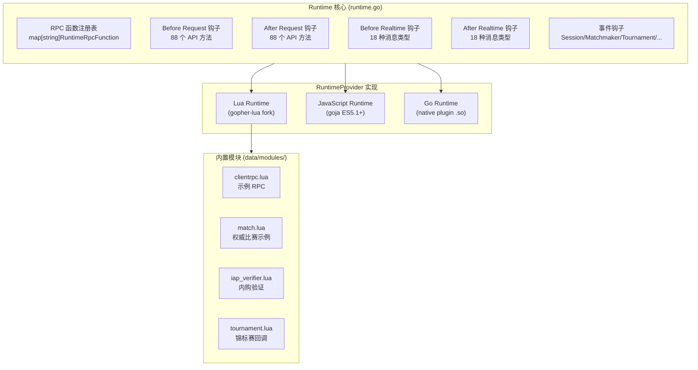
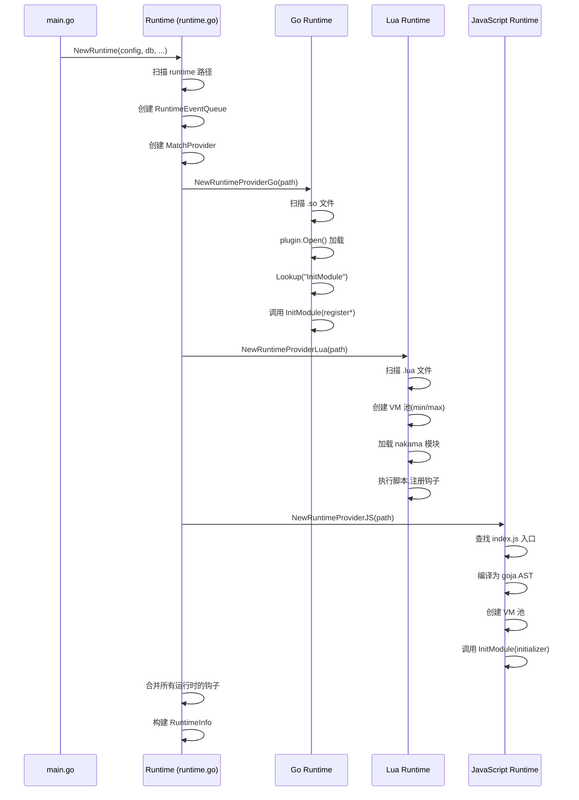
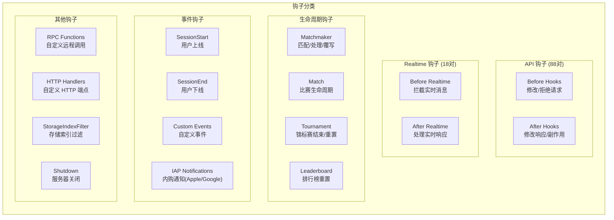
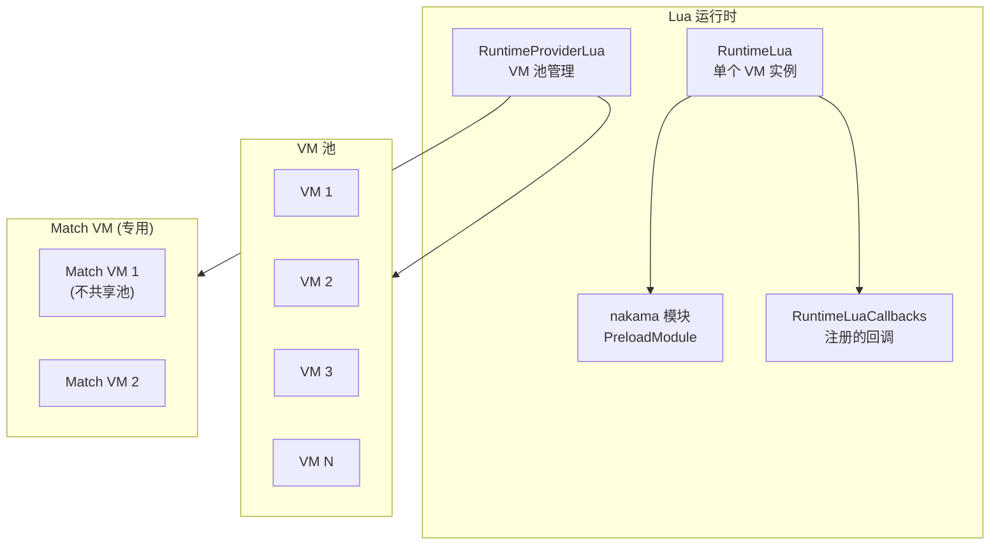
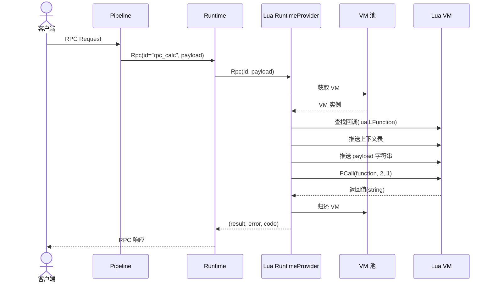
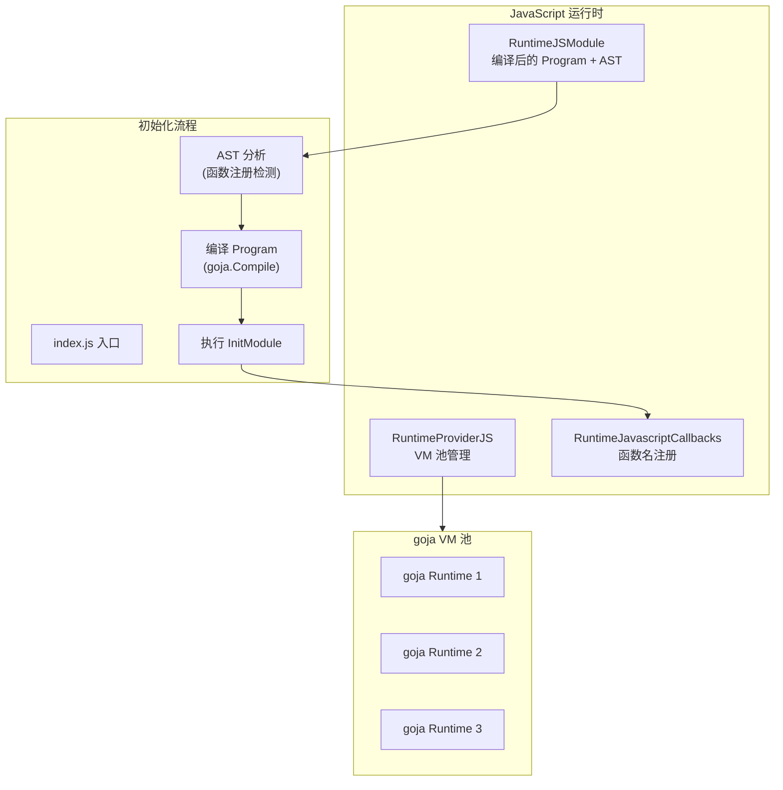
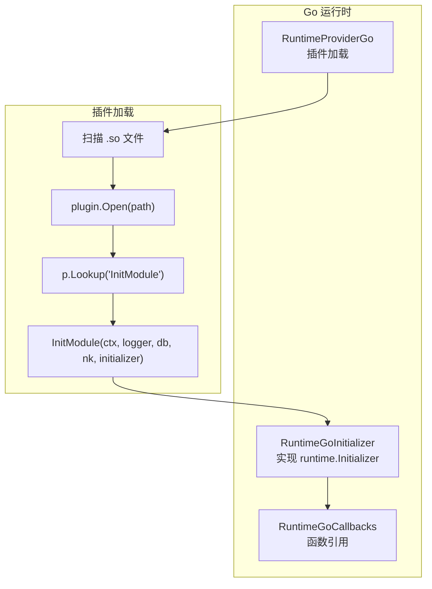
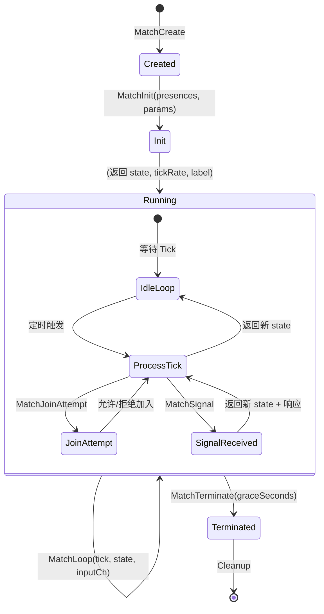
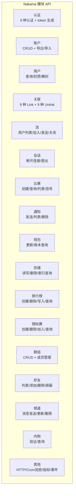
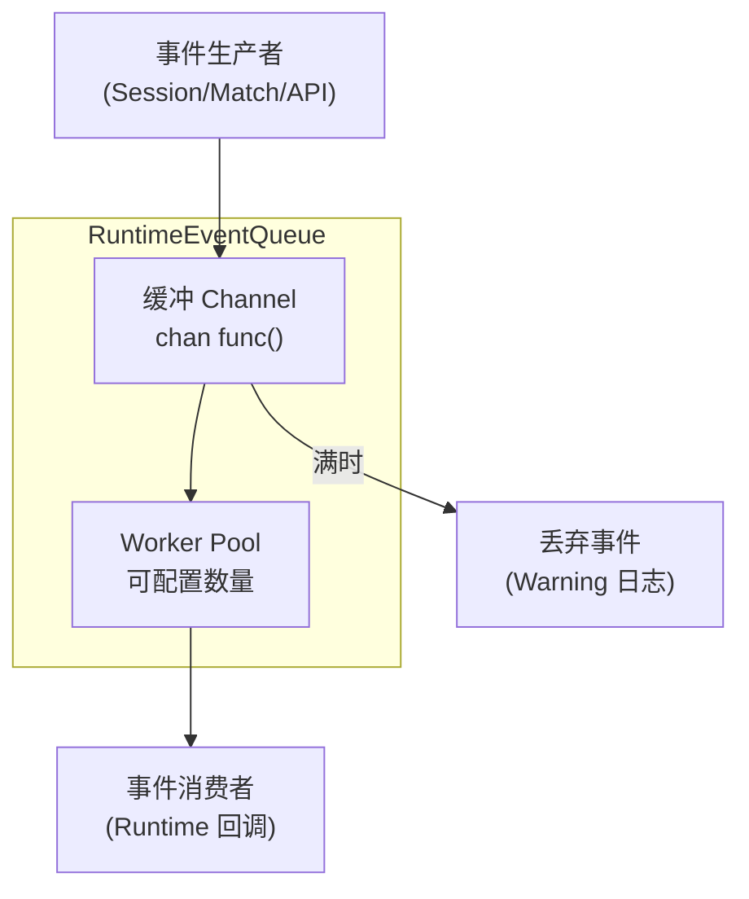

# Nakama 动态脚本设计文档

## 1. 概述

Nakama 运行时系统是服务端自定义逻辑的核心引擎,支持 **三种脚本/运行时环境**: Lua、JavaScript、Go Native Plugin。通过统一钩子系统,开发者可以在 API 请求的前后、实时消息的处理、比赛生命周期、排行榜事件等关键节点注入自定义逻辑。

### 1.1 三语言运行时架构



### 1.2 运行时优先级

当多个运行时提供相同 ID 的函数时,优先级为:

```
Go Plugin > Lua > JavaScript
```

Go 插件最后注册,会覆盖同名 Lua 函数;Lua 覆盖同名 JS 函数。

---

## 2. 运行时初始化

### 2.1 启动流程



### 2.2 运行时上下文

每个脚本调用都附带一个上下文环境,包含以下键:

| 上下文键 | 说明 | 可用模式 |
|---------|------|---------|
| `env` | 运行时环境变量(map[string]string) | 所有模式 |
| `execution_mode` | 执行模式("rpc"/"match"/"before"/"after"等) | 所有模式 |
| `node` | 服务器节点名 | 所有模式 |
| `version` | 服务器版本 | 所有模式 |
| `user_id` | 调用者用户 ID | API/RT/RPC |
| `username` | 调用者用户名 | API/RT/RPC |
| `user_session_exp` | 会话过期时间 | API/RT/RPC |
| `session_id` | 会话 ID | API/RT/RPC |
| `client_ip` | 客户端 IP | API/RT/RPC |
| `client_port` | 客户端端口 | API/RT/RPC |
| `lang` | 语言标签 | API/RT/RPC |
| `headers` | HTTP 请求头 | RPC |
| `query_params` | HTTP 查询参数 | RPC |
| `match_id` | 比赛 ID | Match |
| `match_node` | 比赛节点 | Match |
| `match_label` | 比赛标签 | Match |
| `match_tick_rate` | 比赛 Tick 频率 | Match |
| `trace_id` | 追踪 ID | 所有模式 |

---

## 3. 钩子系统

### 3.1 钩子类型总览



### 3.2 API Book 命名约定

Hook 函数按命名约定自动注册:

| 模式 | Lua 示例 | 说明 |
|------|---------|------|
| `before_<method>` | `nk.register_req_before(before_authenticate_device)` | API 方法前置拦截 |
| `after_<method>` | `nk.register_req_after(after_write_leaderboard_record)` | API 方法后置处理 |
| `rpc_<name>` | `nk.register_rpc(rpc_calculate_damage)` | 自定义 RPC 函数 |
| `before_rt_<type>` | `nk.register_rt_before(before_rt_channel_join)` | 实时消息前置拦截 |
| `after_rt_<type>` | `nk.register_rt_after(after_rt_match_create)` | 实时消息后置处理 |

### 3.3 API 钩子完整列表

**Before/After Hook 覆盖的 API 方法(88 对):**

`GetAccount`, `UpdateAccount`, `DeleteAccount`, `SessionRefresh`, `SessionLogout`, `AuthenticateApple`, `AuthenticateCustom`, `AuthenticateDevice`, `AuthenticateEmail`, `AuthenticateFacebook`, `AuthenticateFacebookInstantGame`, `AuthenticateGameCenter`, `AuthenticateGoogle`, `AuthenticateSteam`, `ListChannelMessages`, `ListFriends`, `ListFriendsOfFriends`, `AddFriends`, `DeleteFriends`, `BlockFriends`, `ImportFacebookFriends`, `ImportSteamFriends`, `CreateGroup`, `UpdateGroup`, `DeleteGroup`, `JoinGroup`, `LeaveGroup`, `AddGroupUsers`, `BanGroupUsers`, `KickGroupUsers`, `PromoteGroupUsers`, `DemoteGroupUsers`, `ListGroupUsers`, `ListUserGroups`, `ListGroups`, `DeleteLeaderboardRecord`, `DeleteTournamentRecord`, `ListLeaderboardRecords`, `WriteLeaderboardRecord`, `ListLeaderboardRecordsAroundOwner`, `LinkApple`, `LinkCustom`, `LinkDevice`, `LinkEmail`, `LinkFacebook`, `LinkFacebookInstantGame`, `LinkGameCenter`, `LinkGoogle`, `LinkSteam`, `ListMatches`, `ListNotifications`, `DeleteNotifications`, `ListStorageObjects`, `ReadStorageObjects`, `WriteStorageObjects`, `DeleteStorageObjects`, `JoinTournament`, `ListTournamentRecords`, `ListTournaments`, `WriteTournamentRecord`, `ListTournamentRecordsAroundOwner`, `UnlinkApple`, `UnlinkCustom`, `UnlinkDevice`, `UnlinkEmail`, `UnlinkFacebook`, `UnlinkFacebookInstantGame`, `UnlinkGameCenter`, `UnlinkGoogle`, `UnlinkSteam`, `GetUsers`, `Event`, `ValidatePurchaseApple`, `ValidateSubscriptionApple`, `ValidatePurchaseGoogle`, `ValidateSubscriptionGoogle`, `ValidatePurchaseHuawei`, `ValidatePurchaseFacebookInstant`, `ListSubscriptions`, `GetSubscription`, `GetMatchmakerStats`, `ListParties`

### 3.4 Realtime 钩子

签名:
```go
// Before
func(ctx, logger, traceID, userID, username, vars, expiry,
     sessionID, clientIP, clientPort, lang, in *rtapi.Envelope) (*rtapi.Envelope, error)
// After
func(ctx, logger, traceID, userID, username, vars, expiry,
     sessionID, clientIP, clientPort, lang, out, in *rtapi.Envelope) error
```

**Before 钩子可以返回 `nil` 信封来抑制服务端的默认处理**(完全由脚本接管)。

### 3.5 特殊函数钩子

```go
// 匹配器
MatchmakerMatchedFunction   func(ctx, entries) (matchId, bool, error)     // 匹配成功通知
MatchmakerProcessorFunction func(ctx, entries) [][]entries                // 自定义匹配逻辑
MatchmakerOverrideFunction  func(ctx, candidateMatches) [][]entries       // 覆写匹配结果

// 比赛
MatchCreateFunction func(ctx, logger, id, node, stopped, name) (MatchCore, error) // 创建比赛

// 锦标赛
TournamentEndFunction   func(ctx, tournament, end, reset int64) error   // 锦标赛结束
TournamentResetFunction func(ctx, tournament, end, reset int64) error   // 锦标赛重置

// 排行榜
LeaderboardResetFunction func(ctx, leaderboard, reset int64) error      // 排行榜重置

// IAP 通知
PurchaseNotificationXxxFunction      func(ctx, notificationType, purchase, providerPayload) error
SubscriptionNotificationXxxFunction  func(ctx, notificationType, subscription, providerPayload) error

// 事件
EventFunction             func(ctx, logger, evt *api.Event)            // 自定义事件
EventSessionStartFunction func(ctx, userID, username, vars, ...)        // 会话开始
EventSessionEndFunction   func(ctx, userID, username, vars, ..., reason) // 会话结束

// 关闭
ShutdownFunction func(ctx) error

// 存储索引过滤
StorageIndexFilterFunction func(ctx, write *StorageOpWrite) (bool, error)
```

### 3.6 执行模式常量

```go
const (
    RuntimeExecutionModeEvent                     = 0  // "event"
    RuntimeExecutionModeRunOnce                   = 1  // "run_once"
    RuntimeExecutionModeRPC                       = 2  // "rpc"
    RuntimeExecutionModeBefore                    = 3  // "before"
    RuntimeExecutionModeAfter                     = 4  // "after"
    RuntimeExecutionModeMatch                     = 5  // "match"
    RuntimeExecutionModeMatchmaker                = 6  // "matchmaker"
    RuntimeExecutionModeMatchmakerOverride        = 7  // "matchmaker_override"
    RuntimeExecutionModeMatchmakerProcessor       = 8  // "matchmaker_processor"
    RuntimeExecutionModeMatchCreate               = 9  // "match_create"
    RuntimeExecutionModeTournamentEnd             = 10 // "tournament_end"
    RuntimeExecutionModeTournamentReset           = 11 // "tournament_reset"
    RuntimeExecutionModeLeaderboardReset          = 12 // "leaderboard_reset"
    RuntimeExecutionModePurchaseNotificationApple = 13
    RuntimeExecutionModeSubscriptionNotificationApple  = 14
    RuntimeExecutionModePurchaseNotificationGoogle     = 15
    RuntimeExecutionModeSubscriptionNotificationGoogle = 16
    RuntimeExecutionModeStorageIndexFilter             = 17
    RuntimeExecutionModeShutdown                       = 18
)
```

---

## 4. Lua 运行时

### 4.1 架构



### 4.2 VM 配置

- **VM 引擎:** 基于 `internal/gopher-lua/`(yuin/gopher-lua 的嵌入式 fork)
- **池化模型:** VM 从池中借用,请求完成后归还
- **池大小:** `LuaMinCount`(最小空闲) ~ `LuaMaxCount`(最大容量)
- **调用栈大小:** `LuaCallStackSize`
- **注册表大小:** `LuaRegistrySize`
- **支持 Go 堆栈追踪:** `IncludeGoStackTrace: true`

### 4.3 标准库

选择性加载,不全部开放(安全考虑):

| 库 | 加载 | 说明 |
|----|------|------|
| base | 完全加载 | 基本函数(print, assert, error, etc.) |
| math | 完全加载 | 数学函数 |
| table | 完全加载 | 表操作 |
| string | 完全加载 | 字符串操作 |
| os | 安全子集 | 仅提供 `time`, `date`, `difftime` |
| bit32 | 完全加载 | 位操作 |
| coroutine | 未加载 | 不支持协程 |
| io | 未加载 | 禁止文件 IO |
| debug | 未加载 | 禁止调试 |

### 4.4 回调存储

```go
type RuntimeLuaCallbacks struct {
    RPC                            *MapOf[string, *lua.LFunction]
    Before                         *MapOf[string, *lua.LFunction]
    After                          *MapOf[string, *lua.LFunction]
    Matchmaker                     *lua.LFunction
    TournamentEnd                  *lua.LFunction
    TournamentReset                *lua.LFunction
    LeaderboardReset               *lua.LFunction
    Shutdown                       *lua.LFunction
    PurchaseNotificationApple      *lua.LFunction
    SubscriptionNotificationApple  *lua.LFunction
    PurchaseNotificationGoogle     *lua.LFunction
    SubscriptionNotificationGoogle *lua.LFunction
    StorageIndexFilter             *MapOf[string, *lua.LFunction]
}
```

### 4.5 RPC 调用流程



### 4.6 插件模块入口 (module.lua)

```lua
local nk = require("nakama")

-- 注册 RPC
local function rpc_echo(context, payload)
    return nk.json_encode({ message = payload })
end
nk.register_rpc(rpc_echo, "rpc_echo")

-- 注册 Before Hook
local function before_authenticate_device(context, payload)
    -- payload 是 JSON 序列化的请求 proto
    -- 返回修改后的 JSON 或 nil+error
    return payload  -- 透传
end
nk.register_req_before(before_authenticate_device, "AuthenticateDevice")

-- 注册 After Hook
local function after_write_leaderboard_record(context, payload)
    -- payload 是 JSON 序列化的响应 proto
    return payload
end
nk.register_req_after(after_write_leaderboard_record, "WriteLeaderboardRecord")

-- RunOnce 防止重复执行
if nk.run_once("init") then
    nk.logger_info("Module initialized!")
end
```

---

## 5. JavaScript 运行时

### 5.1 架构



### 5.2 关键特性

- **引擎:** goja (纯 Go ES5.1+ JavaScript 解释器)
- **入口文件:** `index.js`(单入口)
- **池化模型:** 与 Lua 相同的池化模式
- **回调存储:** 存储函数名(字符串),调用时从 goja 全局范围查找

```go
type RuntimeJavascriptCallbacks struct {
    Rpc                            map[string]string   // key → 全局函数名
    Before                         map[string]string
    After                          map[string]string
    StorageIndexFilter             map[string]string
    Matchmaker                     string
    TournamentEnd                  string
    TournamentReset                string
    LeaderboardReset               string
    // ...
}
```

### 5.3 InitModule 入口

```javascript
function InitModule(ctx, logger, nk, initializer) {
    // 注册 RPC
    initializer.registerRpc("rpc_echo", rpcEchoFn);

    // 注册 Before Hook
    initializer.registerBeforeAuthenticateDevice(beforeAuthDevice);

    // 注册 After Hook
    initializer.registerAfterWriteLeaderboardRecord(afterWriteLeaderboard);

    // 注册比赛
    initializer.registerMatch("deathmatch", {
        matchInit: function(ctx, logger, nk, params) { /* ... */ },
        matchJoinAttempt: function(ctx, logger, nk, dispatcher, tick, state, presence, metadata) { /* ... */ },
        matchJoin: function(ctx, logger, nk, dispatcher, tick, state, presences) { /* ... */ },
        matchLeave: function(ctx, logger, nk, dispatcher, tick, state, presences) { /* ... */ },
        matchLoop: function(ctx, logger, nk, dispatcher, tick, state, messages) { /* ... */ },
        matchTerminate: function(ctx, logger, nk, dispatcher, tick, state, graceSeconds) { /* ... */ },
        matchSignal: function(ctx, logger, nk, dispatcher, tick, state, data) { /* ... */ },
    });
}
```

---

## 6. Go Native Plugin 运行时

### 6.1 架构



### 6.2 InitModule 签名

每个 Go 插件必须导出:

```go
func InitModule(
    ctx context.Context,
    logger runtime.Logger,
    db *sql.DB,
    nk runtime.NakamaModule,
    initializer runtime.Initializer,
) error
```

### 6.3 注册 API

```go
// 注册 RPC
initializer.RegisterRpc("rpc_echo", func(ctx context.Context, logger runtime.Logger, db *sql.DB,
    nk runtime.NakamaModule, payload string) (string, error, codes.Code) {
    // 处理逻辑
    return `{"result": "ok"}`, nil, codes.OK
})

// 注册 Before Hook
initializer.RegisterBeforeAuthenticateEmail(func(ctx context.Context, logger runtime.Logger, db *sql.DB,
    nk runtime.NakamaModule, in *api.AuthenticateEmailRequest) (*api.AuthenticateEmailRequest, error, codes.Code) {
    // 修改/拒绝请求
    return in, nil, codes.OK
})

// 注册比赛
initializer.RegisterMatch("deathmatch", func(ctx context.Context, logger runtime.Logger, db *sql.DB,
    nk runtime.NakamaModule, params map[string]interface{}) (runtime.Match, error) {
    return &MyMatchHandler{}, nil
})
```

---

## 7. 比赛处理器生命周期

### 7.1 生命周期状态机



### 7.2 MatchCore 接口

```go
type RuntimeMatchCore interface {
    MatchInit(presences, deferFn, params) -> (state, tickRate, label, error)
    MatchJoinAttempt(tick, state, userID, sessionID, ..., metadata) -> (state, allow, reason, error)
    MatchJoin(tick, state, joins []*MatchPresence) -> (state, error)
    MatchLeave(tick, state, leaves []*MatchPresence) -> (state, error)
    MatchLoop(tick, state, inputCh <-chan *MatchDataMessage) -> (state, error)
    MatchTerminate(tick, state, graceSeconds) -> (state, error)
    MatchSignal(tick, state, data) -> (state, responseData, error)
}
```

### 7.3 Lua 比赛处理器

每个 Lua 比赛获得**专用 VM**(不共享池)。模块必须返回包含 7 个函数的表:

```lua
local M = {}

function M.match_init(context, params)
    local state = { scores = {} }
    local tick_rate = 10   -- 每秒 10 次 tick
    local label = "deathmatch"
    return state, tick_rate, label
end

function M.match_join_attempt(context, dispatcher, tick, state, presence, metadata)
    -- 返回 (state, allow_bool, reason_string)
    return state, true, ""
end

function M.match_join(context, dispatcher, tick, state, presences)
    return state
end

function M.match_leave(context, dispatcher, tick, state, presences)
    return state
end

function M.match_loop(context, dispatcher, tick, state, messages)
    -- 处理输入消息,更新 state
    for _, msg in ipairs(messages) do
        -- 处理 msg.data
    end
    return state
end

function M.match_terminate(context, dispatcher, tick, state, grace_seconds)
    return state
end

function M.match_signal(context, dispatcher, tick, state, data)
    return state, "signal_acknowledged"
end

return M
```

**比赛调度 API (Lua):**

| 函数 | 说明 |
|------|------|
| `dispatcher.broadcast_message(op_code, data, presences, sender)` | 立即广播 |
| `dispatcher.broadcast_message_deferred(op_code, data, presences, sender)` | 延迟广播(本 tick 结束后) |
| `dispatcher.match_kick(presences)` | 踢出玩家 |
| `dispatcher.match_label_update(label)` | 更新比赛标签 |

---

## 8. Nakama 模块 API

Nakama 向脚本暴露了完整的服务端 API,三大运行时(Lua/JS/Go)功能一致。

### 8.1 功能分类



### 8.2 完整 API 清单

**认证 (10):** `authenticate_apple`, `authenticate_custom`, `authenticate_device`, `authenticate_email`, `authenticate_facebook`, `authenticate_facebook_instant_game`, `authenticate_game_center`, `authenticate_google`, `authenticate_steam`, `authenticate_token_generate`

**账户 (6):** `account_get_id`, `accounts_get_id`, `account_update_id`, `account_delete_id`, `account_export_id`, `account_import_id`

**用户 (6):** `users_get_id`, `users_get_username`, `users_get_friend_status`, `users_get_random`, `users_ban_id`, `users_unban_id`

**关联/解除关联 (18):** `link_*` / `unlink_*` (apple, custom, device, email, facebook, facebook_instant_game, gamecenter, google, steam)

**流 (9):** `stream_user_list`, `stream_user_get`, `stream_user_join`, `stream_user_update`, `stream_user_leave`, `stream_user_kick`, `stream_count`, `stream_close`, `stream_send`, `stream_send_raw`

**通知 (8):** `notification_send`, `notifications_send`, `notification_send_all`, `notifications_list`, `notifications_delete`, `notifications_get_id`, `notifications_delete_id`, `notifications_update`

**钱包 (4):** `wallet_update`, `wallets_update`, `wallet_ledger_update`, `wallet_ledger_list`

**存储 (5):** `storage_list`, `storage_read`, `storage_write`, `storage_delete`, `storage_index_list`

**多表更新 (1):** `multi_update` (原子更新账户+存储+钱包)

**排行榜 (10):** `leaderboard_create`, `leaderboard_delete`, `leaderboard_list`, `leaderboard_ranks_disable`, `leaderboard_records_list`, `leaderboard_records_list_cursor_from_rank`, `leaderboard_record_write`, `leaderboard_record_delete`, `leaderboard_records_haystack`, `leaderboards_get_id`

**锦标赛 (13):** `tournament_create`, `tournament_delete`, `tournament_add_attempt`, `tournament_join`, `tournament_list`, `tournament_ranks_disable`, `tournaments_get_id`, `tournament_records_list`, `tournament_record_write`, `tournament_record_delete`, `tournament_records_haystack`

**内购/订阅 (11):** IAP 验证(apple/google/huawei/facebook_instant) + 查询

**群组 (12):** 群组 CRUD + 成员管理(加入/离开/添加/封禁/踢出/晋升/降级) + 列表查询

**好友 (6):** `friend_metadata_update`, `friends_list`, `friends_of_friends_list`, `friends_add`, `friends_delete`, `friends_block`

**频道 (5):** `channel_message_send`, `channel_message_update`, `channel_message_remove`, `channel_messages_list`, `channel_id_build`

**加密/哈希 (13):** `base64_encode/decode`, `base64url_encode/decode`, `base16_encode/decode`, `aes128_encrypt/decrypt`, `aes256_encrypt/decrypt`, `md5_hash`, `sha256_hash`, `hmac_sha256_hash`, `rsa_sha256_hash`, `bcrypt_hash`, `bcrypt_compare`

**其他:** `http_request`, `jwt_generate`, `json_encode/decode`, `uuid_v4`, `uuid_bytes_to_string`, `uuid_string_to_bytes`, `sql_exec`, `sql_query`, `cron_next`, `cron_prev`, `get_config`, `get_satori`, `file_read`, `secure_random_bytes`, `run_once`, `time`, `event`, `logger_debug/info/warn/error`, `metrics_counter_add`, `metrics_gauge_set`, `metrics_timer_record`, `localcache_get/put/delete/clear`

---

## 9. 内置模块

**目录:** `data/modules/`

| 文件 | 用途 |
|------|------|
| `clientrpc.lua` | 示例 RPC: echo, error, PONG, 通知, 流数据, 创建比赛, 环境打印, 创建排行榜 |
| `debug_utils.lua` | Lua 表格式化打印工具 |
| `iap_verifier.lua` | Google/Apple 内购验证(基于配置的凭据) |
| `iap_verifier_rpc.lua` | IAP 验证的 RPC 包装器 |
| `match.lua` | 完整的权威比赛示例(含全部 7 个生命周期回调) |
| `match_init.lua` | Matchmaker 匹配成功处理器(创建权威比赛) |
| `p2prelayer.lua` | P2P 中继比赛示例(10 tick 后自动结束) |
| `runonce_check.lua` | 使用 `nk.run_once()` 防止集群重启时重复执行 |
| `tournament.lua` | 锦标赛结束/重置回调 + 排行榜重置回调 |

### 9.1 match.lua 示例结构

```lua
-- 完整的权威比赛处理器
local nk = require("nakama")

local M = {}

function M.match_init(context, params)
    local state = {
        presences = {},
        debug = (params and params.debug) or false,
        joined = {},
        empty_ticks = 0,
    }
    local tick_rate = 1
    local label = nk.uuid_v4()
    return state, tick_rate, label
end

function M.match_join_attempt(context, dispatcher, tick, state, presence, metadata)
    return state, true, ""
end

function M.match_join(context, dispatcher, tick, state, presences)
    for _, p in ipairs(presences) do
        state.presences[p.session_id] = p
    end
    return state
end

function M.match_leave(context, dispatcher, tick, state, presences)
    for _, p in ipairs(presences) do
        state.presences[p.session_id] = nil
    end
    return state
end

function M.match_loop(context, dispatcher, tick, state, messages)
    for _, msg in ipairs(messages) do
        local decoded = nk.json_decode(msg.data)
        -- 处理游戏逻辑
        dispatcher.broadcast_message(1, nk.json_encode({tick = tick}), nil, nil)
    end

    -- 空闲超时自动终止
    if next(state.presences) == nil then
        state.empty_ticks = state.empty_ticks + 1
        if state.empty_ticks > 100 then
            return nil  -- 返回 nil 终止比赛
        end
    end
    return state
end

function M.match_terminate(context, dispatcher, tick, state, grace_seconds)
    return state
end

function M.match_signal(context, dispatcher, tick, state, data)
    return state, "signal received"
end

nk.register_match("match", M)
```

---

## 10. 事件队列



- 事件通过缓冲 channel 分发
- 可配置 worker 数量和队列大小
- Channel 满时**非阻塞丢弃**(记录 Warning)

---

## 11. HTTP 处理器

运行时可以注册自定义 HTTP 端点:

```go
type RuntimeHttpHandler struct {
    PathPattern string
    Handler     func(http.ResponseWriter, *http.Request)
    Methods     []string  // GET, POST, etc.
}
```

- **客户端 API HTTP 处理器:** 注册到客户端端口(7350)的 `/v2/rpc/` 前缀下
- **控制台 HTTP 处理器:** 注册到控制台端口(7351)
- 直接使用 Go 标准库 `http.ResponseWriter` / `*http.Request`

---

## 12. 运行时错误处理

**内置错误常量:**

| 错误 | 说明 |
|------|------|
| `ErrStorageRejectedVersion` | 存储版本不匹配 |
| `ErrStorageRejectedPermission` | 存储权限拒绝 |
| `ErrLeaderboardNotFound` | 排行榜不存在 |
| `ErrTournamentNotFound` | 锦标赛不存在 |
| `ErrTournamentAuthoritative` | 锦标赛为权威模式 |
| `ErrMatchmakerQueryInvalid` | 匹配查询无效 |
| `ErrPartyClosed` | 组队已关闭 |
| `ErrPartyFull` | 组队已满 |
| `ErrGroupNameInUse` | 群组名已使用 |
| `ErrGroupFull` | 群组已满 |
| `ErrMatchLabelTooLong` | 比赛标签过长 |

**自定义错误:**

```go
type Error struct {
    Message string  // 错误消息
    Code    int     // gRPC 状态码 (0-16)
}
```

脚本可以通过返回自定义 Error 来控制 gRPC 响应状态码。
