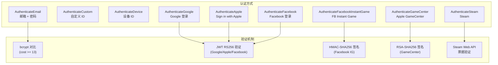
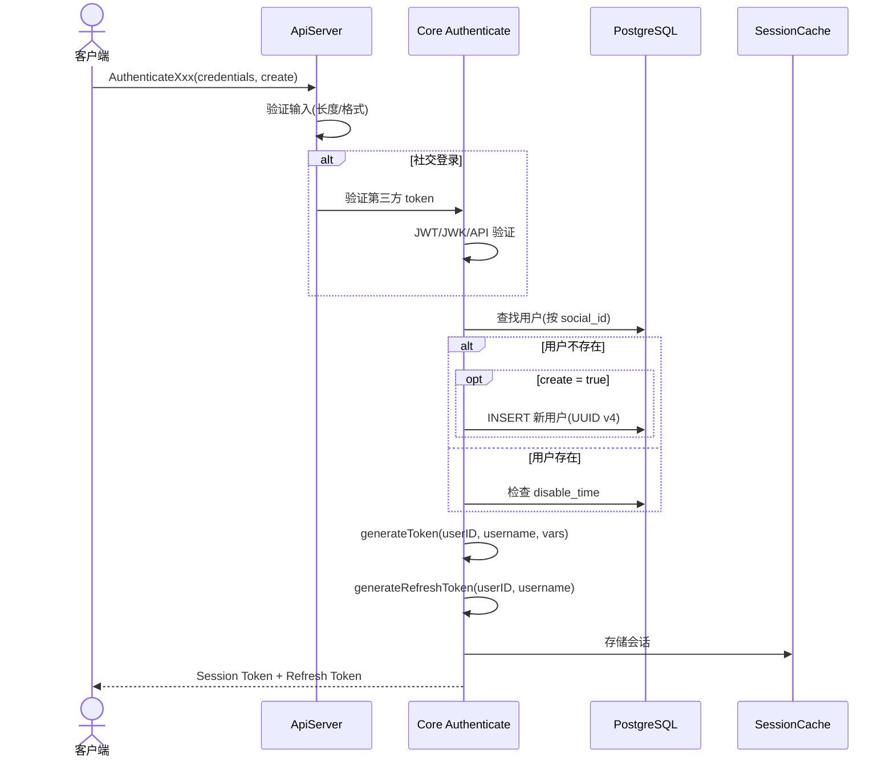
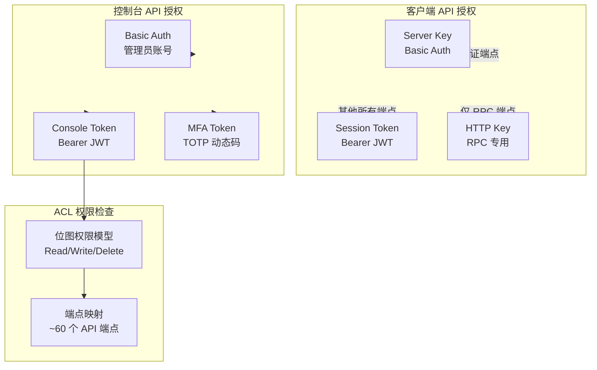
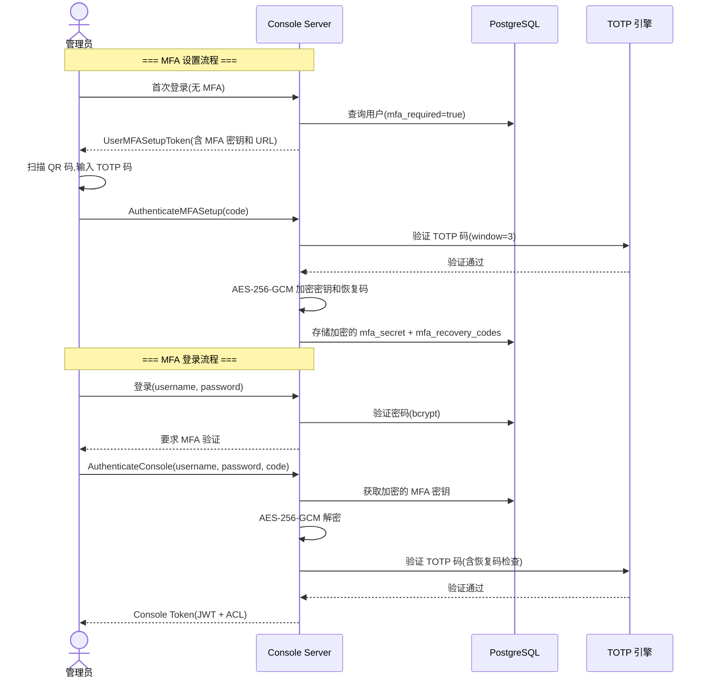
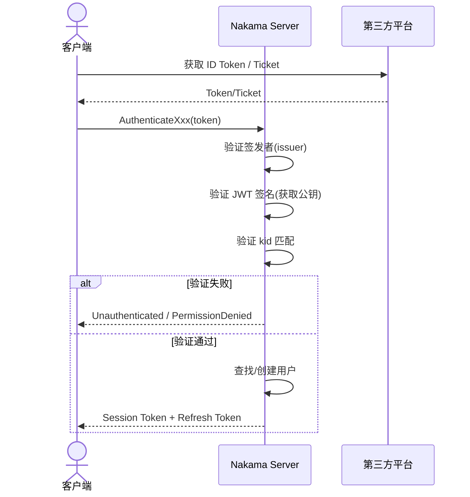
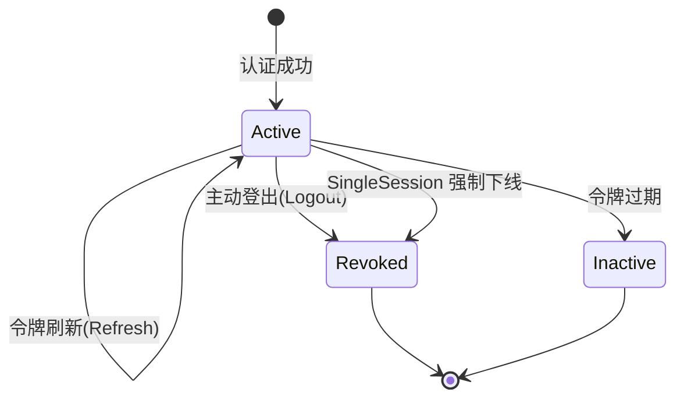

# Nakama 安全设计文档

## 1. 概述

Nakama 安全模型涵盖三个层面:客户端 API 认证、控制台管理认证、以及运行时授权。系统使用 JWT(HS256)、bcrypt 密码哈希、TOTP 多因素认证、和基于位图的 ACL 权限控制。

### 1.1 密钥体系

| 密钥名称 | 默认值 | 用途 | 加密算法 |
|---------|--------|------|---------|
| ServerKey | `"defaultkey"` | 服务端 API 认证(Basic Auth) | — |
| Session.EncryptionKey | `"defaultencryptionkey"` | 客户端会话 JWT 签名 | HMAC-SHA256 |
| Session.RefreshEncryptionKey | `"defaultrefreshencryptionkey"` | 客户端刷新令牌签名 | HMAC-SHA256 |
| Console.SigningKey | `"defaultsigningkey"` | 控制台会话 JWT 签名 | HMAC-SHA256 |
| Runtime.HTTPKey | `"defaulthttpkey"` | RPC 调用认证 | — |
| MFA.StorageEncryptionKey | `"the-key-has-to-be-32-bytes-long!"` | MFA 机密加密存储 | AES-256-GCM |

> **安全注意:** 所有默认密钥在生产环境中必须重新生成。`Session.EncryptionKey` 和 `Session.RefreshEncryptionKey` 必须不同(启动时校验)。

---

## 2. 认证机制

### 2.1 客户端认证方式

Nakama 支持 **10 种客户端认证方式**,每种都有对应的 gRPC 端点:



### 2.2 认证流程



### 2.3 JWT 令牌结构

#### 客户端会话令牌 (SessionTokenClaims)

```go
type SessionTokenClaims struct {
    TokenId   string            `json:"tid"`   // UUID v4
    UserId    string            `json:"uid"`   // UUID v4
    Username  string            `json:"usn"`
    Vars      map[string]string `json:"vrs"`   // 会话变量
    ExpiresAt int64             `json:"exp"`   // Unix 时间戳
    IssuedAt  int64             `json:"iat"`   // Unix 时间戳
}
```

- **算法:** HMAC-SHA256 (HS256)
- **签名密钥:** `Session.EncryptionKey`
- **默认过期:** 60 秒
- **刷新令牌过期:** 3600 秒(1 小时)

#### 控制台会话令牌 (ConsoleTokenClaims)

```go
type ConsoleTokenClaims struct {
    ID        string `json:"id"`    // 用户 UUID
    Username  string `json:"usn"`
    Email     string `json:"ema"`
    Acl       string `json:"acl"`   // Base64(RawURL) ACL 位图
    ExpiresAt int64  `json:"exp"`
    Cookie    string `json:"cki"`   // 遥测 cookie
}
```

- **算法:** HMAC-SHA256 (HS256)
- **签名密钥:** `Console.SigningKey`
- **默认过期:** 86400 秒(24 小时)

### 2.4 令牌黑名单与过期

- **SessionCache** 维护内存中的令牌黑名单。
- 用户登出时,`tokenId` 被加入黑名单。
- 当 `SingleSession=true` 时,`RemoveAll` 设置 `lastInvalidation` 时间戳,该时间之前颁发的所有令牌自动失效。
- WebSocket 连接断开时自动注销会话。

---

## 3. 密码安全

### 3.1 bcrypt 哈希

**算法:** bcrypt,通过 `golang.org/x/crypto/bcrypt`

**代价因子:**
```go
var bcryptHashCost = int(math.Max(float64(bcrypt.DefaultCost), 13))
// bcrypt.DefaultCost = 10, 结果: cost = 13 (2^13 = 8192 次迭代)
```

**密码策略:**

| 用户类型 | 最小长度 | 最大长度 | 哈希 |
|---------|---------|---------|------|
| 客户端用户 | 8 | — | bcrypt cost 13 |
| 控制台用户 | 12 | 128 | bcrypt cost 13 |

### 3.2 时序攻击防御

控制台登录时,即使用户不存在,也会执行一次伪造的 bcrypt 比较,防止用户名枚举:

```go
var dummyHash = []byte("$2y$10$x8B0hPVxYGDq7bZiYC9jcuwA0B9m4J6vYITYIv0nf.IfYuM1kGI3W")
_ = bcrypt.CompareHashAndPassword(dummyHash, []byte(password))
```

### 3.3 输入验证

- **用户名:** 禁止控制字符,正则 `[[:cntrl:]]|[[\t\n\r\f\v]]`
- **邮箱:** 正则 `^.+@.+\..+$`
- **自定义 ID:** 6-128 字节
- **设备 ID:** 10-128 字节

---

## 4. 授权与 ACL

### 4.1 三层授权模型



### 4.2 客户端 API 授权

- **Server Key:** 通过 `Authorization: Basic base64(serverKey:)` 认证,用于所有认证端点(`Authenticate*`, `SessionRefresh`)
- **Session Token:** 通过 `Authorization: Bearer <token>` 认证,用于所有非认证端点
- **HTTP Key:** 通过 `http_key` 查询参数或请求体,仅用于 RPC 调用
- 客户端用户之间**无细粒度权限控制**,所有认证用户拥有同等访问权限

### 4.3 控制台 ACL 位图模型

**文件:** `console/acl/acl.go`

控制台 ACL 使用**位图(bitmap)**模型:

```
每个资源占用 3 个连续位:
  bit 0: Read (读)
  bit 1: Write (写)
  bit 2: Delete (删除)

位图大小: ceil(资源数量 × 3 / 8) 字节
```

**权限级别:**

| 级别 | 说明 | 位图值 |
|------|------|--------|
| None | 无权限 | 全 0 |
| PermissionRead | 只读 | bit 0 = 1 |
| PermissionWrite | 读写 | bit 0,1 = 1 |
| PermissionDelete | 完全控制 | bit 0,1,2 = 1 |
| Admin | 超级管理员 | 全 0xFF |

**权限检查流程:**

1. Admin 权限(全 0xFF): 直接通过
2. None 权限(全 0x00): 直接拒绝
3. 位图与操作(`&`): 检查对应资源位是否设置

**ACL 序列化:**
- 数据库存储: JSON 格式 `{"admin":true}` 或 `{"acl":{"RESOURCE":{"read":true,"write":false,"delete":false}}}`
- JWT 令牌: Base64(RawURL) 编码的位图字节

### 4.4 端点 ACL 映射

`CheckACL(path, userPermissions)` 覆盖约 60 个控制台端点:
- 用户管理: ListUsers(Read), GetUser(Read), BanUser(Write), DeleteUser(Delete)
- 存储管理: ListStorage(Read), GetStorage(Read), UpdateStorage(Write), DeleteStorage(Delete)
- 排行榜: ListLeaderboards(Read), CreateLeaderboard(Write), DeleteLeaderboard(Delete)
- ...等

HTTP 网关使用 `CheckACLHttp(method, path, userPermissions)` 进行对应的 HTTP 方法映射:
- `GET` → Read
- `POST`, `PUT`, `PATCH` → Write
- `DELETE` → Delete

### 4.5 ACL 模板

支持预设 ACL 模板(`console_acl_template` 表),快速为管理员分配权限组合:
- 模板定义了 `acl` JSONB 结构
- 创建管理员时可引用模板

---

## 5. 多因素认证(MFA)

### 5.1 MFA 架构

MFA 仅适用于**控制台管理员**,客户端用户不支持 MFA。



### 5.2 TOTP 配置

| 参数 | 值 |
|------|-----|
| 算法 | HMAC-SHA1 (dgoogauth) |
| 时间步长 | 30 秒(隐含) |
| 窗口大小 | 3 个时间步(±90 秒容忍) |
| 密钥长度 | 80 位,B32 编码,无填充 |
| 发行者 | "HeroicLabs" |
| 恢复码 | 16 个,每个 8 位数字 |

### 5.3 MFA 机密加密

```
加密算法: AES-256-GCM
密钥: config.GetMFA().StorageEncryptionKey (必须恰好 32 字节)
加密对象: MFA 密钥 + 16 个恢复码
存储位置: console_user.mfa_secret, console_user.mfa_recovery_codes (BYTEA)
```

---

## 6. 社交登录集成

### 6.1 第三方验证总览

| 平台 | 验证方式 | 证书端点 | 缓存策略 |
|------|---------|---------|---------|
| Google | JWT RS256 | `https://www.googleapis.com/oauth2/v1/certs` | 最快证书到期前 1 小时刷新 |
| Apple | JWT RS256(JWK) | `https://appleid.apple.com/auth/keys` | 60 分钟缓存 |
| Facebook | JWT RS256(JWK) | `https://limited.facebook.com/.well-known/oauth/openid/jwks/` | 60 分钟缓存 |
| Facebook IG | HMAC-SHA256 | — | — |
| GameCenter | SHA256WithRSA | 客户端提供的 Apple URL | 单次获取 |
| Steam | Web API | Steam Partner API | — |

### 6.2 验证流程



**签发者验证:**

| 平台 | 允许的 Issuer |
|------|-------------|
| Google | `accounts.google.com`, `https://accounts.google.com` |
| Apple | `https://appleid.apple.com` |
| Facebook | `https://www.facebook.com`, `https://facebook.com` |

**安全措施:**
- 所有社交平台验证使用 HTTPS
- JWT 算法必须与证书算法匹配(防止算法降级攻击)
- 证书通过 HTTPS 获取并缓存
- GameCenter 公钥 URL 必须使用 HTTPS 且域名为 `.apple.com`

---

## 7. 登录速率限制

### 7.1 控制台登录限制

**文件:** `server/login_attempt_cache.go`

| 限制类型 | 最大尝试次数 | 锁定时长 | 状态 |
|---------|-------------|---------|------|
| 账号锁定 | 5 次 | 1 分钟 | 启用 |
| IP 锁定 | 10 次 | 10 分钟 | 代码中已注释(未启用) |

**实现:** `LocalLoginAttemptCache` 使用滑动窗口算法,基于进程内存,通过 `sync.RWMutex` 保护。

**清理:** 后台 goroutine 每 10 分钟清理过期条目。

> **注意:** 客户端 API 认证**无**速率限制。

---

## 8. 传输安全

### 8.1 TLS/SSL

TLS 是可选的,**不推荐**在生产环境中直接使用 Nakama 的 SSL 终端:

```
WARNING: enabling direct SSL termination is not recommended,
use an SSL-capable proxy or load balancer for production!
```

**TLS 配置:**

```go
type SocketConfig struct {
    SSLCertificate string            // 证书 PEM 文件路径
    SSLPrivateKey  string            // 私钥 PEM 文件路径
    TLSCert        []tls.Certificate // 解析后的 X509 密钥对
}
```

**TLS 应用路径:**
1. gRPC 服务器: `grpc.Creds(credentials.NewServerTLSFromCert(...))`
2. HTTP 网关: `ServeTLS()` 替代 `Serve()`
3. 内部 gRPC 调用(网关→gRPC): `InsecureSkipVerify: true`(因为拨号 127.0.0.1)

### 8.2 CORS

```go
handlers.AllowedHeaders("Authorization", "Content-Type", "User-Agent")
handlers.AllowedOrigins("*")  // 允许所有来源
handlers.AllowedMethods("GET", "HEAD", "POST", "PUT", "DELETE")
```

### 8.3 请求安全

- **请求大小限制:** 通过 `http.MaxBytesReader` 限制 `MaxRequestSizeBytes`
- **响应头:** 所有 API 响应设置 `Cache-Control: no-store, no-cache, must-revalidate`
- **Content-Type 检查:** 对需要 JSON 的端点强制检查 `Content-Type: application/json`

---

## 9. 会话管理

### 9.1 会话生命周期



### 9.2 会话配置

| 参数 | 默认值 | 说明 |
|------|--------|------|
| TokenExpirySec | 60 | 会话令牌过期时间(秒) |
| RefreshTokenExpirySec | 3600 | 刷新令牌过期时间(秒) |
| SingleSession | false | 是否强制单会话(新登录踢旧会话) |
| SessionQueueWorkers | 16 | 会话事件处理并发数 |

### 9.3 WebSocket 会话

- WebSocket 升级时通过查询参数 `?token=<jwt>` 认证
- 连接建立后创建 Session,注册到 Tracker
- 断开连接时自动注销会话、执行 SessionEnd 事件

---

## 10. 安全算法总结

| 组件 | 算法 | 密钥/参数 |
|------|------|----------|
| 客户端 JWT | HMAC-SHA256 | session.encryption_key |
| 刷新令牌 JWT | HMAC-SHA256 | session.refresh_encryption_key |
| 控制台 JWT | HMAC-SHA256 | console.signing_key |
| 密码哈希 | bcrypt | cost >= 13 |
| MFA 机密加密 | AES-256-GCM | mfa.storage_encryption_key (32 字节) |
| MFA TOTP | HMAC-SHA1 | 80 位密钥,30 秒步长,窗口 3 |
| Google 令牌验证 | RS256 | Google 公钥证书 |
| Apple 令牌验证 | RS256(JWK) | Apple 公钥证书 |
| Facebook LL | JWT RS256(JWK) | Facebook 公钥证书 |
| Facebook IG | HMAC-SHA256 | app_secret |
| GameCenter | SHA256WithRSA | Apple 公钥 |
